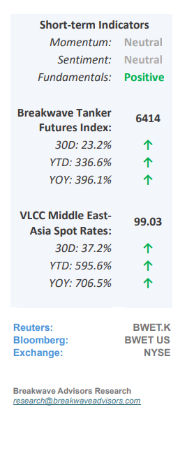
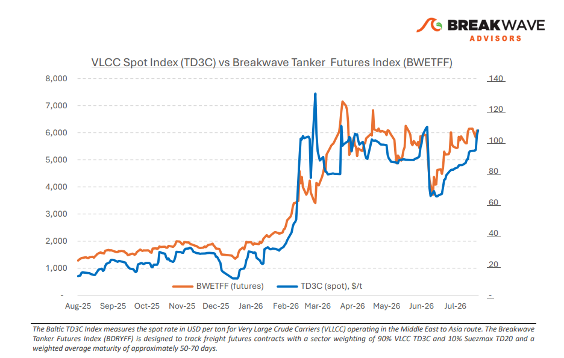
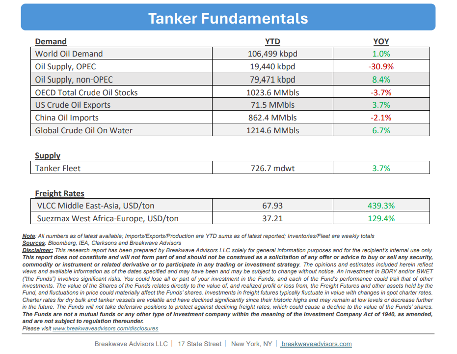

# Breakwave Bi-Weekly Tanker Report - August 11, 2026

**Date:** August 11, 2026  
**Publisher:** Breakwave Advisors | **Category:** Market Insights  
**Original URL:** [https://www.breakwaveadvisors.com/insights/8112026wetreportkjj2026jj78944](https://www.breakwaveadvisors.com/insights/8112026wetreportkjj2026jj78944)  

---

•**East of Suez Risk Jumps**– The**geopolitical risk premium**identified in late July remains embedded in East of Suez tanker freight, but the disruption has evolved from a Hormuz centered issue into a broader Middle East routing risk spanning both the Gulf and Red Sea. Iran and Oman are nearing an agreement on new shipping arrangements through Hormuz, although Tehran has separated progress on the framework from a full reopening of the Strait.**Diplomatic progress has therefore yet to translate into sustained normalization**of commercial traffic, keeping security exposure embedded in voyage economics. At the same time, Saudi Arabia's increased reliance on its East West pipeline and Yanbu has provided an alternative outlet for crude constrained in the Gulf. Renewed Houthi threats against**Saudi linked shipping**, however, have**added risk**to the Red Sea route. Redirecting barrels west therefore shifts rather than removes the security exposure, while changing the direction and duration of tanker employment. For tanker demand, the composition of the crude adjustment is becoming as important as the recovery in volumes.**China's increased reliance**on shorter haul**Russian barrels**provides less tonne mile support than replacement crude sourced from the Atlantic Basin, while Saudi flows through Yanbu redistribute vessel demand across different trading corridors. These shifts are increasingly reflected in the divergence between East and West of Suez.**Atlantic VLCC freight has softened,**while East of Suez earnings continue to carry a stronger geopolitical component. Even as the East of Suez ballast to laden ratio rises, greater ballast availability can coexist with firm freight when disruption affects the circulation and employment of laden vessels.

> **Figure 1: Cea3cf84ceb9ceb3cebcceb9cf8ccf84cf85**  
> [Local Asset](file:///C:/Users/Dell/Github/Shipping/corpus/03-breakwave/insights/2026/assets/2026-08-11_8112026wetreportkjj2026jj78944_img_cea3cf84ceb9ceb3cebcceb9cf8ccf84cf85_4c8f2ca6163a.png)

•**Oil Prices Remain Sensitive to Hormuz Developments**– Crude oil prices have once again fluctuated in response to developments surrounding the Strait of Hormuz, defying ongoing**structural supply deficits**and persistent market uncertainty. Thus far, decelerating demand across Asia, particularly from China, has partially stabilized the market, supplemented by aggressive strategic petroleum reserve drawdowns and the recent transit of approximately 100 million barrels out of the Arabian Gulf. However, these critical**contingency buffers**have largely been**exhausted**. While substantial inventories prior to the March 2026 Iran-US conflict provided a robust cushion that successfully capped price spikes, the market faces tightening balances in the coming months. Consequently, we**anticipate heightened volatility**as oil prices gradually establish a higher baseline.

•**Our Long-term View**– The tanker market has been recovering from a long period of staggered rates as the growth in new vessel supply shrunk while oil demand remained elevated in line with the global economy. The recent rapid increase in freight rates has led to significant new vessel ordering, with the orderbook now standing at above average levels, and although in the near term such a supply/demand misbalance is small, we expect a meaningful negative balance to develop longer term leading to a potential downcycle.

> **Figure 2: Στιγμιότυπο Οθόνης 2026 08 11 101453**  
> [Local Asset](file:///C:/Users/Dell/Github/Shipping/corpus/03-breakwave/insights/2026/assets/2026-08-11_8112026wetreportkjj2026jj78944_img_cea3cf84ceb9ceb3cebcceb9cf8ccf84cf85_fcc645a812ff.png)

> **Figure 3: Στιγμιότυπο Οθόνης 2026 08 11 134916**  
> [Local Asset](file:///C:/Users/Dell/Github/Shipping/corpus/03-breakwave/insights/2026/assets/2026-08-11_8112026wetreportkjj2026jj78944_img_cea3cf84ceb9ceb3cebcceb9cf8ccf84cf85_813adcdaa3d6.png)

### Subscribe:
