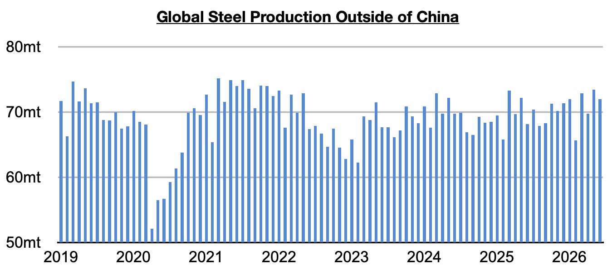
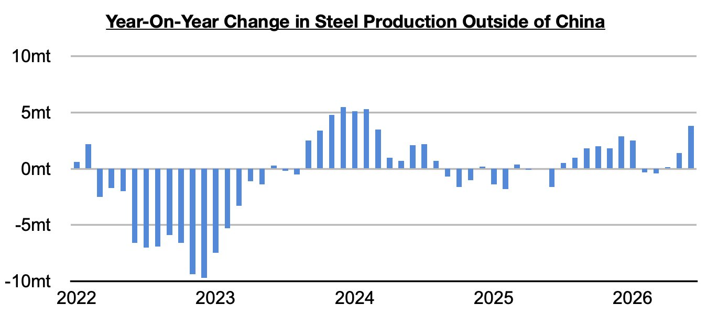
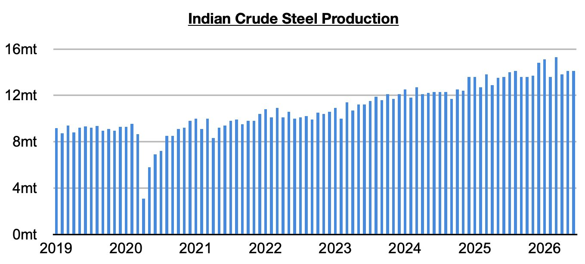

# More Improvement in Steel Production Ex-China

**Date:** August 11, 2026  
**Publisher:** Breakwave Advisors | **Category:** Market Insights  
**Original URL:** [https://www.breakwaveadvisors.com/insights/2026/8/7/more-improvement-in-steel-production-ex-china](https://www.breakwaveadvisors.com/insights/2026/8/7/more-improvement-in-steel-production-ex-china)  

---

*By*[*Jeffrey Landsberg*](https://www.linkedin.com/in/jeffrey-landsberg-70ab957/)

Global steel production totaled approximately 155.7 million tons last month. This is down month-on-month 2.2 million tons (-1%) but is up year-on-year by 4.3 million tons (3%). Steel production outside of China totaled approximately 72 million tons. This is down month-on-month by 1.5 million tons (-2%) but is up year-on-year by 3.8 million tons (6%).

> **Figure 1: Chart 1**  
> [Local Asset](file:///C:/Users/Dell/Github/Shipping/corpus/03-breakwave/insights/2026/assets/2026-08-11_more-improvement-in-steel-production-ex-china_img_chart1_954f3a9dad20.jpg)

Steel production ex-China has now increased on a year-on-year basis for three straight months. Last month’s 3.8% year-on-year growth has marked the largest growth seen since early 2024.

> **Figure 2: Chart 2**  
> [Local Asset](file:///C:/Users/Dell/Github/Shipping/corpus/03-breakwave/insights/2026/assets/2026-08-11_more-improvement-in-steel-production-ex-china_img_chart2_f7ee9b34de4a.jpg)

Taking India out of the equation, production grew year-on-year by 3.3 million tons (6%). This has also marked the largest year-on-year growth seen since early 2024. Indian steel production totaled 14.1 million tons last month. This is unchanged from May and is up year-on-year by 500,000 tons (4%). Production has now grown on a year-on-year basis for forty straight months.

> **Figure 3: Chart 3**  
> [Local Asset](file:///C:/Users/Dell/Github/Shipping/corpus/03-breakwave/insights/2026/assets/2026-08-11_more-improvement-in-steel-production-ex-china_img_chart3_7f7c7cf946cd.jpg)

---

**Tags:** Drybulk, Ironore, Commodities  
