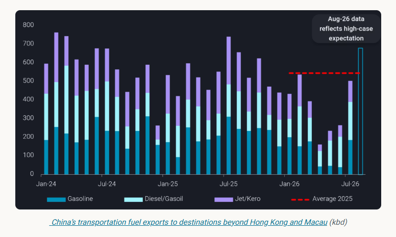
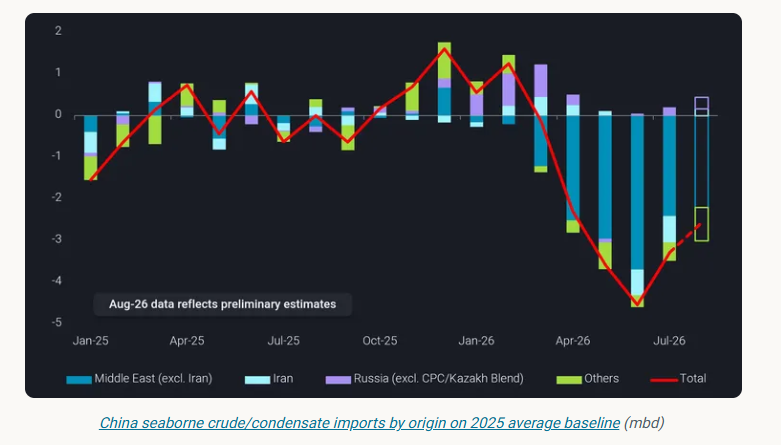
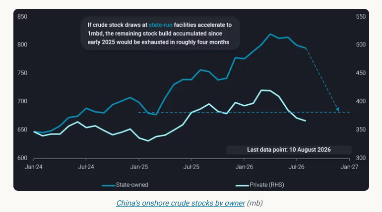
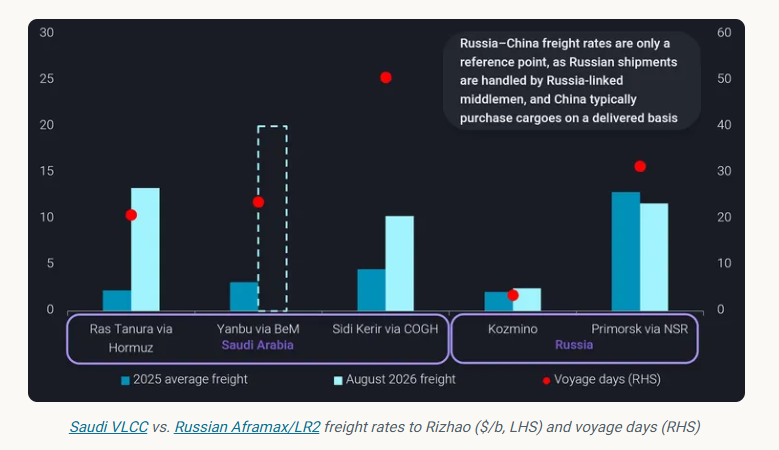

# Sixth month into the war: what changes can we interpret from China?

**Date:** August 12, 2026  
**Publisher:** Breakwave Advisors | **Category:** Market Insights  
**Original URL:** [https://www.breakwaveadvisors.com/insights/2026/8/12/sixth-month-into-the-war-what-changes-can-we-interpret-from-china](https://www.breakwaveadvisors.com/insights/2026/8/12/sixth-month-into-the-war-what-changes-can-we-interpret-from-china)  

---

China’s oil policies start to shift in July, signalling that refiners are increasingly focused on protecting margins while maintaining supply security.

*By*[*Emma Li*](https://www.linkedin.com/in/emma-li-73003443/)

China removed transportation fuel export restrictions in late June, resulting in July exports to destinations beyond Hong Kong and Macau rebounding to 510kbd, from just 220kbd in Q2. August exports are reportedly set to rise further to around 680kbd, the highest since July 2025, although some volumes could roll over into September given the limited time available to arrange shipments.

> **Figure 1: Στιγμιότυπο Οθόνης 2026 08 12 105842**  
> **Interactive Data & Source:** [Analytics Vortexa](https://analytics.vortexa.com/InsightsHubPage?articleId=7CtmU1YQsqNqTvzdtDJXgp&articleType=highlight&categoryFilters=%5B%22webinar%22%2C%22report%22%2C%22article%22%2C%22highlight%22%2C%22briefing%22%5D&page=InsightsHubPage&tabId=40173c18-c403-400d-85fa-180fff870c86) | [Local Asset](file:///C:/Users/Dell/Github/Shipping/corpus/03-breakwave/insights/2026/assets/2026-08-12_sixth-month-into-the-war-what-changes-can-we-interpret-from-china_img_cea3cf84ceb9ceb3cebcceb9cf8ccf84cf85_53b7ac645852.png)

While securing domestic energy supply remains the ultimate priority — Beijing continues to require refiners to maintain product inventories above February levels — the relaxation of export restrictions nevertheless signals a gradual shift towards supporting economic activity.

It also suggests that state planners are becoming more confident in China’s ability to safeguard domestic energy supplies through a prolonged period of disrupted oil flows.

However, boosting refining margins is not straightforward. Asian product cracks have strengthened, but feedstock costs — the actual cost of crude delivered to Asian refiners, rather than benchmark prices alone — have risen sharply again as transportation costs increase amid renewed disruption around the Middle East Gulf and the emerging Houthi threat to the Bab el-Mandeb.

If feedstock costs remain elevated, strong product cracks alone will not necessarily translate into higher refining margins. At this stage, Chinese refiners appear to have an advantage in managing feedstock costs — without needing to undertake escort operations into already heightened-risk areas.

## Refiners to Favour Crude Barrels with Lower Cost, More Reliable Delivery Timelines

China’s refinery runs recovered in July, supported by higher arrivals of non-Iranian Middle Eastern crude and a faster drawdown of crude inventories to meet stronger transportation fuel exports demand. While seaborne crude imports appear to have bottomed out in July, the recovery in demand is likely to be selective. Rather than simply buying more crude, refiners are increasingly favouring barrels that can be delivered reliably and at reasonable freight costs.

Under current market conditions, the most reliable seaborne barrels are likely to be sanctioned crude already floating in Asian waters, as well as barrels with relatively short voyage times.

**A less visible policy shift is that Beijing has quietly allowed state-run refiners to purchase western-sanctioned Russian energy products**, albeit through intermediaries and with efforts to avoid traceable payments.

> **Figure 2: Στιγμιότυπο Οθόνης 2026 08 12 105849**  
> **Interactive Data & Source:** [Analytics Vortexa](https://analytics.vortexa.com/InsightsHubPage?articleId=7CtmU1YQsqNqTvzdtDJXgp&articleType=highlight&categoryFilters=%5B%22webinar%22%2C%22report%22%2C%22article%22%2C%22highlight%22%2C%22briefing%22%5D&page=InsightsHubPage&tabId=40173c18-c403-400d-85fa-180fff870c86) | [Local Asset](file:///C:/Users/Dell/Github/Shipping/corpus/03-breakwave/insights/2026/assets/2026-08-12_sixth-month-into-the-war-what-changes-can-we-interpret-from-china_img_cea3cf84ceb9ceb3cebcceb9cf8ccf84cf85_52eb3a418ad9.png)

As highlighted in our July Market Insights, sanctioned crude grades are likely to gain market share in China during August.

Iranian crude imports and consumption — currently concentrated among private Chinese refiners — should rebound as floating inventories accumulated in Asian waters during July begin to discharge.

Russian crude imports are also likely to exceed their 2025 average, supported by renewed purchases of Russian Far East crude by Chinese oil majors and the seasonal reopening of the Northern Sea Route [[China turns back to Russian crude amid renewed Middle East disruptions](https://analytics.vortexa.com/InsightsHubPage?articleId=7CtmU1YQsqNqTvzdtDJXgp&articleType=highlight&categoryFilters=%5B%22webinar%22%2C%22report%22%2C%22article%22%2C%22highlight%22%2C%22briefing%22%5D&page=InsightsHubPage&tabId=40173c18-c403-400d-85fa-180fff870c86)], which can reduce the voyage time for western Russian crude to around four weeks.

By contrast, imports from other origins — particularly barrels facing greater delivery uncertainty or elevated freight costs — are likely to remain below seasonal norms.

## Ample State-Initiated Crude Stockpiles Provide an Additional Buffer

Compared with seaborne flows, the most reliable source of feedstock in the near term is actually onshore crude inventories.

Unlike other major net crude importers, China only began drawing down crude stocks in May, with the draw rate averaging around 750kbd since then.

Stock draws accelerated to 1mbd in July, the deepest monthly draw since February 2023. Crude inventories held by private entities in Shandong declined by about 20mb during the month, also the largest monthly draw since February 2023, as Iranian arrivals stumbled following the first round of the US blockade on Iranian exports.

Even so, inventories at both state-owned and private facilities remained above early-2025 levels at the end of July.

> **Figure 3: Στιγμιότυπο Οθόνης 2026 08 12 105859**  
> **Interactive Data & Source:** [Analytics Vortexa](https://analytics.vortexa.com/InsightsHubPage?articleId=4pODuEK4CLtMB289fV0hsx&articleType=article&categoryFilters=%5B%22webinar%22%2C%22report%22%2C%22article%22%2C%22highlight%22%2C%22briefing%22%5D&page=InsightsHubPage&tabId=40173c18-c403-400d-85fa-180fff870c86) | [Local Asset](file:///C:/Users/Dell/Github/Shipping/corpus/03-breakwave/insights/2026/assets/2026-08-12_sixth-month-into-the-war-what-changes-can-we-interpret-from-china_img_cea3cf84ceb9ceb3cebcceb9cf8ccf84cf85_60abe46afc5d.png)

For August, we expect inventory trends to diverge. Drawdowns from private commercial storage should slow as more Iranian cargoes move onshore. By contrast, state-owned inventories could see faster drawdowns as renewed Middle East supply disruptions increase the need to bridge supply gaps.

**Even if state-owned inventories are drawn down at 1mbd, the stock build accumulated since 2025 would still provide around four months of supply at current levels**, giving Chinese oil majors little incentive to aggressively pursue long-haul, high-freight-cost cargoes.

## Next to Watch: Will China Turn Back to Its Middle East Baseloads Via the Normal Route?

A key constraint on Chinese refiners increasing purchases of their Middle Eastern baseload crude — particularly term barrels on an FOB basis — is the sharp rise in freight and insurance costs.

Among non-sanctioned Middle Eastern barrels, only imports of UAE crude have seen a significant rebound, rising from less than 100kbd in Q2 to 610kbd in July and 710kbd in August. This is still below pre-war levels of 600–900kbd, excluding the record 1.3mbd in December 2025.

However, most recent UAE cargoes were offered either on a delivered basis or FOB from east of Hormuz locations - including offshore Malaysia, through spot tenders. Some Chinese refiners reportedly even resold these contracts to other Asian refiners at margins above those available from processing the crude themselves.

Still, this contrasts with Saudi and Iraqi barrels, which were previously China’s largest Middle Eastern suppliers and continue to be offered primarily on an FOB basis, leaving buyers to bear the transportation cost and risk.

Taking Saudi barrels as an example, the Ras Tanura–Rizhao VLCC rate via the normal Hormuz route exceeded $13/b in early August, while the Yanbu–Rizhao rate via the Red Sea spiked to nearly $20/b. Both are substantially above the $2–5/b range seen before February. Although freight for cargoes from Sidi Kerir via the Cape of Good Hope remains below $15/b, the voyage takes more than 50 days laden, excluding SUMED transit time, making the route too slow to be practical for Chinese refiners.

> **Figure 4: Στιγμιότυπο Οθόνης 2026 08 12 105908**  
> **Interactive Data & Source:** [Analytics Vortexa](https://analytics.vortexa.com/InsightsHubPage?articleId=4pODuEK4CLtMB289fV0hsx&articleType=article&categoryFilters=%5B%22webinar%22%2C%22report%22%2C%22article%22%2C%22highlight%22%2C%22briefing%22%5D&page=InsightsHubPage&tabId=40173c18-c403-400d-85fa-180fff870c86) | [Local Asset](file:///C:/Users/Dell/Github/Shipping/corpus/03-breakwave/insights/2026/assets/2026-08-12_sixth-month-into-the-war-what-changes-can-we-interpret-from-china_img_cea3cf84ceb9ceb3cebcceb9cf8ccf84cf85_3c71cac31b92.png)

Moreover,**Chinese-flagged tankers have been advised not to enter high-risk areas, as vessels could face extended delays at load ports if they are unable to transit the blockade zones**. Although Chinese tankers are generally not the primary attack targets [[Four in five vessels are now talking their way through Bab el-Mandeb](https://analytics.vortexa.com/InsightsHubPage?articleId=4pODuEK4CLtMB289fV0hsx&articleType=article&categoryFilters=%5B%22webinar%22%2C%22report%22%2C%22article%22%2C%22highlight%22%2C%22briefing%22%5D&page=InsightsHubPage&tabId=40173c18-c403-400d-85fa-180fff870c86)], operators have remained surprisingly cautious about Middle East voyages, minimising the risk of becoming embroiled in diplomatic issues while Beijing’s response to the crisis remains closely watched.

If Chinese refiners could source more Middle Eastern FOB barrels at deep discounts while keeping freight costs lower by transiting the normal Middle East–China routes, refining margins could improve further. However, this appears unlikely in the near term, as Beijing appears to avoid creating the perception that Chinese shipping enjoys preferential access through conflict zones.

This means China’s seaborne crude demand may recover more slowly than refinery runs suggest, with incremental demand increasingly concentrated in short-haul, discounted or blockade-free barrels. Unless Middle East freight costs normalise or Chinese refiners become more willing to resume conventional Middle East procurement, the crisis is likely to continue reshaping China’s crude sourcing mix — favouring sanctioned flows and inventory drawdowns over a broad-based recovery in seaborne imports.

Data Source:[Vortexa](https://www.vortexa.com//oil-gas-data-traders-analysts-data-scientists?gclid=Cj0KCQjw8_qRBhCXARIsAE2AtRZKOvMnbilZ_6_91d7huSFFy71pWLrnPwGwOHVzXsmsG-1a1mZnQw8aAt89EALw_wcB&hsa_acc=1782073842&hsa_ad=548425387665&hsa_cam=14746637662&hsa_grp=125038601902&hsa_kw=&hsa_mt=&hsa_net=adwords&hsa_src=g&hsa_tgt=dsa-1431852288425&hsa_ver=3&utm_campaign=%5BCD%5D%20-%20DSA%20-%20EMEA&utm_medium=cpc&utm_medium=ppc&utm_source=google&utm_source=adwords&utm_term=)

---

**Tags:** Crude, Tankers, Markets  
