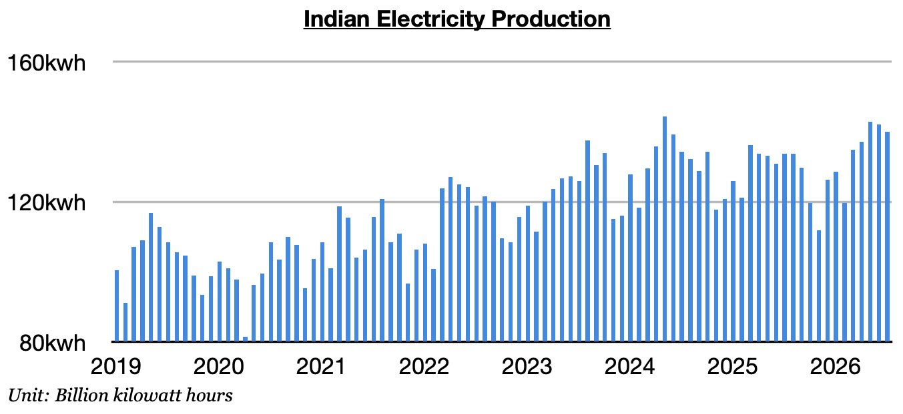
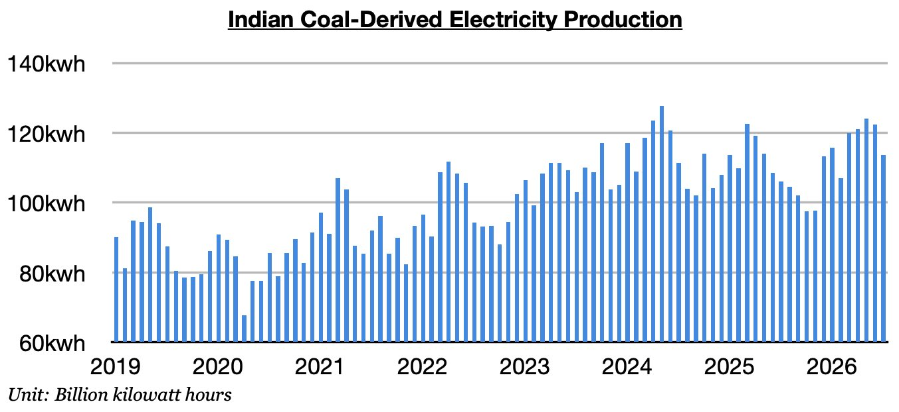

# India's Dramatic Improvement Continues

**Date:** August 13, 2026  
**Publisher:** Breakwave Advisors | **Category:** Market Insights  
**Original URL:** [https://www.breakwaveadvisors.com/insights/2026/8/13/indias-dramatic-improvement-continues](https://www.breakwaveadvisors.com/insights/2026/8/13/indias-dramatic-improvement-continues)  

---

*By*[*Jeffrey Landsberg*](https://www.linkedin.com/in/jeffrey-landsberg-70ab957/)

As we discussed in Commodore Research's most recent Weekly Executive Report, India produced approximately 140 billion kilowatt hours of electricity last month. This is down month-on-month by 2 billion kilowatt hours (-1%), up year-on-year by 6.3 billion kilowatt hours (5%), and is the largest amount ever produced in the month of July. Electricity production has now increased year-on-year for four straight months. Previously, it had contracted in eight of the prior twelve months.

> **Figure 1: Chart 1**  
> [Local Asset](file:///C:/Users/Dell/Github/Shipping/corpus/03-breakwave/insights/2026/assets/2026-08-13_indias-dramatic-improvement-continues_img_chart1_1217d55051d4.jpg)

Coal-derived electricity generation totaled approximately 113.7 billion kilowatt hours. This is down month-on-month by 8.7 billion kilowatt hours (-7%), up year-on-year by 7.6 billion kilowatt hours (7%), and is the largest amount ever produced in July. Generation has grown year-on-year for four straight months. Previously, it had fallen on a year-on-year basis in nine of the prior twelve months, which marked the**only time this decade**that such an event had occurred. As we have stressed in our work, the Iran war has been aiding thermal coal demand. Temperatures have also been warmer than usual and hydropower output has been in contraction.

> **Figure 2: Chart 2**  
> [Local Asset](file:///C:/Users/Dell/Github/Shipping/corpus/03-breakwave/insights/2026/assets/2026-08-13_indias-dramatic-improvement-continues_img_chart2_6793495e3b8a.jpg)

---

**Tags:** Coal, Commodities, Drybulk  
