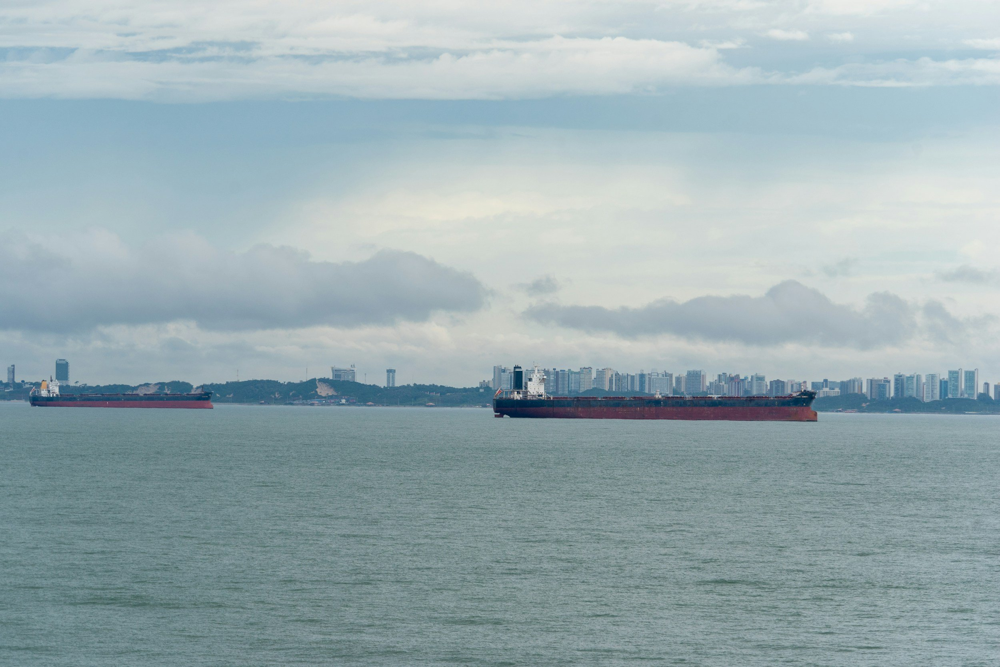

# The 2026 freight recovery

**Date:** August 13, 2026  
**Publisher:** Breakwave Advisors | **Category:** Market Insights  
**Original URL:** [https://www.breakwaveadvisors.com/insights/2026/8/13/the-2026-freight-recovery](https://www.breakwaveadvisors.com/insights/2026/8/13/the-2026-freight-recovery)  

---

> **Figure 1: Byeirini Diamantara&dimitris Roumeliotis**  
> *ByEirini Diamantara&Dimitris Roumeliotis*  
> **Interactive Data & Source:** [Linkedin](https://www.linkedin.com/in/eirini-diamantara-58b269105/) | [Local Asset](file:///C:/Users/Dell/Github/Shipping/corpus/03-breakwave/insights/2026/assets/2026-08-13_the-2026-freight-recovery_img_image-asset_96060c6f44c8.jpeg)

The dry bulk freight market delivered a considerably stronger performance during the first seven months of 2026, with Baltic Exchange time-charter equivalent earnings improving across all four major vessel segments compared with January–July 2025. The recovery was broad-based rather than dependent on a single vessel class, reflecting stronger cargo volumes, improved fleet utilisation and firmer demand across both major and minor bulk trades.

Based on the available daily assessments, the Capesize 5TC averaged approximately USD 30,400/day, up 81% from USD 16,800/day during the corresponding period of 2025. Capesize earnings reached a high of USD 46,538/day in late May, while the market closed July at USD 35,457/day, well above the USD 26,858/day recorded at the end of July last year. The improvement extended across the smaller segments. Kamsarmax earnings averaged around USD 17,600/day, increasing 53% year-on-year from USD 11,500/day, while the Ultramax 11TC rose by 48% also near to USD 17,600/day. Handysize earnings recorded the smallest, but still substantial, increase, averaging USD 14,100/day compared with USD 10,100/day in 2025, representing growth of 39%. The progression of rates was also important.

Following a relatively stable opening quarter, earnings strengthened sharply during April and May, particularly for Capesizes and Kamsarmaxes. Ultramax and Handysize markets advanced more steadily, reaching their strongest levels during June and July and demonstrating healthier underlying support across geographically diversified trades. This stronger freight environment was accompanied by an increase in total seaborne dry bulk volumes. Based on the Signal Ocean data, approximately 3.41 billion tonnes were transported during January–July 2026, compared with 3.35 billion tonnes during the same period of 2025, representing growth of almost 2%. Capesize-carried cargo increased by 4.8% to 936.7 million tonnes, lifting its share of total trade from 26.7% to 27.4%. Panamax, Supramax and Handymax volumes also increased, while VLOC, Handysize and Small vessel cargoes declined. The figures therefore indicate that trade growth was concentrated mainly in the larger and medium-sized vessel categories, supporting the segments that experienced the strongest freight improvement.

Commodity flows remained dominated by iron ore and coal, which together represented more than 52% of total dry bulk trade. Iron ore volumes increased by 1.5% to 992.2 million tonnes, while coal shipments rose by 2.1% to 788.9 million tonnes. Grain trade delivered a more pronounced increase of 10.4%, reaching 358.9 million tonnes and overtaking other ores and rocks as the third-largest cargo category. By contrast, fertilizers, steel, cement and forestry products declined, confirming that overall growth was driven primarily by the traditional core commodities. Australia remained the largest origin, increasing exports to 844.8 million tonnes, followed by Brazil at 374.1 million tonnes. Guinea recorded one of the strongest increases, rising 22% to 131.9 million tonnes, supporting long-haul bauxite movements. China remained overwhelmingly the largest destination, receiving 1.36 billion tonnes, up 2.9% year-on-year and representing almost 40% of global dry bulk imports. South Korea, Vietnam and Indonesia also increased intake, while India declined by almost 5%.

Overall, the 2026 freight recovery appears firmly connected to improving physical trade. Higher iron ore, coal and grain volumes, combined with stronger long-haul exports from Australia, Brazil and Guinea, increased vessel employment and supported rates across the market. The particularly strong Capesize performance reflects both higher cargo volumes and the tonne-mile intensity of major ore trades, while the gains in smaller vessels confirm that the recovery has developed into a genuinely broad-based dry bulk market.

Data source:[Xclusiv Shipbrokers Inc.](https://www.linkedin.com/company/xclusiv-shipbrokers-inc/)

---

**Tags:** Commodities, Drybulk, Shipping  
