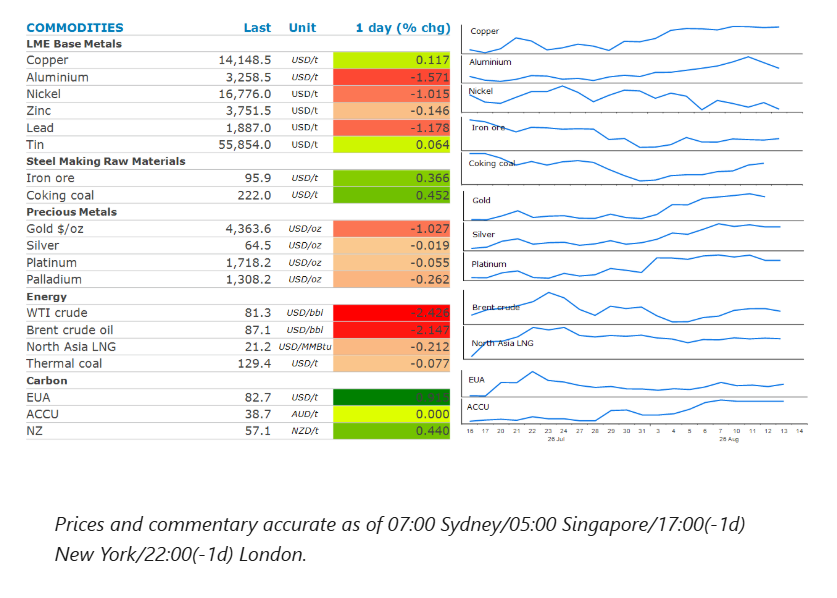
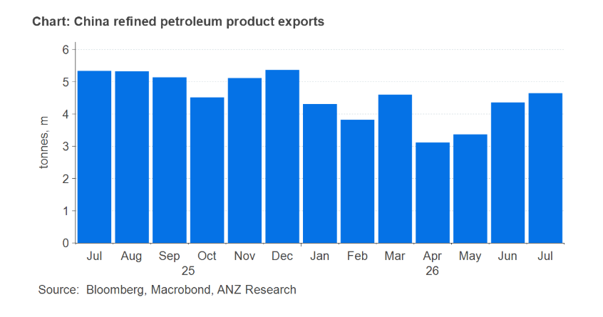

# Oil retraces amid a stalemate in US-Iran talks

**Date:** August 14, 2026  
**Publisher:** Breakwave Advisors | **Category:** Market Insights  
**Original URL:** [https://www.breakwaveadvisors.com/insights/2026/8/14/oil-retraces-amid-a-stalemate-in-us-iran-talks](https://www.breakwaveadvisors.com/insights/2026/8/14/oil-retraces-amid-a-stalemate-in-us-iran-talks)  

---

Energy fell as oil supplies find their way out of the Persian Gulf. Precious metals fell on profit taking. Industrial metals edged higher on supply concerns.

*By*[*Daniel Hynes*](https://www.linkedin.com/in/dahynes/)

> **Figure 1: Στιγμιότυπο Οθόνης 2026 08 14 072843**  
> **Interactive Data & Source:** [Linkedin](https://www.linkedin.com/newsletters/commodities-wrap-6692196755876012032/?fbclid=IwAR3kiXJqZdxmp9ZcRwBNI7FsBySI-XSC0pfPur1qzjt7OZp7PTE59Tsl1QI) | [Local Asset](file:///C:/Users/Dell/Github/Shipping/corpus/03-breakwave/insights/2026/assets/2026-08-14_oil-retraces-amid-a-stalemate-in-us-iran-talks_img_cea3cf84ceb9ceb3cebcceb9cf8ccf84cf85_903f6de6c711.png)

### Market Commentary

**Crude oil**prices fell as traders weighed up the limited progress of talks on reopening the Strait of Hormuz with signs of oil flows rising. Earlier this week US Energy Secretary, Chris Wright, said flows have averaged 9mb/d over the past week, well above what ship tracking data suggest. Persian Gulf producers such as the UAE and Saudi Arabia are said to be doing what they can to keep exports flowing, including switching transponders to move cargo through the strait without detection. This has led to an increased amount of crude from the Middle East finding its way to the US. At least 9mbbl are set to arrive at US ports in August, according to maritime analytics firm Kpler. This comes as US imports from Venezuela rise to their highest in nine years.

However, oil pared back some of the earlier losses after reports emerged that the Iranian-backed Houthi militant group had targeted Saudi Aramco’s oil refinery in Jazan on the Red Sea Coast. It’s the second such attack by the group on the refinery in less than a week. Progress on talks to reopen Hormuz have also stalled. Both sides claim they have control of the waterway and are demanding concessions that are unlikely to be met, leaving a durable peace elusive. According to the International Energy Agency, the global oil market will subsequently face a shortfall of 1.8mb/d this quarter, more than double an earlier projection.

**Natural gas**in Europe and Asia followed crude oil lower, although the losses were more limited as buyers remain concerned about supply shortages. Indian importers bought more spot shipments of LNG as hopes of a deal to reopen Hormuz fade. North Asia LNG prices hovered around USD21/MMBtu. European natural gas futures remained above EUR60/MWh as the market struggles to refill depleted storage facilities.

**Gold**fell despite fears of further rate hikes easing. Soft US producer price inflation has reinforced bets that the Fed will refrain from raising rates next month. This follows consumer price inflation data earlier this week, that showed price pressures remain benign. However, the recent bounce from USD4,000/oz led to some investor taking profit after the precious metal broke through its 100-day moving average, a key technical resistance level.

The base metals sector was mixed as traders grappled with supply side issues and an uncertain economic backdrop.**Aluminium**fell for a second day on easing supply side concerns. Emirates Global Aluminium PJSC announced that it aims to lift output to pre-war levels in the first quarter of next year. This comes after its main smelter was hit by Iranian missiles in March. Nevertheless, signs of tightness remain supportive. Stockpiles held in LME warehouses are at their lowest level since 1990. The market is also facing rising costs that are making many current operations uneconomic. The Tomago smelter in Australia was forced to secure a AUD2.5bn government rescue package to allow the operations to continue.**Copper**managed to end the session higher as signs of tightness persist. The LME cash price is trading its highest premium to the 3month futures contract since late July. Supply disruptions also endure. Antofagasta PLC cuts its copper production guidance by around 50kt/y as it struggles to recover from storms in Chile that led to the government declaring a catastrophe in the semi-arid Coquimbo region.

### Chart of the Day

China could once again step in to help tightness in the oil market. China banned fuel exports in early March, in order to safeguard the domestic market from the loss of Persian Gulf oil. However, energy supplies had stabilized enough for state-owned refiners to begin applying for permits to resume exports. Chinese oil refiners have subsequently been granted more permits to export gasoline, diesel and jet fuel this month, according to Bloomberg.

Exports have already been rising. July volumes of refined petroleum products hit 4.65mt, up from 3.1mt in April. Further gains could help ease tightness in diesel and gasoline markets that have resulted in refining margins surge higher in recent months.

> **Figure 2: Στιγμιότυπο Οθόνης 2026 08 14 072936**  
> **Interactive Data & Source:** [Linkedin](https://www.linkedin.com/newsletters/commodities-wrap-6692196755876012032/?fbclid=IwAR3kiXJqZdxmp9ZcRwBNI7FsBySI-XSC0pfPur1qzjt7OZp7PTE59Tsl1QI) | [Local Asset](file:///C:/Users/Dell/Github/Shipping/corpus/03-breakwave/insights/2026/assets/2026-08-14_oil-retraces-amid-a-stalemate-in-us-iran-talks_img_cea3cf84ceb9ceb3cebcceb9cf8ccf84cf85_c52593a00d05.png)

Data source:[Commodities Wrap](https://www.linkedin.com/newsletters/commodities-wrap-6692196755876012032/?fbclid=IwAR3kiXJqZdxmp9ZcRwBNI7FsBySI-XSC0pfPur1qzjt7OZp7PTE59Tsl1QI)

---

**Tags:** Commodities, Shipping, Markets  
