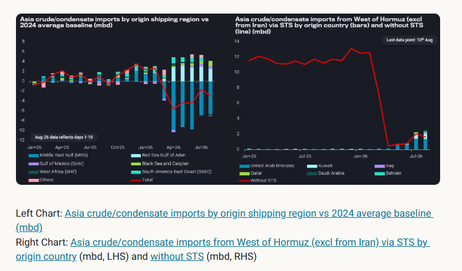
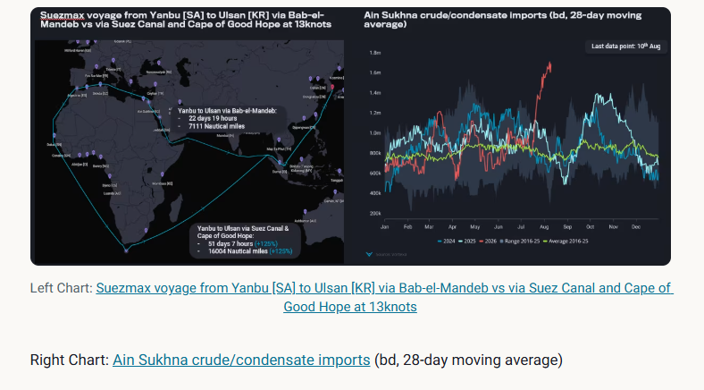
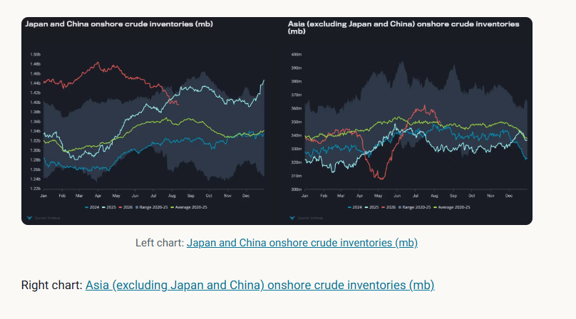

# Asia crude imports at an inflection point

**Date:** August 17, 2026  
**Publisher:** Breakwave Advisors | **Category:** Market Insights  
**Original URL:** [https://www.breakwaveadvisors.com/insights/2026/8/17/asia-crude-imports-at-an-inflection-point](https://www.breakwaveadvisors.com/insights/2026/8/17/asia-crude-imports-at-an-inflection-point)  

---

Asia crude imports at an inflection point, as Red Sea disruption and Gulf supply risk drive stock draws and Atlantic Basin buying.

*By*[*Xavier Tang*](https://www.linkedin.com/in/xavier-tang/)

Since the start of the US-Iran conflict, Asian countries have suffered from a historic oil supply shock, as the bulk of their seaborne crude/condensate supplies originate from the Middle East Gulf. In 2025,[Asia imported 15 mbd of crude/condensate from the Middle East Gulf](https://analytics.vortexa.com/Flows?dateRange=2016-01-01T00%3A00%3A00.000Z__2026-08-10T23%3A59%3A59.999Z&filtersEnabled=%5B%22p%22%2C%22o%22%2C%22d%22%2C%22d_r%22%2C%22v%22%2C%22intra_d%22%2C%22sts_o%22%2C%22c_o%22%2C%22hd%22%2C%22w%22%2C%22sts%22%5D&frequency=year&geoBreakdownDestinationGlobal=region&metric=bpd&movementEvent=unloading_start&page=Flows&products=%5B%2254af755a090118dcf9b0724c9a4e9f14745c26165385ffa7f1445bc768f06f11%22%5D&tabId=d96a9348-3daf-472a-85c0-5be7ba654347&timeSeriesBaselineEnd=2024-12-31T23%3A59%3A59.999Z&timeSeriesBaselineStart=2024-01-01T00%3A00%3A00.000Z&timeSeriesProperty=origin_shipping_region_v2&to=%5B%22e6955a2c59dc90833986fe0894cf6718dddaa7816bb51bc955cdd3eb4470e554%22%5D&tsAnalysisTotalToggle=1&tsSeasonalMovingAvg=1&tsSeasonalMovingAvgWindow=28d&v=3), representing 60% of total seaborne crude/condensate imports.

[Asian countries began sourcing alternative barrels from the Atlantic Basin](https://analytics.vortexa.com/Flows?dateRange=2016-01-01T00%3A00%3A00.000Z__2026-08-10T23%3A59%3A59.999Z&filtersEnabled=%5B%22p%22%2C%22o%22%2C%22d%22%2C%22d_r%22%2C%22v%22%2C%22intra_d%22%2C%22sts_o%22%2C%22c_o%22%2C%22hd%22%2C%22w%22%2C%22sts%22%5D&from=%5B%2267be333ea46a3cd312e207b05e2c5c4502a9353e39ec81642a93e3b23cc3c10a%22%5D&geoBreakdownDestinationGlobal=region&metric=bpd&movementEvent=unloading_start&page=Flows&products=%5B%2254af755a090118dcf9b0724c9a4e9f14745c26165385ffa7f1445bc768f06f11%22%5D&tabId=d96a9348-3daf-472a-85c0-5be7ba654347&timeSeriesBaselineEnd=2024-12-31T23%3A59%3A59.999Z&timeSeriesBaselineStart=2024-01-01T00%3A00%3A00.000Z&timeSeriesProperty=origin_shipping_region_v2&to=%5B%22e6955a2c59dc90833986fe0894cf6718dddaa7816bb51bc955cdd3eb4470e554%22%5D&tsAnalysisTotalToggle=1&tsSeasonalMovingAvg=1&tsSeasonalMovingAvgWindow=28d&v=3)to offset the supply shortage, with volumes hitting a record high of 9.3mbd in June before tapering off slightly. Part of the shortfall was also covered by Asian countries absorbing Russian and Iranian crude on water during the waiver period, though there seem to be limited changes in buying activities post-waiver.

In July and early August,[Asia crude/condensate imports on a 28-day moving average](https://analytics.vortexa.com/Flows?dateRange=2025-01-01T00%3A00%3A00.000Z__2026-08-10T23%3A59%3A59.999Z&filtersEnabled=%5B%22p%22%2C%22o%22%2C%22d%22%2C%22d_r%22%2C%22v%22%2C%22intra_d%22%2C%22sts_o%22%2C%22c_o%22%2C%22hd%22%2C%22w%22%2C%22sts%22%5D&frequency=day&geoBreakdownDestinationGlobal=region&metric=bpd&movementEvent=unloading_start&page=Flows&products=%5B%2254af755a090118dcf9b0724c9a4e9f14745c26165385ffa7f1445bc768f06f11%22%5D&tabId=d96a9348-3daf-472a-85c0-5be7ba654347&timeSeriesBaselineEnd=2024-12-31T23%3A59%3A59.999Z&timeSeriesBaselineStart=2024-01-01T00%3A00%3A00.000Z&timeSeriesChartView=seasonal&timeSeriesProperty=origin_shipping_region_v2&to=%5B%22e6955a2c59dc90833986fe0894cf6718dddaa7816bb51bc955cdd3eb4470e554%22%5D&tsAnalysisTotalToggle=1&tsSeasonalMovingAvg=1&tsSeasonalMovingAvgWindow=28d&v=3)rebounded sharply, largely due to increased imports from the Middle East Gulf region. Middle Eastern countries used STSes outside the Strait of Hormuz to facilitate Asian oil purchases, as vessel owners/operators are unwilling to take the risk of transiting the waterway. ([Read more here](https://analytics.vortexa.com/InsightsHubPage?articleId=6IUxhWHUBkrc543djzrajw&articleType=article&authorFilters=%5B%222BkhsIjpO7gn0gLSvGNVDI%22%5D&categoryFilters=%5B%22article%22%5D&page=InsightsHubPage&searchTerm=&tabId=184bc451-c0a7-4065-a23c-b533b8459744)). In fact, Asia crude/condensate imports via STSes from inside the Strait of Hormuz surpassed those without STSes since June, continuing to rise to record highs (see chart below).

[Asia mainstream crude/condensate imports via STSes from inside the Strait of Hormuz](https://analytics.vortexa.com/Flows?dateRange=2016-01-01T00%3A00%3A00.000Z__2026-08-10T23%3A59%3A59.999Z&filtersEnabled=%5B%22p%22%2C%22o%22%2C%22d%22%2C%22d_r%22%2C%22v%22%2C%22intra_d%22%2C%22sts_o%22%2C%22c_o%22%2C%22hd%22%2C%22w%22%2C%22sts%22%5D&from=%5B%220cbe50bd8391492dbd1c968b9badf1d48b0492df670e4807965668f08cc68b8d%22%5D&fromExcluded=%5B%22d308ddc557e774187ad6c7da81b39db990def9a39e6c88e79cb163b6bdd6e8e5%22%5D&geoBreakdownDestinationGlobal=region&metric=bpd&movementEvent=unloading_start&page=Flows&products=%5B%2254af755a090118dcf9b0724c9a4e9f14745c26165385ffa7f1445bc768f06f11%22%5D&shipToShipOnlyXFilter=1&tabId=d96a9348-3daf-472a-85c0-5be7ba654347&timeSeriesBaselineEnd=2024-12-31T23%3A59%3A59.999Z&timeSeriesBaselineStart=2024-01-01T00%3A00%3A00.000Z&timeSeriesProperty=origin_country&to=%5B%22e6955a2c59dc90833986fe0894cf6718dddaa7816bb51bc955cdd3eb4470e554%22%5D&tsAnalysisTotalToggle=1&tsSeasonalMovingAvg=1&tsSeasonalMovingAvgWindow=28d&v=3)hit a record high of 2.3mbd in July, accounting for 53% of total imports from inside the chokepoint. The rise in STS activities also reflects a new normal, whereby Middle Eastern countries are increasingly using shuttle tankers to transfer crude to end buyers and taking on the transit risk themselves. However,[crude/condensate transits at the Strait of Hormuz](https://analytics.vortexa.com/Flows?dateRange=2026-01-01T00%3A00%3A00.000Z__2026-08-10T23%3A59%3A59.999Z&filtersEnabled=%5B%22p%22%2C%22o%22%2C%22d%22%2C%22d_r%22%2C%22v%22%2C%22intra_d%22%2C%22sts_o%22%2C%22c_o%22%2C%22hd%22%2C%22w%22%2C%22sts%22%5D&frequency=week&from=%5B%220cbe50bd8391492dbd1c968b9badf1d48b0492df670e4807965668f08cc68b8d%22%5D&fromExcluded=%5B%22d308ddc557e774187ad6c7da81b39db990def9a39e6c88e79cb163b6bdd6e8e5%22%5D&geoBreakdownDestinationGlobal=region&metric=bpd&movementEvent=waypoint_start&page=Flows&products=%5B%2254af755a090118dcf9b0724c9a4e9f14745c26165385ffa7f1445bc768f06f11%22%5D&tabId=d96a9348-3daf-472a-85c0-5be7ba654347&timeSeriesBaselineEnd=2024-12-31T23%3A59%3A59.999Z&timeSeriesBaselineStart=2024-01-01T00%3A00%3A00.000Z&timeSeriesProperty=origin_country&tsAnalysisTotalToggle=1&tsSeasonalMovingAvg=1&tsSeasonalMovingAvgWindow=28d&v=3&waypoint=%5B%22331fd90b8f038b8b941ee70b066f605937451c9446dff73f1e69b4c30346c2d0%22%5D)have remained lacklustre over the past few weeks compared with the peak levels seen in June, reflecting ongoing uncertainty on the road to supply recovery.

> **Figure 1: Στιγμιότυπο Οθόνης 2026 08 17 104638**  
> **Interactive Data & Source:** [Analytics Vortexa](https://analytics.vortexa.com/Flows?dateRange=2025-01-01T00%3A00%3A00.000Z__2026-08-10T23%3A59%3A59.999Z&filtersEnabled=%5B%22p%22%2C%22o%22%2C%22d%22%2C%22d_r%22%2C%22v%22%2C%22intra_d%22%2C%22sts_o%22%2C%22c_o%22%2C%22hd%22%2C%22w%22%2C%22sts%22%5D&fromExcluded=%5B%220427e0f9d52b38c1a98b68c59b8fd80cb1c508e44882e96611e48ef5b140d927%22%5D&geoBreakdownDestinationGlobal=region&metric=bpd&movementEvent=unloading_start&page=Flows&products=%5B%2254af755a090118dcf9b0724c9a4e9f14745c26165385ffa7f1445bc768f06f11%22%5D&tabId=d96a9348-3daf-472a-85c0-5be7ba654347&timeSeriesBaselineEnd=2024-12-31T23%3A59%3A59.999Z&timeSeriesBaselineStart=2024-01-01T00%3A00%3A00.000Z&timeSeriesProperty=origin_shipping_region_v2&to=%5B%22e6955a2c59dc90833986fe0894cf6718dddaa7816bb51bc955cdd3eb4470e554%22%5D&tsAnalysisTotalToggle=1&tsSeasonalMovingAvg=1&tsSeasonalMovingAvgWindow=28d&v=3) | [Local Asset](file:///C:/Users/Dell/Github/Shipping/corpus/03-breakwave/insights/2026/assets/2026-08-17_asia-crude-imports-at-an-inflection-point_img_cea3cf84ceb9ceb3cebcceb9cf8ccf84cf85_288c66600a26.png)

## Another Key Chokepoint Emerges

Since March, Asia crude/condensate imports from the Red Sea Gulf have become a key alternative source after Saudi Arabia ramped up exports via its Red Sea ports.[Asia crude/condensate imports from the Red Sea Gulf of Aden amounted to 3.1mbd in July](https://analytics.vortexa.com/Flows?dateRange=2025-01-01T00%3A00%3A00.000Z__2026-08-10T23%3A59%3A59.999Z&filtersEnabled=%5B%22p%22%2C%22o%22%2C%22d%22%2C%22d_r%22%2C%22v%22%2C%22intra_d%22%2C%22sts_o%22%2C%22c_o%22%2C%22hd%22%2C%22w%22%2C%22sts%22%5D&fromExcluded=%5B%220427e0f9d52b38c1a98b68c59b8fd80cb1c508e44882e96611e48ef5b140d927%22%5D&geoBreakdownDestinationGlobal=region&metric=bpd&movementEvent=unloading_start&page=Flows&products=%5B%2254af755a090118dcf9b0724c9a4e9f14745c26165385ffa7f1445bc768f06f11%22%5D&tabId=d96a9348-3daf-472a-85c0-5be7ba654347&timeSeriesBaselineEnd=2024-12-31T23%3A59%3A59.999Z&timeSeriesBaselineStart=2024-01-01T00%3A00%3A00.000Z&timeSeriesProperty=origin_shipping_region_v2&to=%5B%22e6955a2c59dc90833986fe0894cf6718dddaa7816bb51bc955cdd3eb4470e554%22%5D&tsAnalysisTotalToggle=1&tsSeasonalMovingAvg=1&tsSeasonalMovingAvgWindow=28d&v=3), or 21% of seaborne crude/condensate imports, excluding those from the Middle East Gulf[GM1] . With reduced medium-sour availability from inside the Strait of Hormuz, these highly sought-after medium-sour barrels from the Red Sea Gulf are now in the spotlight as renewed attacks at the Bab-el-Mandeb threaten to disrupt vessel transits.

According to Vortexa’s voyage calculator,[a typical Suezmax voyage from Yanbu, Saudi Arabia, to Ulsan, South Korea](https://tinyurl.com/3c2num72), takes about 22-23 days at 13 knots, while[the same voyage rerouted via the Suez Canal and the Cape of Good Hope](https://tinyurl.com/tnwhye6c)takes approximately 51-52 days at the same speed, lengthening the voyage by a month (see chart below). Some vessels which were initially heading to Yanbu to load crude have now diverted towards the Atlantic Basin, potentially tightening vessel availability to lift cargoes out of the Red Sea ([Read our Freight report here](https://analytics.vortexa.com/InsightsHubPage?articleId=wr-0ca528bd042621e2fb3147cda4fd6934bf3c5b9c&articleType=report&authorFilters=%5B%222BkhsIjpO7gn0gLSvGNVDI%22%5D&categoryFilters=%5B%22report%22%5D&page=InsightsHubPage&searchTerm=&tabId=184bc451-c0a7-4065-a23c-b533b8459744)). The reduced vessel availability in the Red Sea Gulf could have affected[crude/condensate liftings in the region](https://analytics.vortexa.com/Flows?dateRange=2024-01-01T00%3A00%3A00.000Z__2026-08-10T23%3A59%3A59.999Z&filtersEnabled=%5B%22p%22%2C%22o%22%2C%22d%22%2C%22d_r%22%2C%22v%22%2C%22intra_d%22%2C%22sts_o%22%2C%22c_o%22%2C%22hd%22%2C%22w%22%2C%22sts%22%5D&frequency=day&from=%5B%2281378c3b71d71c5dab1d5f9d8fc46698a215812961a08b7be1593a4ada3bab8f%22%5D&geoBreakdownDestinationGlobal=region&intraMovementDropdown=all&metric=bpd&page=Flows&products=%5B%2254af755a090118dcf9b0724c9a4e9f14745c26165385ffa7f1445bc768f06f11%22%5D&tabId=d96a9348-3daf-472a-85c0-5be7ba654347&timeSeriesBaselineEnd=2024-12-31T23%3A59%3A59.999Z&timeSeriesBaselineStart=2024-01-01T00%3A00%3A00.000Z&timeSeriesChartView=seasonal&timeSeriesProperty=waypoint_selected&tsAnalysisTotalToggle=1&tsSeasonalMovingAvg=1&tsSeasonalMovingAvgWindow=28d&v=3), causing a recent decline in the 28-day moving average volumes from 4.7-4.9mbd in late July to 4.1-4.3mbd in early August, though it remains to be seen whether the trend will continue.

There are three outlets [GM2] [XT3] for Red Sea Gulf exports to flow through: the Suez Canal, Bab el-Mandeb, and the SUMED pipeline. With Saudi Arabia's oil flows via the Bab-el-Mandeb facing heightened risks, vessels have diverted northwards towards the Suez Canal and the SUMED pipeline through the Ain Sukhna port.[Red Sea Gulf crude/condensate transits via the Suez Canal on a 28-day moving average](https://analytics.vortexa.com/Flows?dateRange=2023-01-01T00%3A00%3A00.000Z__2026-08-10T23%3A59%3A59.999Z&filtersEnabled=%5B%22p%22%2C%22o%22%2C%22d%22%2C%22d_r%22%2C%22v%22%2C%22intra_d%22%2C%22sts_o%22%2C%22c_o%22%2C%22hd%22%2C%22w%22%2C%22sts%22%5D&frequency=day&from=%5B%2281378c3b71d71c5dab1d5f9d8fc46698a215812961a08b7be1593a4ada3bab8f%22%5D&geoBreakdownDestinationGlobal=region&intraMovementDropdown=all&metric=bpd&movementEvent=waypoint_start&page=Flows&products=%5B%2254af755a090118dcf9b0724c9a4e9f14745c26165385ffa7f1445bc768f06f11%22%5D&tabId=a7d7ba58-0dde-499b-af43-2e4adb52e931&timeSeriesBaselineEnd=2024-12-31T23%3A59%3A59.999Z&timeSeriesBaselineStart=2024-01-01T00%3A00%3A00.000Z&timeSeriesChartView=seasonal&timeSeriesProperty=waypoint_selected×eriesMovingAvg=28d&tsAnalysisTotalToggle=1&tsSeasonalMovingAvg=1&tsSeasonalMovingAvgWindow=28d&v=3&waypoint=%5B%22f5634597081459985237dc54fcbe518d4b0a4f4af618b7719abda334b95538d1%22%5D)hit multi-year highs at 380kb[GM4] d, while[Ain Sukhna crude/condensate imports on a 28-day moving average](https://analytics.vortexa.com/Flows?dateRange=2024-01-01T00%3A00%3A00.000Z__2026-08-10T23%3A59%3A59.999Z&filtersEnabled=%5B%22p%22%2C%22o%22%2C%22d%22%2C%22d_r%22%2C%22v%22%2C%22intra_d%22%2C%22sts_o%22%2C%22c_o%22%2C%22hd%22%2C%22w%22%2C%22sts%22%5D&frequency=day&geoBreakdownDestinationGlobal=region&metric=bpd&movementEvent=unloading_start&page=Flows&products=%5B%2254af755a090118dcf9b0724c9a4e9f14745c26165385ffa7f1445bc768f06f11%22%5D&tabId=d96a9348-3daf-472a-85c0-5be7ba654347&timeSeriesBaselineEnd=2024-12-31T23%3A59%3A59.999Z&timeSeriesBaselineStart=2024-01-01T00%3A00%3A00.000Z&timeSeriesChartView=seasonal&timeSeriesProperty=waypoint_selected&to=%5B%229ab4381aab3268d41c92fe179c819cb9e01e5b4fc6c22b231124c2a83e59ff98%22%5D&tsAnalysisTotalToggle=1&tsSeasonalMovingAvg=1&tsSeasonalMovingAvgWindow=28d&v=3)hit record highs of 1.6mbd, reflecting the increasing diversion of the Red Sea Gulf cargoes. The utilisation rate of the SUMED pipeline has likely hit record highs, as crude exports at Sidi Kerir and crude imports at Ain Sukhna reflect record outflows and inflows.

> **Figure 2: Στιγμιότυπο Οθόνης 2026 08 17 104646**  
> **Interactive Data & Source:** [Analytics Vortexa](https://analytics.vortexa.com/Flows?dateRange=2025-01-01T00%3A00%3A00.000Z__2026-08-10T23%3A59%3A59.999Z&filtersEnabled=%5B%22p%22%2C%22o%22%2C%22d%22%2C%22d_r%22%2C%22v%22%2C%22intra_d%22%2C%22sts_o%22%2C%22c_o%22%2C%22hd%22%2C%22w%22%2C%22sts%22%5D&frequency=day&from=%5B%2281378c3b71d71c5dab1d5f9d8fc46698a215812961a08b7be1593a4ada3bab8f%22%5D&geoBreakdownDestinationGlobal=region&intraMovementDropdown=all&metric=bpd&movementEvent=unloading_start&page=Flows&products=%5B%2254af755a090118dcf9b0724c9a4e9f14745c26165385ffa7f1445bc768f06f11%22%5D&tabId=d96a9348-3daf-472a-85c0-5be7ba654347&timeSeriesBaselineEnd=2024-12-31T23%3A59%3A59.999Z&timeSeriesBaselineStart=2024-01-01T00%3A00%3A00.000Z&timeSeriesChartView=seasonal&timeSeriesProperty=destination_shipping_region_v2&to=%5B%22e6955a2c59dc90833986fe0894cf6718dddaa7816bb51bc955cdd3eb4470e554%22%5D&tsAnalysisTotalToggle=1&tsSeasonalMovingAvg=1&tsSeasonalMovingAvgWindow=28d&v=3) | [Local Asset](file:///C:/Users/Dell/Github/Shipping/corpus/03-breakwave/insights/2026/assets/2026-08-17_asia-crude-imports-at-an-inflection-point_img_cea3cf84ceb9ceb3cebcceb9cf8ccf84cf85_af90320f3849.png)

Knock-on effect on Asia purchases and onshore inventories

[Asia crude imports from the Red Sea Gulf](https://analytics.vortexa.com/Flows?dateRange=2025-01-01T00%3A00%3A00.000Z__2026-08-10T23%3A59%3A59.999Z&filtersEnabled=%5B%22p%22%2C%22o%22%2C%22d%22%2C%22d_r%22%2C%22v%22%2C%22intra_d%22%2C%22sts_o%22%2C%22c_o%22%2C%22hd%22%2C%22w%22%2C%22sts%22%5D&frequency=day&from=%5B%2281378c3b71d71c5dab1d5f9d8fc46698a215812961a08b7be1593a4ada3bab8f%22%5D&geoBreakdownDestinationGlobal=region&intraMovementDropdown=all&metric=bpd&movementEvent=unloading_start&page=Flows&products=%5B%2254af755a090118dcf9b0724c9a4e9f14745c26165385ffa7f1445bc768f06f11%22%5D&tabId=d96a9348-3daf-472a-85c0-5be7ba654347&timeSeriesBaselineEnd=2024-12-31T23%3A59%3A59.999Z&timeSeriesBaselineStart=2024-01-01T00%3A00%3A00.000Z&timeSeriesChartView=seasonal&timeSeriesProperty=destination_shipping_region_v2&to=%5B%22e6955a2c59dc90833986fe0894cf6718dddaa7816bb51bc955cdd3eb4470e554%22%5D&tsAnalysisTotalToggle=1&tsSeasonalMovingAvg=1&tsSeasonalMovingAvgWindow=28d&v=3)are set to slow over the next few weeks, with a knock-on effect on Asia crude deliveries due to the additional one-month duration for imports from the Red Sea. Asian refiners will likely seek replacement barrels from the Atlantic basin to cover the shortfall. Although[Atlantic Basin crude/condensate exports to Asia](https://analytics.vortexa.com/Flows?dateRange=2024-01-01T00%3A00%3A00.000Z__2026-08-10T23%3A59%3A59.999Z&filtersEnabled=%5B%22p%22%2C%22o%22%2C%22d%22%2C%22d_r%22%2C%22v%22%2C%22intra_d%22%2C%22sts_o%22%2C%22c_o%22%2C%22hd%22%2C%22w%22%2C%22sts%22%5D&frequency=day&from=%5B%2267be333ea46a3cd312e207b05e2c5c4502a9353e39ec81642a93e3b23cc3c10a%22%5D&geoBreakdownDestinationGlobal=region&metric=bpd&page=Flows&products=%5B%2254af755a090118dcf9b0724c9a4e9f14745c26165385ffa7f1445bc768f06f11%22%5D&tabId=d96a9348-3daf-472a-85c0-5be7ba654347&timeSeriesBaselineEnd=2024-12-31T23%3A59%3A59.999Z&timeSeriesBaselineStart=2024-01-01T00%3A00%3A00.000Z&timeSeriesChartView=seasonal&timeSeriesProperty=waypoint_selected&to=%5B%22e6955a2c59dc90833986fe0894cf6718dddaa7816bb51bc955cdd3eb4470e554%22%5D&tsAnalysisTotalToggle=1&tsSeasonalMovingAvg=1&tsSeasonalMovingAvgWindow=28d&v=3)have fallen back to the seasonal average after hitting seasonal highs between early April and late July, these volumes could rebound due to recent replacement buying activity, which will likely be reflected in our export data in about 1-2 months.

With a crude supply deficit looming – at least in the short term – some Asian countries have already begun tapping their onshore crude inventories. Japan and China, the top two Asian countries with the largest onshore crude stock reserves, have been[GM5] [GM6] drawing on their crude stocks since early April, reaching a total stock draw of 90mb as of 12th August, compared with peak levels seen in late March. This is in stark contrast to the rest of Asia, where stock builds were seen since early May, peaking at 363 mb on 16th July before falling again in late July and early August.

The stock-change trend in Asia seems to be converging, with stock draws as the key short-term solution to offset shortfalls. China, the country with the largest oil inventory reserves, could lead Asia’s stock draws in the months ahead as[its crude/condensate imports have remained below the 10-year seasonal average](https://analytics.vortexa.com/Flows?dateRange=2024-01-01T00%3A00%3A00.000Z__2026-08-10T23%3A59%3A59.999Z&filtersEnabled=%5B%22p%22%2C%22o%22%2C%22d%22%2C%22d_r%22%2C%22v%22%2C%22intra_d%22%2C%22sts_o%22%2C%22c_o%22%2C%22hd%22%2C%22w%22%2C%22sts%22%5D&frequency=day&geoBreakdownDestinationGlobal=region&metric=bpd&movementEvent=unloading_start&page=Flows&products=%5B%2254af755a090118dcf9b0724c9a4e9f14745c26165385ffa7f1445bc768f06f11%22%5D&tabId=d96a9348-3daf-472a-85c0-5be7ba654347&timeSeriesBaselineEnabled=1&timeSeriesBaselineEnd=2024-12-31T23%3A59%3A59.999Z&timeSeriesBaselineStart=2024-01-01T00%3A00%3A00.000Z&timeSeriesChartView=seasonal&timeSeriesProperty=origin_shipping_region_v2&to=%5B%22934c47f36c16a58d68ef5e007e62a23f5f036ee3f3d1f5f85a48c572b90ad8b2%22%5D&tsSeasonalMovingAvg=1&tsSeasonalMovingAvgWindow=28d&v=3)since mid-April. Conversely,[the rest of Asia (excluding China) has seen a sharp rebound in crude/condensate imports](https://analytics.vortexa.com/Flows?dateRange=2024-01-01T00%3A00%3A00.000Z__2026-08-10T23%3A59%3A59.999Z&filtersEnabled=%5B%22p%22%2C%22o%22%2C%22d%22%2C%22d_r%22%2C%22v%22%2C%22intra_d%22%2C%22sts_o%22%2C%22c_o%22%2C%22hd%22%2C%22w%22%2C%22sts%22%5D&frequency=day&geoBreakdownDestinationGlobal=region&metric=bpd&movementEvent=unloading_start&page=Flows&products=%5B%2254af755a090118dcf9b0724c9a4e9f14745c26165385ffa7f1445bc768f06f11%22%5D&tabId=d96a9348-3daf-472a-85c0-5be7ba654347&timeSeriesBaselineEnabled=1&timeSeriesBaselineEnd=2024-12-31T23%3A59%3A59.999Z&timeSeriesBaselineStart=2024-01-01T00%3A00%3A00.000Z&timeSeriesChartView=seasonal&timeSeriesProperty=origin_shipping_region_v2&to=%5B%22e6955a2c59dc90833986fe0894cf6718dddaa7816bb51bc955cdd3eb4470e554%22%5D&toExcluded=%5B%22934c47f36c16a58d68ef5e007e62a23f5f036ee3f3d1f5f85a48c572b90ad8b2%22%5D&tsSeasonalMovingAvg=1&tsSeasonalMovingAvgWindow=28d&v=3), potentially softening short-term stock draws. However, countries may need to choose between long-term energy security and allowing refineries to run at high rates to capitalise on strong export margins. It is a concerning sign that post-war record-high Asian crude imports in July have failed to stabilise stock levels.

> **Figure 3: Στιγμιότυπο Οθόνης 2026 08 17 104655**  
> **Interactive Data & Source:** [Vortexa](https://www.vortexa.com//oil-gas-data-traders-analysts-data-scientists?gclid=Cj0KCQjw8_qRBhCXARIsAE2AtRZKOvMnbilZ_6_91d7huSFFy71pWLrnPwGwOHVzXsmsG-1a1mZnQw8aAt89EALw_wcB&hsa_acc=1782073842&hsa_ad=548425387665&hsa_cam=14746637662&hsa_grp=125038601902&hsa_kw=&hsa_mt=&hsa_net=adwords&hsa_src=g&hsa_tgt=dsa-1431852288425&hsa_ver=3&utm_campaign=%5BCD%5D%20-%20DSA%20-%20EMEA&utm_medium=cpc&utm_medium=ppc&utm_source=google&utm_source=adwords&utm_term=) | [Local Asset](file:///C:/Users/Dell/Github/Shipping/corpus/03-breakwave/insights/2026/assets/2026-08-17_asia-crude-imports-at-an-inflection-point_img_cea3cf84ceb9ceb3cebcceb9cf8ccf84cf85_252c0ffd798e.png)

Data Source:[Vortexa](https://www.vortexa.com//oil-gas-data-traders-analysts-data-scientists?gclid=Cj0KCQjw8_qRBhCXARIsAE2AtRZKOvMnbilZ_6_91d7huSFFy71pWLrnPwGwOHVzXsmsG-1a1mZnQw8aAt89EALw_wcB&hsa_acc=1782073842&hsa_ad=548425387665&hsa_cam=14746637662&hsa_grp=125038601902&hsa_kw=&hsa_mt=&hsa_net=adwords&hsa_src=g&hsa_tgt=dsa-1431852288425&hsa_ver=3&utm_campaign=%5BCD%5D%20-%20DSA%20-%20EMEA&utm_medium=cpc&utm_medium=ppc&utm_source=google&utm_source=adwords&utm_term=)

---

**Tags:** Crude, Markets, Tankers  
