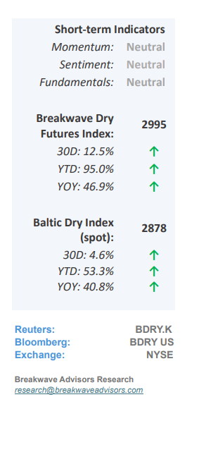
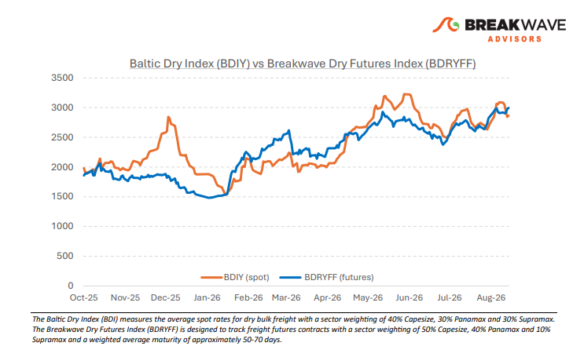
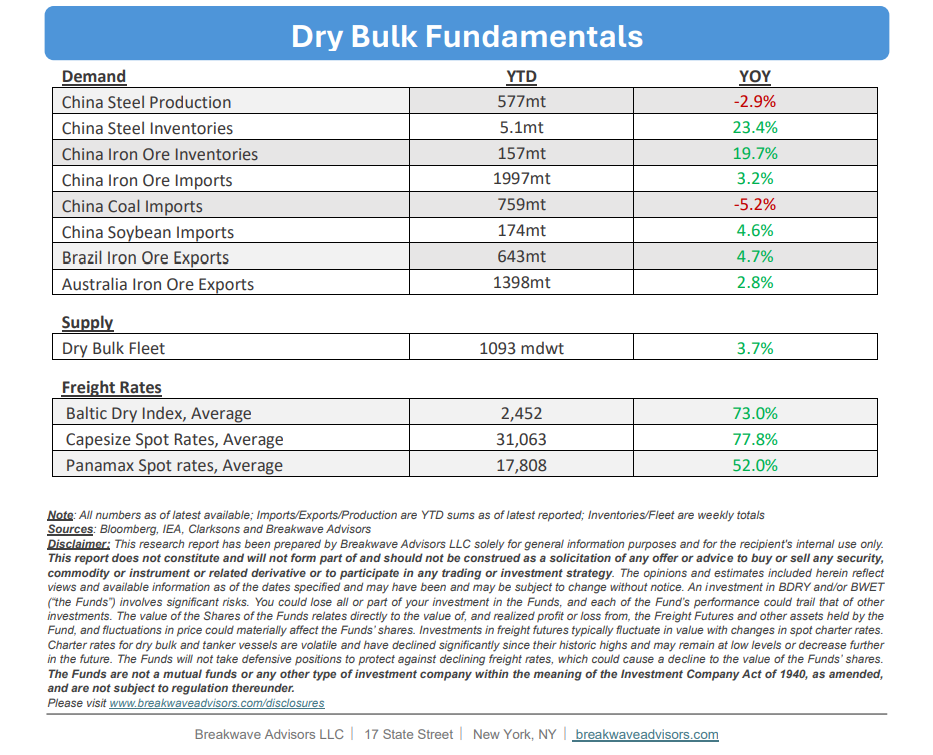

# Breakwave Bi-Weekly Dry Bulk Report - August 18, 2026

**Date:** August 18, 2026  
**Publisher:** Breakwave Advisors | **Category:** Market Insights  
**Original URL:** [https://www.breakwaveadvisors.com/insights/8182026db-report2026488](https://www.breakwaveadvisors.com/insights/8182026db-report2026488)  

---

•**Steady As She Goes**– Realized volatility across the dry bulk sector has collapsed to at least**seven-year lows**as elevated baseline prices have severely compressed percentage fluctuations for the underlying indices, a trend further exacerbated by the typical August seasonal lull. Despite broader**macroeconomic uncertainty**and persistent economic headwinds in China, shipowners remain content to maintain current operations while securing some of the highest absolute dayrates witnessed in decades. This resilient pricing environment is mainly driven by global route disruptions stemming from major geopolitical conflicts, which continue to support all shipping segments regardless of the specific localized constraints across the Black, Arabian, Red, and Baltic Seas.**Absent a resolution**to these structural geopolitical parameters, a meaningful downward**correction**in rates appears**unlikely**, a sentiment further reinforced by a characteristically**flat freight futures**curve across most shipping asset classes. Consequently, we anticipate an uneventful conclusion to the summer trading period, with expectations for renewed market volatility and increased cargo flows as the industry transitions into the peak autumn and winter seasons.

> **Figure 1: Cea3cf84ceb9ceb3cebcceb9cf8ccf84cf85**  
> [Local Asset](file:///C:/Users/Dell/Github/Shipping/corpus/03-breakwave/insights/2026/assets/2026-08-18_8182026db-report2026488_img_cea3cf84ceb9ceb3cebcceb9cf8ccf84cf85_1a413cc539cd.png)

•**Atlantic Iron Ore Netback Falls Below $60/ton**– As iron ore prices drift lower due to high inventories, subdued steel demand, and macroeconomic headwinds in China,**rising freight rates**are significantly**reducing net-of-freight iron ore**pricing for Atlantic basin miners to an eight-year low. Concurrently, record-high diesel prices are inflating mining operational expenses, placing multi-directional pressure on corporate profit margins. While these compounding financial factors have not yet triggered an imminent slowdown in production volumes, the overall**urgency to maximize shipping throughput**has effectively**subsided**. Consequently, producers might be shifting their focus from aggressive volume growth toward rigorous cost-containment strategies and high-quality products. This shifting market dynamic suggests that operational discipline will remain the primary driver of regional performance until broader macroeconomic indicators point towards quantity growth.

•**Our Long-term View**– The last few years have been characterized by increased geopolitical uncertainty. Going forward, we expect such events to continue to affect global trade and have a meaningful impact on effective vessel supply. Combined with the potential for a multi-year cyclical rebound in China’s economic activity following the recent economic turmoil, dry bulk shipping should experience higher volatility on top of a secular tightness driven by stable bulk commodity demand and rather steady but elevated fleet growth.

> **Figure 2: Στιγμιότυπο Οθόνης 2026 08 17 224709**  
> [Local Asset](file:///C:/Users/Dell/Github/Shipping/corpus/03-breakwave/insights/2026/assets/2026-08-18_8182026db-report2026488_img_cea3cf84ceb9ceb3cebcceb9cf8ccf84cf85_7c9327f6c21e.png)

> **Figure 3: Στιγμιότυπο Οθόνης 2026 08 18 114801**  
> [Local Asset](file:///C:/Users/Dell/Github/Shipping/corpus/03-breakwave/insights/2026/assets/2026-08-18_8182026db-report2026488_img_cea3cf84ceb9ceb3cebcceb9cf8ccf84cf85_0b90e5e5f6c0.png)

### Subscribe:
