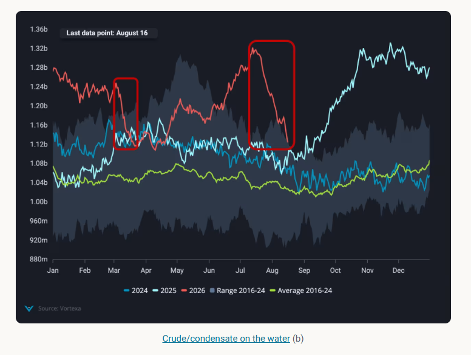
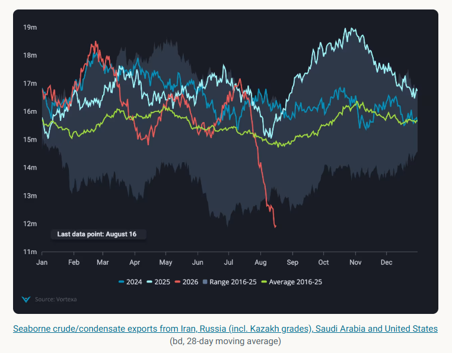
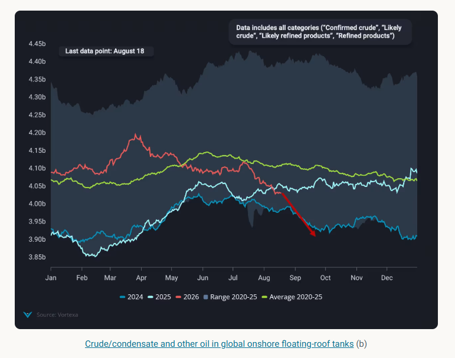

# Crude markets underpricing an impending supply tightness

**Date:** August 19, 2026  
**Publisher:** Breakwave Advisors | **Category:** Market Insights  
**Original URL:** [https://www.breakwaveadvisors.com/insights/2026/8/19/crude-markets-underpricing-an-impending-supply-tightness](https://www.breakwaveadvisors.com/insights/2026/8/19/crude-markets-underpricing-an-impending-supply-tightness)  

---

Global crude markets that looked well-supplied in July are now facing an impending supply tightness and the market is still underpricing shortfall

*By*[*Rohit Rathod*](https://www.linkedin.com/in/rathodrohit/)

For a brief window in mid-July, global crude markets looked well-supplied. After the US-Iran MoU was signed on June 17th, Hormuz transits picked up, Iran also managed to get barrels on the water, and Atlantic Basin exports hit record highs. Crude and condensates on water climbed above ~1.3 bn barrels by July 13th — matching the post-Covid, post-price-war peak of Q2 2020. It was, in hindsight, a false dawn.

Since that peak, Vortexa data shows a collapse in crude on the water of ~200mb in just four weeks — a draw rate of 7.1mbd. To put that in context: the equivalent draw in the four weeks after the Middle East war began in early March was 102mb. This most recent drawdown is 95% larger, and the market appears to have barely noticed. Summer trading lulls, seasonally lower price volatility, and the brief sense of comfort created by the July peak may have dulled the market's sensitivity to what the physical data is now pointing towards.

> **Figure 1: Στιγμιότυπο Οθόνης 2026 08 19 100904**  
> **Interactive Data & Source:** [Vortexa](https://www.vortexa.com//oil-gas-data-traders-analysts-data-scientists?gclid=Cj0KCQjw8_qRBhCXARIsAE2AtRZKOvMnbilZ_6_91d7huSFFy71pWLrnPwGwOHVzXsmsG-1a1mZnQw8aAt89EALw_wcB&hsa_acc=1782073842&hsa_ad=548425387665&hsa_cam=14746637662&hsa_grp=125038601902&hsa_kw=&hsa_mt=&hsa_net=adwords&hsa_src=g&hsa_tgt=dsa-1431852288425&hsa_ver=3&utm_campaign=%5BCD%5D%20-%20DSA%20-%20EMEA&utm_medium=cpc&utm_medium=ppc&utm_source=google&utm_source=adwords&utm_term=) | [Local Asset](file:///C:/Users/Dell/Github/Shipping/corpus/03-breakwave/insights/2026/assets/2026-08-19_crude-markets-underpricing-an-impending-supply-tightness_img_cea3cf84ceb9ceb3cebcceb9cf8ccf84cf85_8e38dd7ee0da.png)

## 5mbd of Supply Shortfall in a Month

The immediate driver of the drawdown is a simultaneous collapse in exports from four of the world's most significant crude exporters. Combined seaborne exports from Iran, Russia (including Kazakh transit grades), Saudi Arabia, and the United States fell to approximately 12mbd — a record low, and a 5mbd drop from just one month prior. Relative to the pre-war February peak, the four-country aggregate is down ~6.7mbd on a four-week moving average basis.

Iranian exports fell to near zero following the re-imposition of the US blockade outside the Strait of Hormuz after the MoU collapsed in mid-July. Saudi exports dropped as both Hormuz and Bab el-Mandeb escalated — with Houthi threats intensifying and vessel availability into the Red Sea port of Yanbu reportedly constrained. Russian and Kazakh export flows continue to suffer from recurring Ukrainian drone attacks on Black Sea shipping and pipeline infrastructure. And US exports eased as SPR releases tapered, peak domestic refinery runs cut into exportable surplus, and arbitrage economics temporarily closed the Atlantic-to-Asia window.

> **Figure 2: Στιγμιότυπο Οθόνης 2026 08 19 100914**  
> **Interactive Data & Source:** [Vortexa](https://www.vortexa.com//oil-gas-data-traders-analysts-data-scientists?gclid=Cj0KCQjw8_qRBhCXARIsAE2AtRZKOvMnbilZ_6_91d7huSFFy71pWLrnPwGwOHVzXsmsG-1a1mZnQw8aAt89EALw_wcB&hsa_acc=1782073842&hsa_ad=548425387665&hsa_cam=14746637662&hsa_grp=125038601902&hsa_kw=&hsa_mt=&hsa_net=adwords&hsa_src=g&hsa_tgt=dsa-1431852288425&hsa_ver=3&utm_campaign=%5BCD%5D%20-%20DSA%20-%20EMEA&utm_medium=cpc&utm_medium=ppc&utm_source=google&utm_source=adwords&utm_term=) | [Local Asset](file:///C:/Users/Dell/Github/Shipping/corpus/03-breakwave/insights/2026/assets/2026-08-19_crude-markets-underpricing-an-impending-supply-tightness_img_cea3cf84ceb9ceb3cebcceb9cf8ccf84cf85_6c06b3bbee55.png)

## Inventories Drawdown While Product Shortfall Keep Refinery Runs Strong

With supply contracting and refinery demand holding up, global onshore crude inventories are drawing at an accelerating pace. The four weeks to August 16th saw floating-roof tank stocks fall by ~80mb at a rate of 2.9mbd — approximately two thirds of those draws materialising in Asia. Global and Asian observed stocks are now showing a year-on-year deficit. Relative to the seasonal average, global inventories have drawn by ~200mb at 1.4mbd since their March peak.

> **Figure 3: Στιγμιότυπο Οθόνης 2026 08 19 100922**  
> **Interactive Data & Source:** [Vortexa](https://www.vortexa.com//oil-gas-data-traders-analysts-data-scientists?gclid=Cj0KCQjw8_qRBhCXARIsAE2AtRZKOvMnbilZ_6_91d7huSFFy71pWLrnPwGwOHVzXsmsG-1a1mZnQw8aAt89EALw_wcB&hsa_acc=1782073842&hsa_ad=548425387665&hsa_cam=14746637662&hsa_grp=125038601902&hsa_kw=&hsa_mt=&hsa_net=adwords&hsa_src=g&hsa_tgt=dsa-1431852288425&hsa_ver=3&utm_campaign=%5BCD%5D%20-%20DSA%20-%20EMEA&utm_medium=cpc&utm_medium=ppc&utm_source=google&utm_source=adwords&utm_term=) | [Local Asset](file:///C:/Users/Dell/Github/Shipping/corpus/03-breakwave/insights/2026/assets/2026-08-19_crude-markets-underpricing-an-impending-supply-tightness_img_cea3cf84ceb9ceb3cebcceb9cf8ccf84cf85_20e38399bd6d.png)

What makes this crude shortfall particularly acute is that the demand side of the equation offers no relief. Refinery margins globally are near record levels, driven largely by a severe and worsening diesel shortage. Middle East and Russian diesel and gasoil exports are down more than 50% year-on-year — falling from around 3.3mbd to just 1.6mbd in recent weeks. Russia has extended its diesel export ban through to at least the start of September. Red Sea product exports are also shrinking following the Jizan outage and broader conflict disruption.

The consequence is straightforward: refineries in the Atlantic Basin are running at or near record utilisation rates, and Asian runs are picking up. Neither region can afford to ease throughput while product inventories remain so depleted. This means crude demand for refining will remain elevated well beyond the typical end of the peak summer season — sustaining competition for an ever-shrinking pool of available barrels. China and India, in particular, are competing increasingly for the same Russian crude, a dynamic that will intensify as the autumn demand season approaches.

## The Market Is Behind the Curve and Underpricing

Crude prices, forward structure and — to a lesser extent — physical crude differentials appear to be significantly undervalued relative to what the physical data is revealing. A combined draw rate of ~9mbd across floating and onshore inventories is an extraordinary signal. The market's relatively muted price response likely reflects a summer liquidity discount, residual optimism about a diplomatic resolution, and a lag in translating global voyage-level physical data into price discovery.

As September approaches and the Atlantic Basin crude supply cliff hits Asian arrivals in full, the mismatch between physical market tightness and financial market pricing is likely to narrow — and not in a direction that will be comfortable for crude buyers.

Data Source:[Vortexa](https://www.vortexa.com//oil-gas-data-traders-analysts-data-scientists?gclid=Cj0KCQjw8_qRBhCXARIsAE2AtRZKOvMnbilZ_6_91d7huSFFy71pWLrnPwGwOHVzXsmsG-1a1mZnQw8aAt89EALw_wcB&hsa_acc=1782073842&hsa_ad=548425387665&hsa_cam=14746637662&hsa_grp=125038601902&hsa_kw=&hsa_mt=&hsa_net=adwords&hsa_src=g&hsa_tgt=dsa-1431852288425&hsa_ver=3&utm_campaign=%5BCD%5D%20-%20DSA%20-%20EMEA&utm_medium=cpc&utm_medium=ppc&utm_source=google&utm_source=adwords&utm_term=)

---

**Tags:** Crude, Tankers, Markets  
