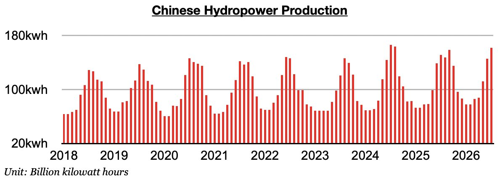
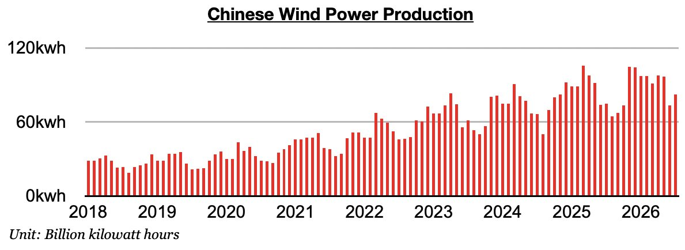
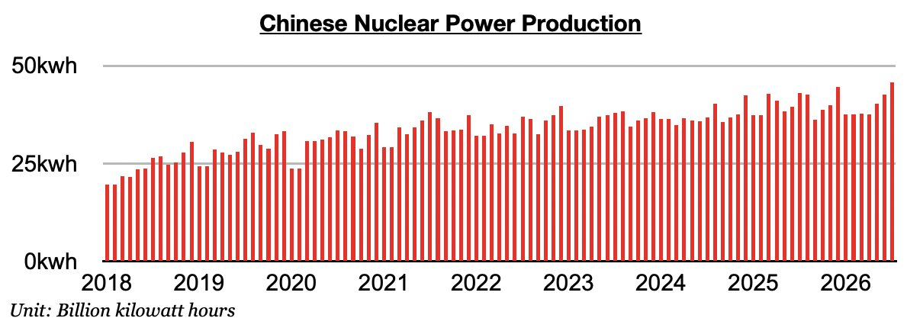
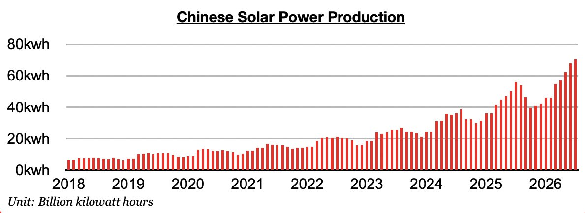

# Ongoing Strength in China's Renewables

**Date:** August 19, 2026  
**Publisher:** Breakwave Advisors | **Category:** Market Insights  
**Original URL:** [https://www.breakwaveadvisors.com/insights/2026/8/19/ongoing-strength-in-chinas-renewables](https://www.breakwaveadvisors.com/insights/2026/8/19/ongoing-strength-in-chinas-renewables)  

---

*By*[*Jeffrey Landsberg*](https://www.linkedin.com/in/jeffrey-landsberg-70ab957/)

As we discussed in Commodore Research's most recent Weekly China Report, Chinese electricity production set a record last month. Electricity production totaled a record 943.9 billion kilowatt hours, which is up year-on-year by 2%. Of note, though, is that thermal coal-derived electricity generation contracted year-on-year by 3%. Fortunately for the dry bulk market, domestic coal production contracted year-on-year by 10%. Significant is that China's hydropower production has continued to maintain solid year-on-year growth, and nuclear and solar power production have each set new records.

Hydropower production totaled 161.7 billion kilowatt hours. This is up month-on-month by 15.9 billion kilowatt hours (11%) and up year-on-year by 10.3 billion kilowatt hours (7%). Hydropower output has now increased year-on-year for eleven straight months.

> **Figure 1: Chart 1**  
> [Local Asset](file:///C:/Users/Dell/Github/Shipping/corpus/03-breakwave/insights/2026/assets/2026-08-19_ongoing-strength-in-chinas-renewables_img_chart1_11a5f57e6857.jpg)

Wind power output totaled 82 billion kilowatt hours. This is up month-on- month by 8.7 billion kilowatt hours (12%) and up year-on-year by 7.6 billion kilowatt hours (10%).

> **Figure 2: Chart 2**  
> [Local Asset](file:///C:/Users/Dell/Github/Shipping/corpus/03-breakwave/insights/2026/assets/2026-08-19_ongoing-strength-in-chinas-renewables_img_chart2_ea5cb8d3f852.jpg)

Nuclear power production totaled a record 45.8 billion kilowatt hours. This is up month-on-month by 3.1 billion kilowatt hours (7%) and up year-on-year by 2.8 billion kilowatt hours (7%).

> **Figure 3: Chart 3**  
> [Local Asset](file:///C:/Users/Dell/Github/Shipping/corpus/03-breakwave/insights/2026/assets/2026-08-19_ongoing-strength-in-chinas-renewables_img_chart3_7102feb01799.jpg)

Solar power production totaled a record 70.3 billion kilowatt hours. This is up month-on-month by 2.4 billion kilowatt hours (4%) and up year-on-year by 14.4 billion kilowatt hours (26%). Solar power production records have now been set in four straight months.

> **Figure 4: Chart 4**  
> [Local Asset](file:///C:/Users/Dell/Github/Shipping/corpus/03-breakwave/insights/2026/assets/2026-08-19_ongoing-strength-in-chinas-renewables_img_chart4_751d81c342b0.jpg)

---

**Tags:** China, Energy, Economy  
