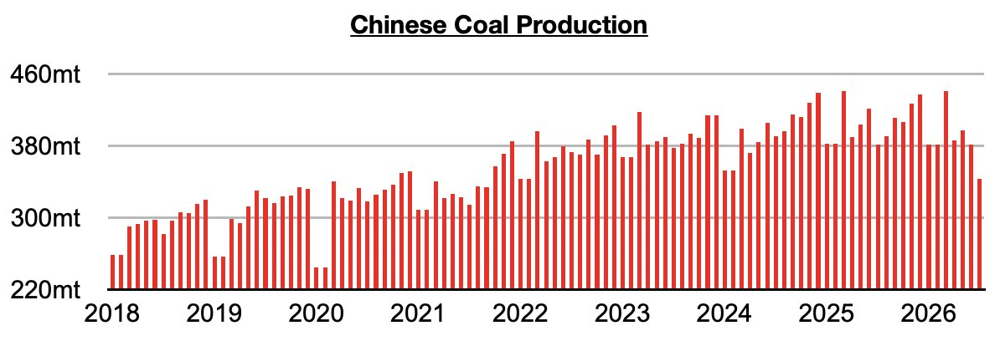
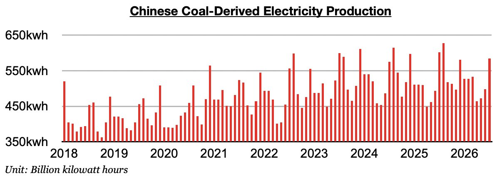

# China's Coal Production Hits Five-Year Low

**Date:** August 21, 2026  
**Publisher:** Breakwave Advisors | **Category:** Market Insights  
**Original URL:** [https://www.breakwaveadvisors.com/insights/2026/8/21/chinas-coal-production-hits-five-year-low](https://www.breakwaveadvisors.com/insights/2026/8/21/chinas-coal-production-hits-five-year-low)  

---

*By*[*Jeffrey Landsberg*](https://www.linkedin.com/in/jeffrey-landsberg-70ab957/)

As we discussed in Commodore Research's most recent Weekly China Report, China’s coal production in July totaled 343.2 million tons. This is down month-on-month by 37.7 million tons (-10%), down year-on-year by 37.8 million tons (-10%), and marks the lowest production since October 2021. Remaining significant is that the last time that there was any year-on-year growth was back in June 2025. Before this stretch, coal production had grown on a year-on-year basis for thirteen straight months.

> **Figure 1: Chart 1**  
> [Local Asset](file:///C:/Users/Dell/Github/Shipping/corpus/03-breakwave/insights/2026/assets/2026-08-21_chinas-coal-production-hits-five-year-low_img_chart1_82469ab6ddca.jpg)

Coal-derived electricity generation in July totaled 584.1 billion kilowatt hours. This is up month-on-month by 86.1 billion kilowatt hours (17%) but down year-on-year by 17.9 billion kilowatt hours (-3%). Very helpful for coal import demand and the dry bulk market is that China's coal-derived electricity generation has now fared better than domestic coal production for seven straight months.

> **Figure 2: Chart 2**  
> [Local Asset](file:///C:/Users/Dell/Github/Shipping/corpus/03-breakwave/insights/2026/assets/2026-08-21_chinas-coal-production-hits-five-year-low_img_chart2_fb2dab9bed22.jpg)

---

**Tags:** Coal, China, Commodities  
