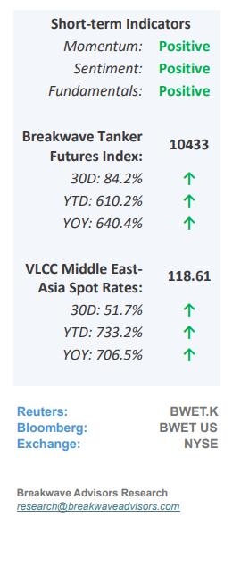
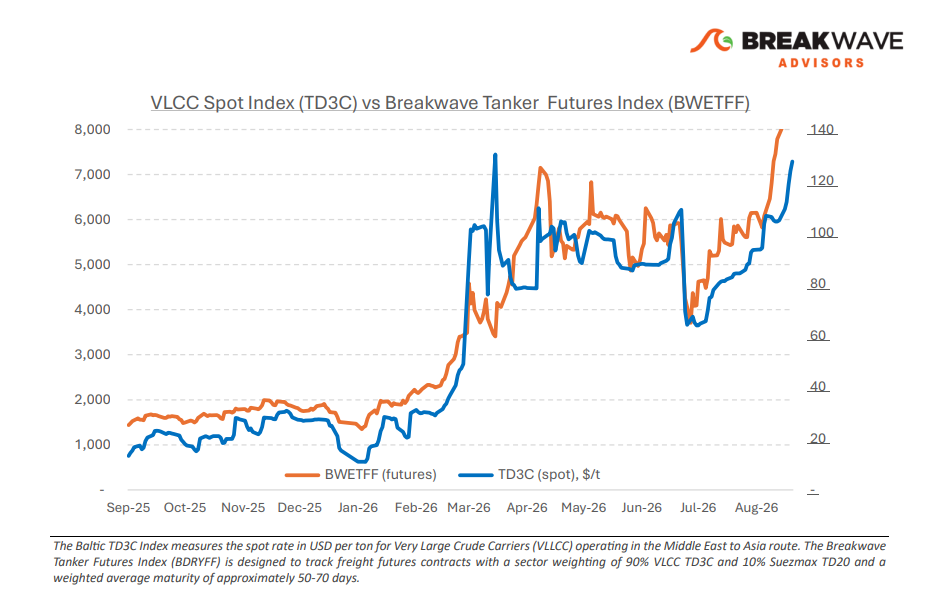
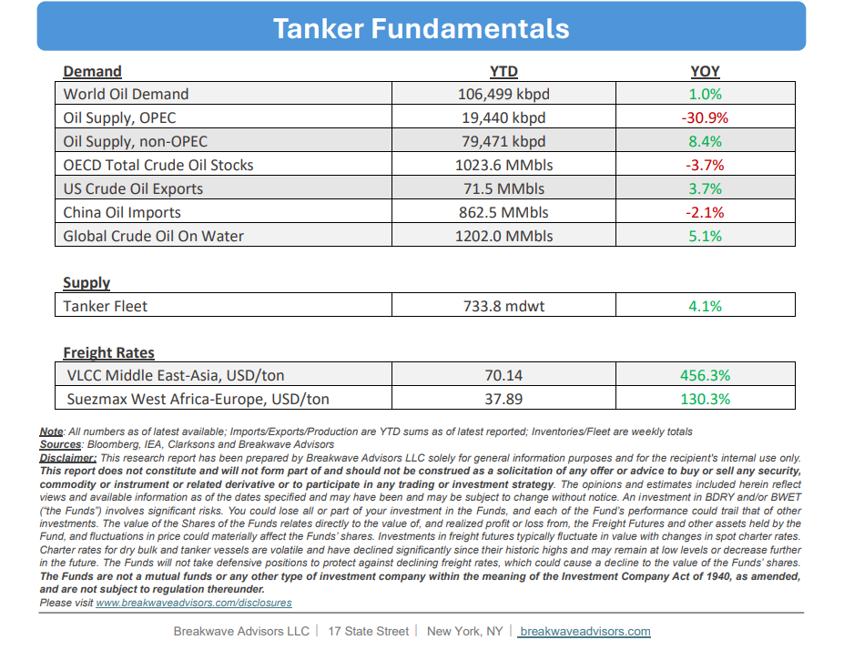

# Breakwave Bi-Weekly Tanker Report - August 25, 2026

**Date:** August 25, 2026  
**Publisher:** Breakwave Advisors | **Category:** Market Insights  
**Original URL:** [https://www.breakwaveadvisors.com/insights/82520026wetreportkjj2026jjtank441](https://www.breakwaveadvisors.com/insights/82520026wetreportkjj2026jjtank441)  

---

•**Late August Shift Leads to Surging Spot VLCC Rates**– The East of Suez risk premium identified in late July remains embedded in the VLCC market. In the Arabian Gulf,**steady enquiry and business concluded**privately have progressively reduced the tonnage list. Successive fixtures at higher levels strengthened owners’ position while limited prompt availability and a stronger Atlantic market have led charterers to attract additional ballasters from the East. Fixtures have gradually reduced the available list and lifted owners’ confidence. In the**US Gulf and Brazil**, continued enquiry and coverage have**tightened availability**despite some prompt vessels initially appearing. Sentiment has firmed in both regions, although the Arabian Gulf retains the stronger geopolitical premium. The final week of August presents a different picture from the reopening discussions that dominated June and July.**Reports of increased tanker passage**through Hormuz have influenced sentiment, with U.S. officials claimed that 40 tankers transited during the night of 21 August using the U.S.-backed route along Oman’s coast.**Yet, more evidence is required**before the increase can be treated as a sustained recovery in tanker circulation. Iran has separately granted permission for several Iraqi oil tankers to pass through Hormuz following requests from Baghdad which is more of a selective access for Iraqi movements rather than a general reopening. The earlier 60-day framework has not produced a lasting agreement, while passage procedures and any potential tolls or service charges remain unresolved.

> **Figure 1: Cea3cf84ceb9ceb3cebcceb9cf8ccf84cf85**  
> [Local Asset](file:///C:/Users/Dell/Github/Shipping/corpus/03-breakwave/insights/2026/assets/2026-08-25_82520026wetreportkjj2026jjtank441_img_cea3cf84ceb9ceb3cebcceb9cf8ccf84cf85_6df9a26af7c6.png)

•**Debate Over AG Oil Flows Shapes Oil Price Outlook**– Following the deceleration of geopolitical hostilities between the United States and Iran, global oil market analysis has transitioned from speculative risk premiums to actual volume metrics, specifically tracking the volume of crude exiting the Persian Gulf.**Quantifying these flows remains challenging**due to the proliferation of "dark transit" practices adopted by maritime vessels to evade regional shipping threats. Concurrently, severe constraints in downstream processing infrastructure and a shortage of specific crude blends have driven global refining margins and refined product prices to unprecedented structural highs. Ultimately, because end-user economic activity depends heavily on these finished fuels,**sustained price premiums**continue to exacerbate global inflationary pressures and dampen macroeconomic growth.

•**Our Long-term View**– The tanker market has been recovering from a long period of staggered rates as the growth in new vessel supply shrunk while oil demand remained elevated in line with the global economy. The recent rapid increase in freight rates has led to significant new vessel ordering, with the orderbook now standing at above average levels, and although in the near term such a supply/demand misbalance is small, we expect a meaningful negative balance to develop longer term leading to a potential downcycle.

> **Figure 2: Στιγμιότυπο Οθόνης 2026 08 24 214201**  
> [Local Asset](file:///C:/Users/Dell/Github/Shipping/corpus/03-breakwave/insights/2026/assets/2026-08-25_82520026wetreportkjj2026jjtank441_img_cea3cf84ceb9ceb3cebcceb9cf8ccf84cf85_ac78cd9c5113.png)

> **Figure 3: Στιγμιότυπο Οθόνης 2026 08 24 214214**  
> [Local Asset](file:///C:/Users/Dell/Github/Shipping/corpus/03-breakwave/insights/2026/assets/2026-08-25_82520026wetreportkjj2026jjtank441_img_cea3cf84ceb9ceb3cebcceb9cf8ccf84cf85_0e68d19bf08c.png)

### Subscribe:
