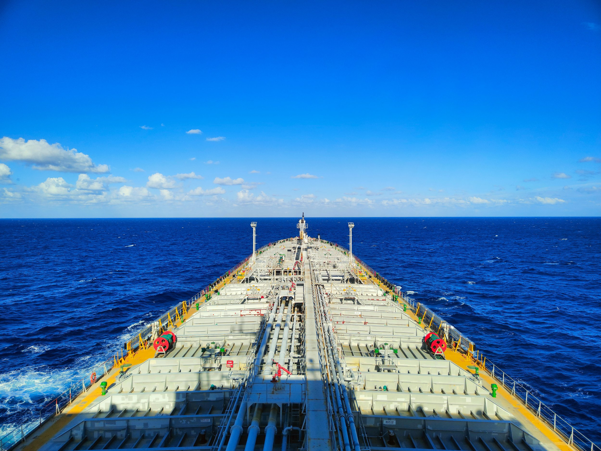

# VLCC Buying Reshapes the Tanker Market in 2026

**Date:** August 25, 2026  
**Publisher:** Breakwave Advisors | **Category:** Market Insights  
**Original URL:** [https://www.breakwaveadvisors.com/insights/2026/8/25/vlcc-buying-reshapes-the-tanker-market-in-2026](https://www.breakwaveadvisors.com/insights/2026/8/25/vlcc-buying-reshapes-the-tanker-market-in-2026)  

---

> **Figure 1: Byeirini Diamantara&dimitris Roumeliotis**  
> *ByEirini Diamantara&Dimitris Roumeliotis*  
> **Interactive Data & Source:** [Linkedin](https://www.linkedin.com/in/eirini-diamantara-58b269105/) | [Local Asset](file:///C:/Users/Dell/Github/Shipping/corpus/03-breakwave/insights/2026/assets/2026-08-25_vlcc-buying-reshapes-the-tanker-market-in-2026_img_pexels-rafid-sahrear-480671561-19302_a2417b883c40.jpg)

The January–July 2026 tanker Sale & Purchase market has been considerably more active than during the corresponding period of 2025, with 365 vessels changing hands compared to 239 last year, representing a 53% year-on-year increase. Activity was particularly strong during the opening months of the year, with January alone accounting for 88 sales (24% of the total), before gradually easing during the second quarter and into July. Despite this moderation, monthly transaction volumes remained broadly above 2025 levels, confirming that market liquidity has strengthened significantly.

From a sector perspective, VLCC/ULCCs dominated activity with 83 transactions, representing almost 23% of all tanker sales, a remarkable increase from only 31 sales during the same period of 2025. This exceptional surge was largely driven by the well-publicized acquisition campaign undertaken by the Sinokor–MSC alliance, which is estimated to have acquired between 60 and 70 VLCCs within a relatively short period. The scale of this fleet expansion alone transformed the dynamics of the VLCC S&P market and explains the extraordinary increase in transactions recorded this year. The MR2 sector ranked second with 80 transactions (22% of total sales), followed by Small Tankers with 51 sales (14%), Suezmaxes with 46 (13%), and Aframax/LR2s with 41 (11%). While Aframax/LR2 activity remained unchanged compared to last year (41 sales in both periods), virtually every other major segment recorded substantial growth. The most impressive increases, after the VLCC sector, were seen in the Panamax/LR1 market, where transactions jumped from 9 to 31 vessels. These figures indicate that buyers have become increasingly willing to commit capital across both the largest crude carriers and several mid-size segments.

The age profile of sold vessels also reveals an interesting shift in market behaviour. Modern tonnage attracted considerably stronger interest, with 0-5-year-old vessels increasing from 19 to 36 sales, while 11-15-year-old ships almost doubled from 48 to 90 transactions. Nevertheless, older tonnage continued to dominate the market. Vessels aged 16-20 years accounted for 157 sales, representing approximately 43% of all transactions, compared to 110 during the same period of 2025. When combining vessels older than 16 years, a total of 207 tankers changed hands this year, equivalent to nearly 57% of total S&P activity. This demonstrates that demand for vintage tonnage remains exceptionally resilient despite tightening environmental regulations and an aging global fleet.

On the buying side, a large proportion of acquisitions (171 vessels) involved undisclosed interests, representing almost 47% of all reported purchases, significantly higher than the 70 undisclosed buyers recorded last year. Among identified buyers, South Korean interests emerged as the most active, acquiring 58 vessels, followed by Others (52), Greek owners (47) and Chinese buyers (37). Greek investors maintained exactly the same acquisition pace as in 2025, suggesting a disciplined investment strategy despite the much stronger overall market. On the selling side, Greek owners once again dominated the market, disposing of 70 tankers, compared with 49 during the same period of 2025. This means Greek-controlled interests were responsible for almost one out of every five tanker sales worldwide, comfortably maintaining their position as the largest sellers. Singaporean owners also increased their selling activity sharply, while Chinese disposals rose only modestly. Overall, the data suggest that the significant increase in transaction volumes during 2026 has been driven by a combination of stronger investor confidence, improved liquidity, and continued appetite for both modern and vintage tanker assets across virtually every major vessel segment.

Data source:[Xclusiv Shipbrokers Inc.](https://www.linkedin.com/company/xclusiv-shipbrokers-inc/)

---

**Tags:** Tankers, Markets, Shipping  
