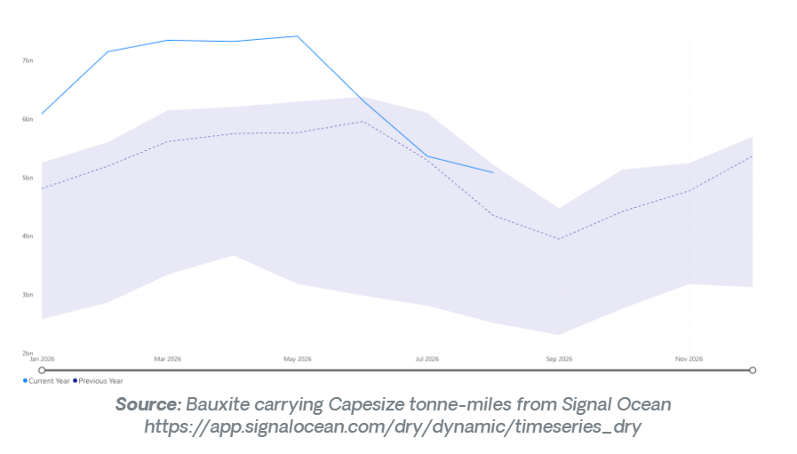
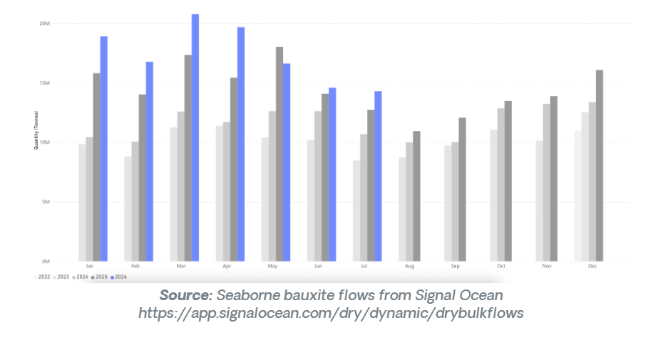
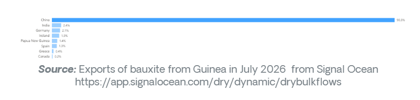

# Front-loading masks a market at a crossroads

**Date:** August 27, 2026  
**Publisher:** Breakwave Advisors | **Category:** Market Insights  
**Original URL:** [https://www.breakwaveadvisors.com/insights/2026/8/27/front-loading-masks-a-market-at-a-crossroads](https://www.breakwaveadvisors.com/insights/2026/8/27/front-loading-masks-a-market-at-a-crossroads)  

---

Policy changes in Guinea provide the largest near-side risk to bauxite flows

- Global bauxite flows increased by 3% y/y in July.
- Flows destined for China increased by 5% y/y in July.
- Flows destined for the UAE fell by over 66% in July.
- Bauxite flows to India declined by 2% y/y in July, only the second decrease in 2026 so far.

> **Figure 1: Στιγμιότυπο Οθόνης 2026 08 27 110712**  
> **Interactive Data & Source:** [Signal Ocean Platform](https://www.thesignalgroup.com/signal-ocean-platform) | [Local Asset](file:///C:/Users/Dell/Github/Shipping/corpus/03-breakwave/insights/2026/assets/2026-08-27_front-loading-masks-a-market-at-a-crossroads_img_cea3cf84ceb9ceb3cebcceb9cf8ccf84cf85_98bf133e3afe.png)

Bauxite flows in July 2026 reached 20 Mt, up over 3% from the same month last year. This was driven by a 5% increase in flows destined for China, which counteracted the large drop-off in flows to almost every other region. India has seen a surge in bauxite imports, but shipments of bauxite destined for the country fell by 2% in July, only the second month in 2026 to record a decrease.

The conflict in the Arabian Gulf region continues to impact bauxite flows to the UAE. July marked the sixth consecutive month of lower-than-previous-year flows, this time 81% lower than July 2025. Bauxite flows from Guinea surged over 12% in July. This was driven by front-loading buying behaviour, as the government of Guinea looks to implement strict bauxite exporting limits. The aluminium chain in China is particularly reliant on the grade of bauxite from Guinea, so buyers and processors here have been more incentivized than most to increase purchasing before any hard limits are announced.

> **Figure 2: Στιγμιότυπο Οθόνης 2026 08 27 110720**  
> **Interactive Data & Source:** [Signal Ocean Platform](https://www.thesignalgroup.com/signal-ocean-platform) | [Local Asset](file:///C:/Users/Dell/Github/Shipping/corpus/03-breakwave/insights/2026/assets/2026-08-27_front-loading-masks-a-market-at-a-crossroads_img_cea3cf84ceb9ceb3cebcceb9cf8ccf84cf85_b63f55d91f20.png)

The outlook for August and September is broadly positive, though the picture is more nuanced than the July headline suggests. Guinea's front-loading dynamic is the central question: if export restrictions are formalised in the coming weeks, the July surge could give way to a sharp pullback in loadings, tightening supply precisely when Chinese refiners are most dependent on Guinean ore. Conversely, if restrictions are delayed or watered down, the buying incentive dissipates and flows normalise from elevated levels. Either way, volatility around Guinea is the dominant near-term risk.

On the demand side, China remains the reliable floor. Alumina refinery capacity continues to expand, and there is no structural reason for Chinese procurement to soften heading into the back half of the year. India is worth watching as a potential upside story: despite the July dip, the broader 2026 trend has been strongly positive, and any recovery in buying there would add incremental volume to an already well-supported market.

The UAE remains effectively offline as a destination for the foreseeable future given the ongoing Arabian Gulf disruption, and other non-Chinese destinations show little sign of compensating. The market's trajectory in August and September will therefore be shaped almost entirely by two variables: how Guinea's export policy crystallises, and whether China's appetite holds at July's elevated pace.

> **Figure 3: Στιγμιότυπο Οθόνης 2026 08 27 110728**  
> **Interactive Data & Source:** [Signal Ocean Platform](https://www.thesignalgroup.com/signal-ocean-platform) | [Local Asset](file:///C:/Users/Dell/Github/Shipping/corpus/03-breakwave/insights/2026/assets/2026-08-27_front-loading-masks-a-market-at-a-crossroads_img_cea3cf84ceb9ceb3cebcceb9cf8ccf84cf85_a501ce79e76e.png)

## The Guinea Question Defines the Outlook

The bauxite market enters the second half of 2026 in a structurally strong position, underpinned by relentless Chinese demand and a Guinea export surge that has pushed volumes to multi-year highs. But the same front-loading behaviour that inflated July's figures introduces genuine uncertainty into the August and September outlook. If Conakry moves decisively on export restrictions, the market could tighten sharply and quickly, a particular concern for Chinese alumina refiners whose feedstock specifications leave limited room to substitute away from Guinean ore. For now, the fundamentals remain supportive, but the policy risk out of Guinea deserves close attention in the weeks ahead.

Data Source:[Signal Ocean Platform](https://www.thesignalgroup.com/signal-ocean-platform)

---

**Tags:** Commodities, Drybulk, Shipping  
