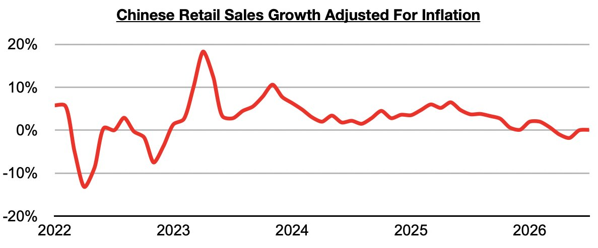
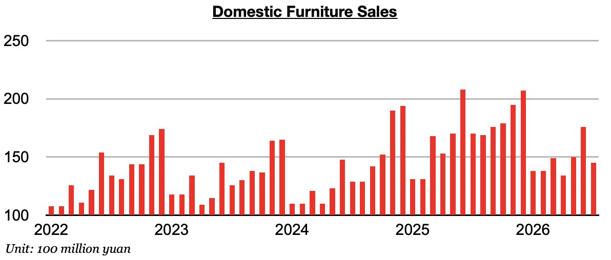
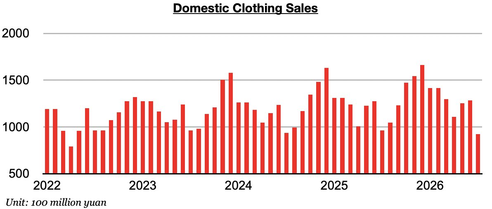
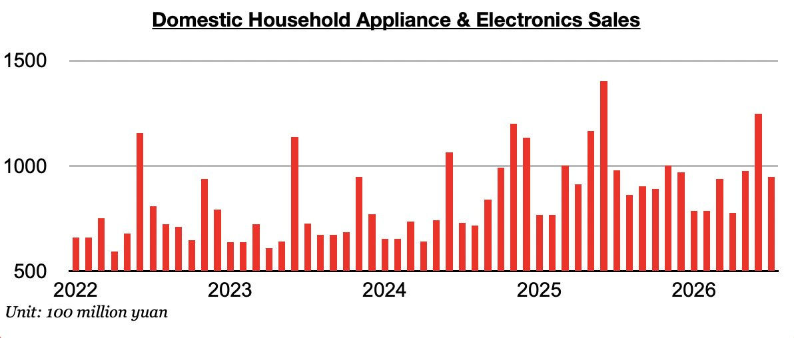
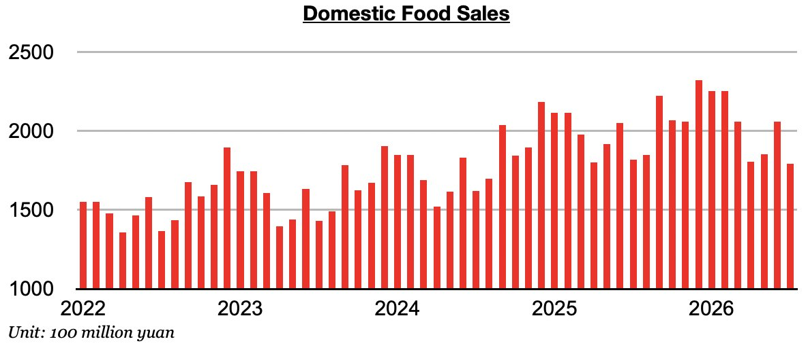
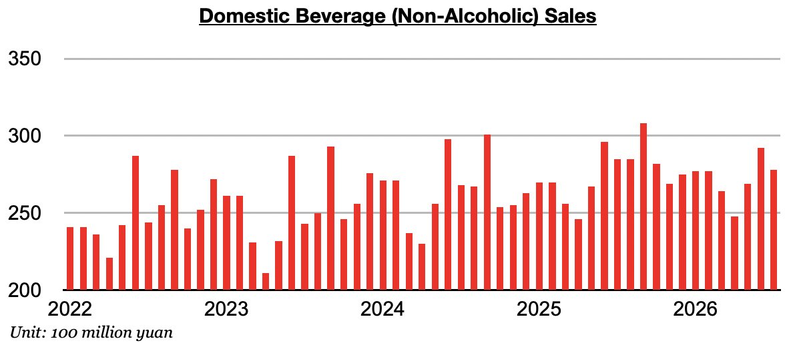
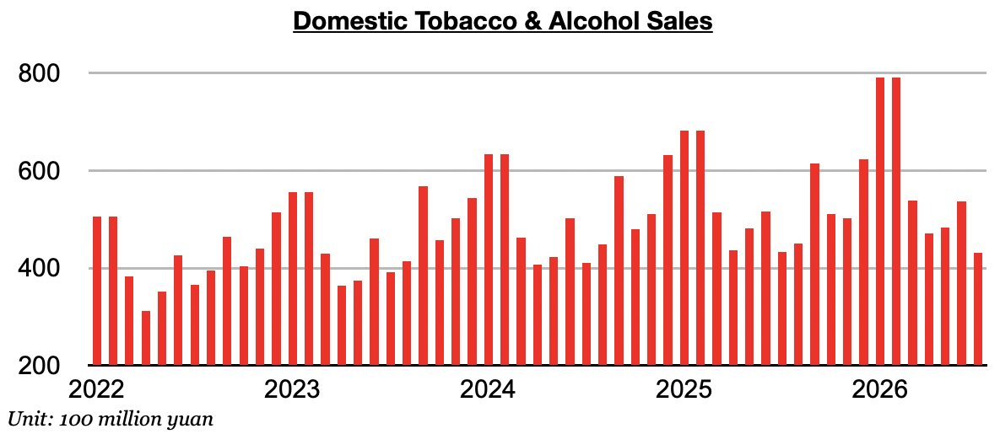
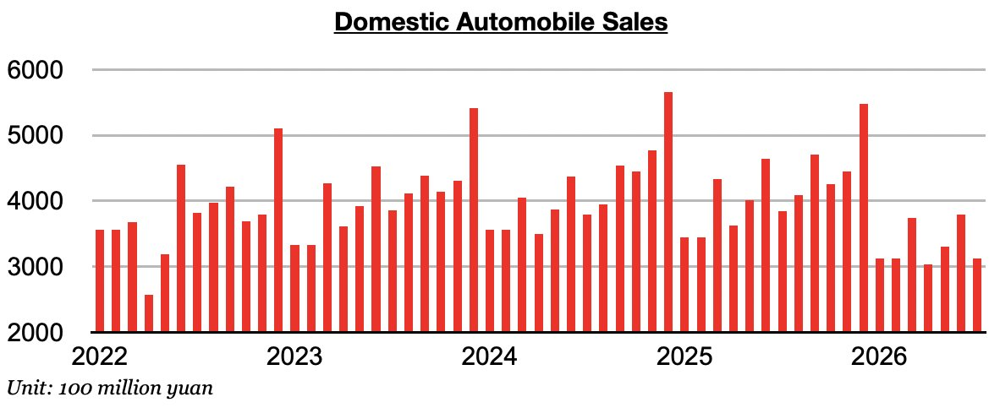
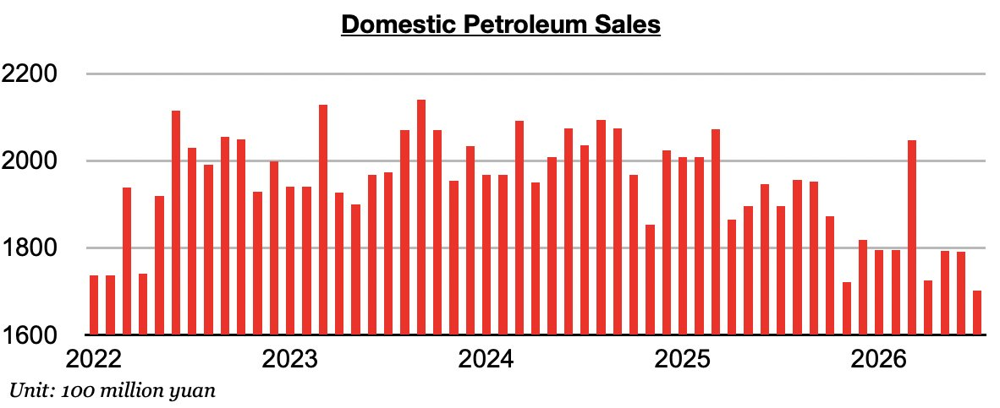
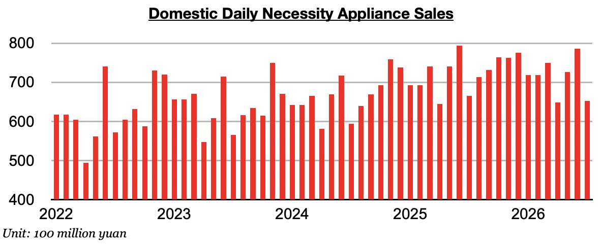

# China's Consumer Sector Remains Very Weak

**Date:** August 28, 2026  
**Publisher:** Breakwave Advisors | **Category:** Market Insights  
**Original URL:** [https://www.breakwaveadvisors.com/insights/2026/8/28/chinas-consumer-sector-remains-very-weak](https://www.breakwaveadvisors.com/insights/2026/8/28/chinas-consumer-sector-remains-very-weak)  

---

*By*[*Jeffrey Landsberg*](https://www.linkedin.com/in/jeffrey-landsberg-70ab957/)

As we discussed in Commodore Research's most recent Weekly China Report,China’s retail sales in July grew year-on-year by 0.6%. Taking July’s 0.5% inflation into account, retail sales adjusted for inflation grew year-on-year by just 0.1%. Just one month prior, June saw retail sales adjusted for inflation come in flat (0%).

> **Figure 1: Chart 1**  
> [Local Asset](file:///C:/Users/Dell/Github/Shipping/corpus/03-breakwave/insights/2026/assets/2026-08-28_chinas-consumer-sector-remains-very-weak_img_chart1_8e516bcea123.jpg)

Overall, China’s consumer sector remains weak. Before June, inflation had exceeded retail sales growth for two straight months, which was a very troubling sign of contraction/recession (as consumers were buying less actual goods than they did during the previous year). Of note on the consumer side is that every consumer sales category that we monitor contracted on a year-on-year basis.

Furniture sales in July contracted year-on-year by 15%. Sales have now fallen for five straight months. Previously, sales had increased on a year-on-year basis during twenty-two of the prior twenty-three months.

> **Figure 2: Chart 2**  
> [Local Asset](file:///C:/Users/Dell/Github/Shipping/corpus/03-breakwave/insights/2026/assets/2026-08-28_chinas-consumer-sector-remains-very-weak_img_chart2_30a52ff915ef.jpg)

Clothing sales (which includes garments, footwear, hats, and knitwear) contracted year-on-year by 4%. Previously, clothing sales had increased on a year-on-year basis during twenty-two of the prior twenty-three months.

> **Figure 3: Chart 3**  
> [Local Asset](file:///C:/Users/Dell/Github/Shipping/corpus/03-breakwave/insights/2026/assets/2026-08-28_chinas-consumer-sector-remains-very-weak_img_chart3_8cf98309869a.jpg)

Household appliance and electronics sales contracted on a year-on-year basis by 3%. Household appliance and electronics sales have now contracted on a year-on-year basis during eight of the last ten months.

> **Figure 4: Chart 4**  
> [Local Asset](file:///C:/Users/Dell/Github/Shipping/corpus/03-breakwave/insights/2026/assets/2026-08-28_chinas-consumer-sector-remains-very-weak_img_chart4_eb40f5c1ca49.jpg)

Food sales contracted year-on-year by 1%. Previously, sales had grown on a year-on-year basis during thirty-six of the prior thirty-seven months.

> **Figure 5: Chart 5**  
> [Local Asset](file:///C:/Users/Dell/Github/Shipping/corpus/03-breakwave/insights/2026/assets/2026-08-28_chinas-consumer-sector-remains-very-weak_img_chart5_c003cd3b24f9.jpg)

Beverage (non-alcoholic) sales contracted year-on-year by 3%. Sales have now contracted on a year-on-year basis for two straight months.

> **Figure 6: Chart 6**  
> [Local Asset](file:///C:/Users/Dell/Github/Shipping/corpus/03-breakwave/insights/2026/assets/2026-08-28_chinas-consumer-sector-remains-very-weak_img_chart6_0226f77d2d35.jpg)

Tobacco and alcohol sales contracted on a year-on-year basis by 0.5%. Previously, sales had increased on a year-on-year basis for six straight months. Prior to those last six months, tobacco and alcohol sales in China had contracted on a year-on-year for two straight months.

> **Figure 7: Chart 7**  
> [Local Asset](file:///C:/Users/Dell/Github/Shipping/corpus/03-breakwave/insights/2026/assets/2026-08-28_chinas-consumer-sector-remains-very-weak_img_chart7_c82faf220f38.jpg)

Automobile sales contracted year-on-year by 19%. Sales have now contracted a year-on-year basis for ten straight months. Prior to the last nine months, sales had increased on a year-on-year basis for seven straight months.

> **Figure 8: Chart 8**  
> [Local Asset](file:///C:/Users/Dell/Github/Shipping/corpus/03-breakwave/insights/2026/assets/2026-08-28_chinas-consumer-sector-remains-very-weak_img_chart8_05c33fa2c518.jpg)

Petroleum sales contracted year-on-year by 10%. Petroleum sales have now contracted on a year-on-year basis for seventeen straight months. Overall, the growing adoption of electric vehicles continues to act as a headwind on petroleum sales. Overall weakness in China’s consumer sector, though, also remains a headwind.

> **Figure 9: Chart 9**  
> [Local Asset](file:///C:/Users/Dell/Github/Shipping/corpus/03-breakwave/insights/2026/assets/2026-08-28_chinas-consumer-sector-remains-very-weak_img_chart9_0145109ab6bc.jpg)

Daily necessity sales contracted on a year-on-year basis by 2%. Daily necessity sales in China have now contracted on a year-on-year basis for three straight months.

> **Figure 10: Chart 10**  
> [Local Asset](file:///C:/Users/Dell/Github/Shipping/corpus/03-breakwave/insights/2026/assets/2026-08-28_chinas-consumer-sector-remains-very-weak_img_chart10_8fa3cb987f24.jpg)

---

**Tags:** China, Economy, Markets  
