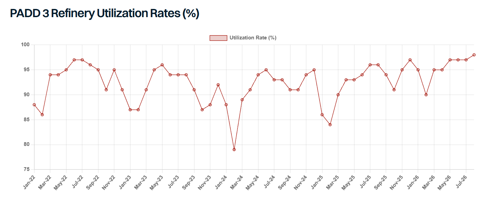

# No Margin for Error

**Date:** August 31, 2026  
**Publisher:** Breakwave Advisors | **Category:** Market Insights  
**Original URL:** [https://www.breakwaveadvisors.com/insights/2026/8/31/no-margin-for-error](https://www.breakwaveadvisors.com/insights/2026/8/31/no-margin-for-error)  

---

> **Figure 1: Tankerrr 2 (1).ξπγ**  
> **Interactive Data & Source:** [Gibsons Co](https://www.gibsons.co.uk/market-reports) | [Local Asset](file:///C:/Users/Dell/Github/Shipping/corpus/03-breakwave/insights/2026/assets/2026-08-31_no-margin-for-error_img_tankerrr-228129cebecf80ceb3_89290ba50318.jpg)

US refinery maintenance typically peaks in October, a season that has historically weighed on freight. This year appears different with very little currently confirmed for the autumn, as robust margins keep refiners from taking units offline. Last week, US refinery utilization clocked in at 97.4%, the highest level since 2018. This dynamic should keep product tankers well supported across the US Gulf through Q4.

The only confirmed turnaround on the PADD 3 slate is Exxon’s Beaumont facility, covering an FCC and at least two hydrotreaters, running for roughly 45 days from early December to mid-January. With FCC work this thin, PADD 3 gasoline exports should stay elevated into Q4.

Distillates look similarly well supplied. The October–November CDU maintenance block that would typically weigh on the market is largely absent this year. PBF has pushed Chalmette’s CDU and coker into 2027, and CITGO has done the same with the Lake Charles coker. Valero, meanwhile, has guided Q3 Gulf Coast throughput to a robust 1.78–1.83 mbd.

It is worth noting that not all maintenance schedules are reported and some units may opt for lighter works this year given prevailing commercial conditions. Notably, the IEA maintains the view that October refining runs in North America will be lower than August at 18.8 mbd vs 20.5 mbd – about 8% lower with a recovery into November at 19.5 mbd.

For freight, the impact on both the short-haul USGC to Latam and USGC to Europe trades look limited given prevailing fundamentals. The thin turnaround slate should cap Q4 disruption, though it likely just pushes deferred maintenance into 1H 2027. In the meantime, light USGC maintenance and continued export flows should keep the USGC–Europe diesel arbitrage workable for longer than usual, while sustained high Gulf Coast runs support export availability and pressure import parity into Latam.

The main risk to this outlook isn’t scheduled downtime but unplanned outages. Deferred maintenance leaves the system running near full utilization with little spare capacity to absorb disruption, and Atlantic hurricane season runs through 30 November. This year’s El Niño conditions should help as they typically suppress storm activity. However, there is still a non-zero percent chance of disruption this season and will remain a key source of concern.

At the same time, tightening restrictions on Panama Canal transits and the possibility of a further deterioration in conditions could cause a spike in USG to WCSA rates. WCSA is highly dependent on the USG for the majority of its CPP imports, with limited alternative suppliers. therefore, the combination of Panama distribution leading to tighter product tanker availability alongside supportive product trading economics could create very bullish sentiment on this trade. This would likely help to support other routes within the region as the impact of the disruption spreads and alternative trades price up.

There’s also the question of when this deferred maintenance eventually lands, since freight is likely to feel it. Pushed out far enough, it could mean a heavy works period in early 2027, though refiners may manage this by phasing individual units rather than taking whole sites down at once. That phased approach hinges on margins staying strong into the new year, which is plausible but not guaranteed. Either way, the underlying reality doesn’t change: a considerable slice of US refining capacity will need maintenance eventually, and the impact on the product tanker market when it comes could be significant.

Similarly, PADD 3 and PADD 1 diesel inventories are at historically low levels with local demand likely to rise in the coming months. This could limit the volume of distillate available for export, especially if domestic pricing increases, with the US mid-term elections due in November, domestic pricing could come into focus given its political sensitivity. Therefore, both diesel arbs and export volumes could face a ceiling, limiting upside potential here.

A wildcard in this analysis is Russia. Restrictions on Russian CPP exports remain in place, and while there’s talk of an easing as early as September, nothing is confirmed. Continued disruption would bite hardest in South America, where the planting season is set to lift diesel demand, a gap USG barrels are well placed to fill. That could keep TC18 arb economics firm, to the benefit of MRs on the route.

Overall, PADD 3 refiners look set to run hard into year-end, supporting both gasoline exports and the transatlantic diesel arb. The risk to watch isn’t the maintenance calendar, it’s an unplanned outage hitting a system with little spare capacity to give. In short, there is no margin for error.

> **Figure 2: Στιγμιότυπο Οθόνης 2026 08 31 102719**  
> **Interactive Data & Source:** [Gibsons Co](https://www.gibsons.co.uk/market-reports) | [Local Asset](file:///C:/Users/Dell/Github/Shipping/corpus/03-breakwave/insights/2026/assets/2026-08-31_no-margin-for-error_img_cea3cf84ceb9ceb3cebcceb9cf8ccf84cf85_5708c14f6404.png)

Data source:[Gibson Shipbrokers](https://www.gibsons.co.uk/market-reports)

---

**Tags:** Crude, Tankers, Shipping  
