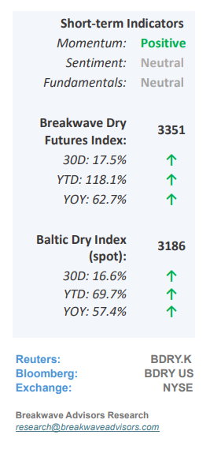
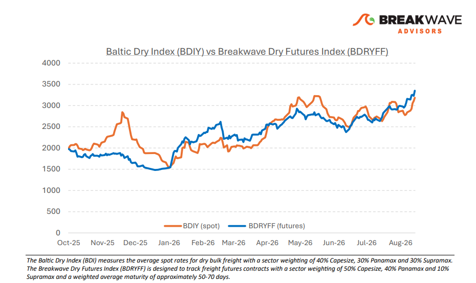
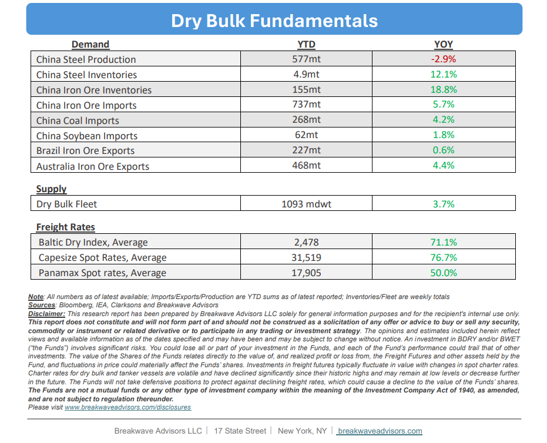

# Breakwave Bi-Weekly Dry Bulk Report - September 1, 2026

**Date:** September 01, 2026  
**Publisher:** Breakwave Advisors | **Category:** Market Insights  
**Original URL:** [https://www.breakwaveadvisors.com/insights/912026db-report2septdryhht67](https://www.breakwaveadvisors.com/insights/912026db-report2septdryhht67)  

---

•**Steady Demand and Shrinking Vessel Supply Pushes Spot Higher**– During the second half of August,**robust iron ore transportation demand**in the Pacific, driven by all three mining majors, combined with localized storm disruptions that**tightened vessel lineups**led to elevated freight rates on the critical Australia-to-China route. Concurrently, a constricted Atlantic tonnage list**pushed spot rates upward**despite softer regional demand, positioning the market advantageously from a higher absolute baseline as it transitions out of the historically quiet summer August month and into the seasonally strong autumn period. Additionally,**metallurgical coal import demand**jumped, following a major accident in China with traders scrambling to secure tonnage of medium-size bulkers. While other maritime segments like tankers and containers are earning significantly higher daily rates, this parallel success**has bolstered shipowner sentiment**despite any direct fundamental link amongst those segments, potentially amplifying upward spot rate pressure should an unexpected market tightening occur. Consequently, despite generally flat underlying fundamentals in our view, the**near-term outlook**for spot Capesize rates**remains highly optimistic,**sustained by a volatile global logistics landscape that continues to drive exceptional volatility and historic performance across the broader shipping industry during a year for global shipping that will be remembered for decades to come.

> **Figure 1: Cea3cf84ceb9ceb3cebcceb9cf8ccf84cf85**  
> [Local Asset](file:///C:/Users/Dell/Github/Shipping/corpus/03-breakwave/insights/2026/assets/2026-09-01_912026db-report2septdryhht67_img_cea3cf84ceb9ceb3cebcceb9cf8ccf84cf85_727760a77d9a.png)

•**Iron Ore follows Coking Coal Higher Amidst the Worst Disaster since 2009**–**Coking coal,**the second most important ingredient in the steelmaking process, delivered an**unprecedented, record-breaking performance**, surging over 40% within the month after a catastrophic mining accident in Shanxi triggered nationwide safety inspections and sweeping production curtailments across China. While iron ore prices experienced a modest, low-single-digit sympathy increase, the steelmaking raw material complex faces shifting dynamics; forward-looking projections indicate ample iron ore supply, yet escalating input costs from both metallurgical coal and ocean freight are**actively compressing steel mill margins**to multi-year lows. Consequently, these severe margin pressures are likely to trigger downward adjustments in steel production, subsequently curtailing downstream demand for iron ore in the near term.

•**Our Long-term View**– The last few years have been characterized by increased geopolitical uncertainty. Going forward, we expect such events to continue to affect global trade and have a meaningful impact on effective vessel supply. Combined with the potential for a multi-year cyclical rebound in China’s economic activity following the recent economic turmoil, dry bulk shipping should experience higher volatility on top of a secular tightness driven by stable bulk commodity demand and rather steady but elevated fleet growth.

> **Figure 2: Στιγμιότυπο Οθόνης 2026 09 01 094723**  
> [Local Asset](file:///C:/Users/Dell/Github/Shipping/corpus/03-breakwave/insights/2026/assets/2026-09-01_912026db-report2septdryhht67_img_cea3cf84ceb9ceb3cebcceb9cf8ccf84cf85_0092583bd781.png)

> **Figure 3: Στιγμιότυπο Οθόνης 2026 09 01 124950**  
> [Local Asset](file:///C:/Users/Dell/Github/Shipping/corpus/03-breakwave/insights/2026/assets/2026-09-01_912026db-report2septdryhht67_img_cea3cf84ceb9ceb3cebcceb9cf8ccf84cf85_b2bb3cabf2f7.png)

### Subscribe:
