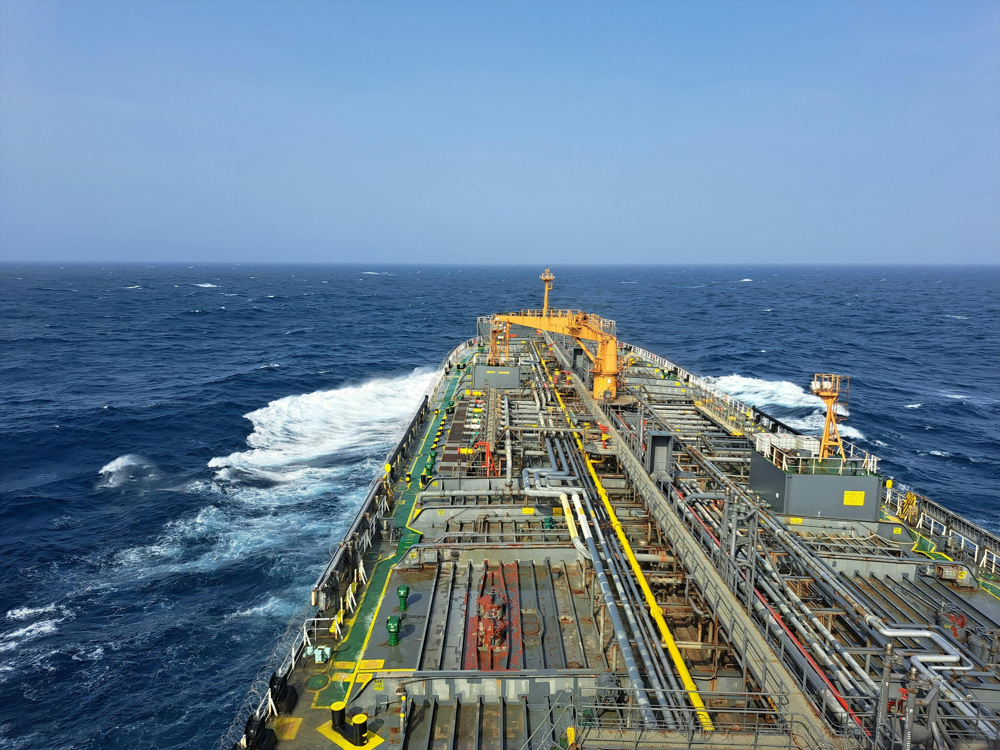
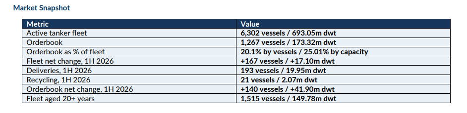
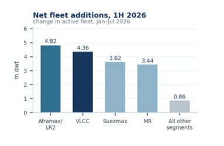
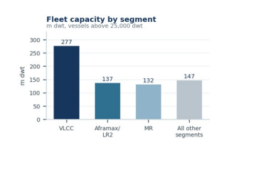
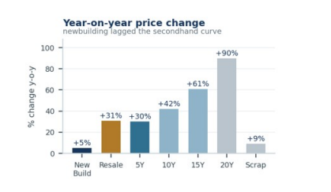
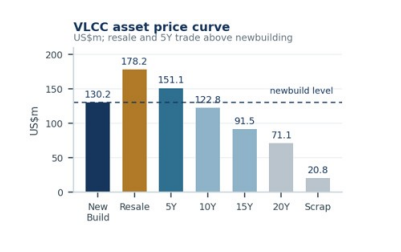
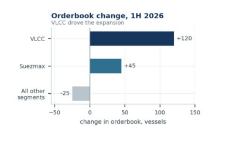

# Tanker 1H 2026: Strong VLCC Earnings Drive Newbuilding and Secondhand Investment

**Date:** September 02, 2026  
**Publisher:** Breakwave Advisors | **Category:** Market Insights  
**Original URL:** [https://www.breakwaveadvisors.com/insights/2026/9/2/tanker-1h-2026-strong-vlcc-earnings-drive-newbuilding-and-secondhand-investment](https://www.breakwaveadvisors.com/insights/2026/9/2/tanker-1h-2026-strong-vlcc-earnings-drive-newbuilding-and-secondhand-investment)  

---

> **Figure 1: Pexels Atmadeep Das 1776637129 28247236**  
> **Interactive Data & Source:** [Allied-shipbroking](https://www.allied-shipbroking.gr/) | [Local Asset](file:///C:/Users/Dell/Github/Shipping/corpus/03-breakwave/insights/2026/assets/2026-09-02_tanker-1h-2026-strong-vlcc-earnings-drive-newbuilding-and-secondhand-investment_img_pexels-atmadeep-das-1776637129-28247_28f5ca7edab3.jpg)

This week’s Allied QuantumSea Research examines tanker fleet and orderbook developments during the first half of 2026, covering fleet growth, age profiles, deliveries, removals and the forward supply outlook.

Freight-market strength following the disruption around the Strait of Hormuz pushed VLCC asset values higher during the first half. Demand was particularly strong in the secondhand market, where prices for five-year-old vessels rose above comparable newbuilding levels. With newbuilding prices adjusting more slowly and immediate tonnage commanding a premium, investment increased across both markets: buyers competed for modern secondhand vessels, while owners also added to the VLCC orderbook.

> **Figure 2: Στιγμιότυπο Οθόνης 2026 09 02 142320**  
> **Interactive Data & Source:** [Allied-shipbroking](https://www.allied-shipbroking.gr/) | [Local Asset](file:///C:/Users/Dell/Github/Shipping/corpus/03-breakwave/insights/2026/assets/2026-09-02_tanker-1h-2026-strong-vlcc-earnings-drive-newbuilding-and-secondhand-investment_img_cea3cf84ceb9ceb3cebcceb9cf8ccf84cf85_04c01a2b71e9.png)

### Fleet in Service: Growth Across Every Main Segment

The active tanker fleet grew by 167 vessels, or 17.10m dwt, over the first half of 2026, on 193 deliveries against 21 vessels sold for recycling and 5 other removals.

Aframax/LR2 led at capacity with 4.82m dwt, followed by VLCC at 4.36m dwt, Suezmax at 3.62m dwt and MR at 3.44m dwt. On unit count, Small Tankers and MR added most, at 77 and 76 vessels.

> **Figure 3: Στιγμιότυπο Οθόνης 2026 09 02 142330**  
> **Interactive Data & Source:** [Allied-shipbroking](https://www.allied-shipbroking.gr/) | [Local Asset](file:///C:/Users/Dell/Github/Shipping/corpus/03-breakwave/insights/2026/assets/2026-09-02_tanker-1h-2026-strong-vlcc-earnings-drive-newbuilding-and-secondhand-investment_img_cea3cf84ceb9ceb3cebcceb9cf8ccf84cf85_98b47e7e615b.png)

### Where the Capacity Sits

The tanker fleet above 25,000 dwt stood at 6,302 vessels and 693.05m dwt. VLCC is the largest capacity segment at 277.12m dwt, ahead of Aframax/LR2 at 136.89m dwt and MR at 132.01m dwt.

MR leads on unit count with 2,978 vessels and Aframax/LR2 at 1,239, so numbers sit with product and mid-size tonnage while capacity exposure runs through the VLCC.

> **Figure 4: Στιγμιότυπο Οθόνης 2026 09 02 142337**  
> **Interactive Data & Source:** [Allied-shipbroking](https://www.allied-shipbroking.gr/) | [Local Asset](file:///C:/Users/Dell/Github/Shipping/corpus/03-breakwave/insights/2026/assets/2026-09-02_tanker-1h-2026-strong-vlcc-earnings-drive-newbuilding-and-secondhand-investment_img_cea3cf84ceb9ceb3cebcceb9cf8ccf84cf85_9eb10ff11f94.png)

### Hormuz Risk Repriced the Fleet

Middle East crude tanker rates reached multi-decade highs in March 2026 as disruption around the Strait of Hormuz took hold, and war risk premiums on Gulf transits rose from a fraction of a percent of hull value to several percent of it.

Asset values followed, and the gains steepened with age. Over the past year VLCC values are up around 30% for five-year-old tonnage, 42% at ten years, 61% at fifteen and 90% at twenty. What the market is paying for is a vessel that can trade now.

> **Figure 5: Στιγμιότυπο Οθόνης 2026 09 02 142349**  
> **Interactive Data & Source:** [Allied-shipbroking](https://www.allied-shipbroking.gr/) | [Local Asset](file:///C:/Users/Dell/Github/Shipping/corpus/03-breakwave/insights/2026/assets/2026-09-02_tanker-1h-2026-strong-vlcc-earnings-drive-newbuilding-and-secondhand-investment_img_cea3cf84ceb9ceb3cebcceb9cf8ccf84cf85_febc7b8407cb.png)

### Secondhand Is on Fire, But Newbuilding Is the Cheaper Ship

The repricing has inverted the curve. A five-year-old VLCC is assessed at about $151m against $130m for a newbuilding contract, while prompt resale tonnage commands roughly $178m, a premium of some $48m over a new order.

Newbuilding prices rose only around 5% over the year, the slowest move anywhere on the curve. For an owner able to wait for a 2028 or 2029 delivery slot, the yard is now the cheaper route to a VLCC than the secondhand market.

> **Figure 6: Στιγμιότυπο Οθόνης 2026 09 02 142355**  
> **Interactive Data & Source:** [Allied-shipbroking](https://www.allied-shipbroking.gr/) | [Local Asset](file:///C:/Users/Dell/Github/Shipping/corpus/03-breakwave/insights/2026/assets/2026-09-02_tanker-1h-2026-strong-vlcc-earnings-drive-newbuilding-and-secondhand-investment_img_cea3cf84ceb9ceb3cebcceb9cf8ccf84cf85_737854524a84.png)

### Orderbook: VLCC Drove the Expansion

The tanker orderbook rose from 1,127 vessels and 131.42m dwt in January 2026 to 1,267 vessels and 173.32m dwt in July, a net increase of 140 vessels and 41.90m dwt, on 339 new contracts against 193 deliveries and 6 cancellatons.

VLCC accounted for a net 120 vessels and 36.68m dwt, on new contracting of 139 vessels and 42.59m dwt, with Suezmax adding 45 vessels and 7.08m dwt. Small Tankers, Panamax/LR1 and Aframax/LR2 all closed the period lower. Forward supply now stands at 20.1% of the fleet by vessels and 25.0% by capacity.

> **Figure 7: Στιγμιότυπο Οθόνης 2026 09 02 142409**  
> **Interactive Data & Source:** [Allied-shipbroking](https://www.allied-shipbroking.gr/) | [Local Asset](file:///C:/Users/Dell/Github/Shipping/corpus/03-breakwave/insights/2026/assets/2026-09-02_tanker-1h-2026-strong-vlcc-earnings-drive-newbuilding-and-secondhand-investment_img_cea3cf84ceb9ceb3cebcceb9cf8ccf84cf85_ecf19effbad3.png)

### Removals Stayed Limited While Older Tonnage Earns

Recycling took 21 vessels, or 2.07m dwt, out of the fleet, against 1,515 vessels and 149.78m dwt aged twenty years and above, of which VLCCs account for 52.01m dwt. With twenty-year-old VLCC values up around 90% year-on-year to $71.1m against a scrap price of $20.8m, the case for keeping older tonnage in the water is straighorward, and the renewal requirement in the tanker fleet has been deferred rather than met.

### Takeaway

Tanker supply expanded across both the fleet and the orderbook in the first half of 2026. Deliveries added capacity across every major segment, while contracting outpaced the tonnage delivered, lifting the orderbook to 25% of the existing fleet by capacity. The increase was concentrated in the VLCC segment. Freight-market strength following the disruption around the Strait of Hormuz supported earnings and asset values, sustaining demand for modern secondhand vessels. At the same time, five-year-old VLCC values moved above comparable newbuilding prices, strengthening the case for ordering.

Data Source:[Allied](https://www.allied-shipbroking.gr/)

---

**Tags:** Tankers, Shipping, Markets  
