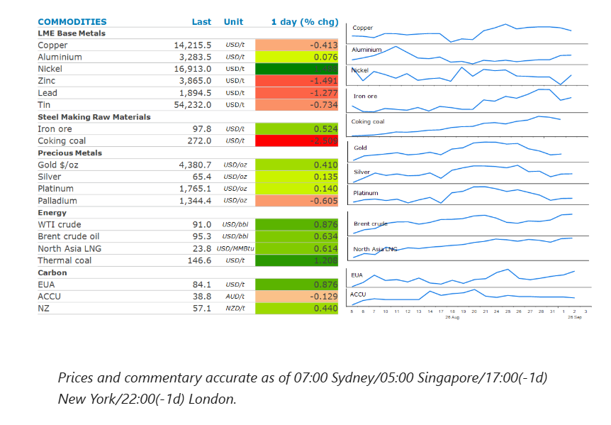
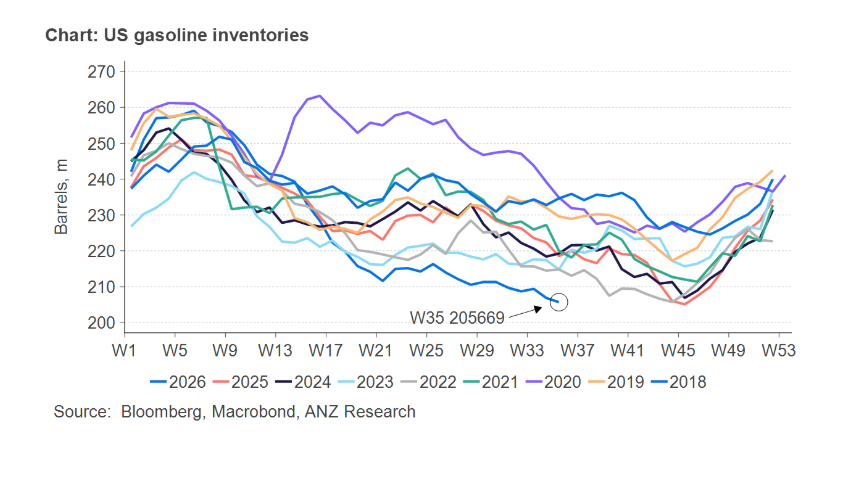

# Metals struggle as economic growth concerns mount

**Date:** September 03, 2026  
**Publisher:** Breakwave Advisors | **Category:** Market Insights  
**Original URL:** [https://www.breakwaveadvisors.com/insights/2026/9/3/metals-struggle-as-economic-growth-concerns-mount](https://www.breakwaveadvisors.com/insights/2026/9/3/metals-struggle-as-economic-growth-concerns-mount)  

---

The energy sector posted gains, as attacks between US and Iran persist. Industrial metal struggled, as concerns over the global economy resurfaced.

*By*[*Daniel Hynes*](https://www.linkedin.com/in/dahynes/)

> **Figure 1: Στιγμιότυπο Οθόνης 2026 09 03 144052**  
> **Interactive Data & Source:** [Linkedin](https://www.linkedin.com/newsletters/commodities-wrap-6692196755876012032/?fbclid=IwAR3kiXJqZdxmp9ZcRwBNI7FsBySI-XSC0pfPur1qzjt7OZp7PTE59Tsl1QI) | [Local Asset](file:///C:/Users/Dell/Github/Shipping/corpus/03-breakwave/insights/2026/assets/2026-09-03_metals-struggle-as-economic-growth-concerns-mount_img_cea3cf84ceb9ceb3cebcceb9cf8ccf84cf85_5c9dcb58af7d.png)

### Market Commentary

**Crude oil**prices rose as the Middle East conflict escalated. The US military carried out a second wave of strikes in three days. Iran retaliated with drone and missile attacks on US bases across the Middle East. The risk to vessels transiting the Strait of Hormuz remains high. The US struck two Iranian vessels under a new “tanker-for-tanker” policy approved by President Trump, according to Axios. Earlier this week, two oil tankers attempting to exit Hormuz were reportedly hit by projectiles. US Treasury Secretary Bessent said that 17mbbl of crude exited Hormuz on Monday. Later, US Energy Secretary, Chris Wright, reiterated that figure and added that exports are averaging around 8mb/d.

Nevertheless, pressure is building in the refined fuel market. Inventories of gasoline in the US fell by 1,173kbbl last week to their lowest level in a decade. That was despite a drop in demand as the official end to the US summer driving season approaches. Distillate supplies on the East Coast are now at a record low. Total commercial oil inventories fell by 4,450kbbl last week after a four-week build, as refineries run at full capacity.

**Natural gas**prices in Europe and Asia also rose as supply disruptions persist. European**natural gas**prices hit their highest since January 2023, as the region faces difficulties in attracting LNG to help refill storage facilities. Across the continent they are 63% full, well below the average of 80% for this time of the year. Britain’s stocks are even lower, prompting warnings the country may end up paying high prices to secure supplies over winter.

**Gold**rebounded as a weaker USD boosted investor demand. The precious metal rose as much as 1.6%, as the USD fell following a sharp increase in the JPY. There was also a push-back from Fed Governor Williams on inflationary concerns. He said there’s evidence inflation is easing as the impact of tariffs fades while higher energy prices are not spreading to other services.

**Nickel**gained as Morowali Industrial Park, a processing plant on the island of Sulawesi, may have to cut production if new sources of water are not found. The company warned that the reduction in output could be 30–40%. The water shortages are the result of the El Nino weather pattern. Adding to the issues are reports that several Chinese-owned nickel smelters are weighing up coordinated output cuts as pressure mounts on profitability due to weak prices.

The rest of the**base metals**complex tracked lower on worries about the global economy. The escalation of fighting in the Middle East is raising concerns that subsequent high energy prices could hit economic activity. Ongoing production issues limited the downside for**copper**. Chile’s output fell 9.4% y/y in July to 403.4kt, according to statistics agency INE, attributed to severe storms that hit mining regions. Short-term availability of copper on the LME remains tight, with spot prices trading more than USD100/t above the benchmark three-month futures.

### Chart of the Day

The drawdown of US gasoline stockpiles raises the spectre of reaching critical levels in coming months. The lower bound of US gasoline inventories is considered to sit around 190mbbls. Based on the weekly drawdowns over the past three months, those levels could be tested by October.

> **Figure 2: Στιγμιότυπο Οθόνης 2026 09 03 144148**  
> **Interactive Data & Source:** [Linkedin](https://www.linkedin.com/newsletters/commodities-wrap-6692196755876012032/?fbclid=IwAR3kiXJqZdxmp9ZcRwBNI7FsBySI-XSC0pfPur1qzjt7OZp7PTE59Tsl1QI) | [Local Asset](file:///C:/Users/Dell/Github/Shipping/corpus/03-breakwave/insights/2026/assets/2026-09-03_metals-struggle-as-economic-growth-concerns-mount_img_cea3cf84ceb9ceb3cebcceb9cf8ccf84cf85_5682189e171d.png)

Data source:[Commodities Wrap](https://www.linkedin.com/newsletters/commodities-wrap-6692196755876012032/?fbclid=IwAR3kiXJqZdxmp9ZcRwBNI7FsBySI-XSC0pfPur1qzjt7OZp7PTE59Tsl1QI)

---

**Tags:** Commodities, Shipping, Markets  
