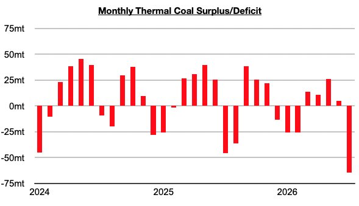

# Record Decline in Chinese Thermal Coal Stockpiles

**Date:** September 03, 2026  
**Publisher:** Breakwave Advisors | **Category:** Market Insights  
**Original URL:** [https://www.breakwaveadvisors.com/insights/2026/9/3/record-decline-in-chinese-thermal-coal-stockpiles](https://www.breakwaveadvisors.com/insights/2026/9/3/record-decline-in-chinese-thermal-coal-stockpiles)  

---

*By*[*Jeffrey Landsberg*](https://www.linkedin.com/in/jeffrey-landsberg-70ab957/)

As we discussed in Commodore Research's most recent Weekly China Report, China’s thermal coal stockpiles plummeted by a record 64.6 million tons in July. There has never been a month that China’s thermal coal stockpiles have fallen by such a large amount.

> **Figure 1: Chart**  
> [Local Asset](file:///C:/Users/Dell/Github/Shipping/corpus/03-breakwave/insights/2026/assets/2026-09-03_record-decline-in-chinese-thermal-coal-stockpiles_img_chart_fd4104b6dd44.jpg)

Overall, China's coal import prospects remain very promising for the near term as we continue to stress in our Weekly Executive Reports and Weekly China Reports. Notably, thermal coal prices in China have climbed even higher this week and are now at their highest level in over two and a half years. We continue to stress that new coal mining safety regulations implemented across the nation in recent months are unlikely to go away anytime soon. We remain very bullish for China's coal import prospects for the near term.

---

**Tags:** China, Coal, Commodities  
