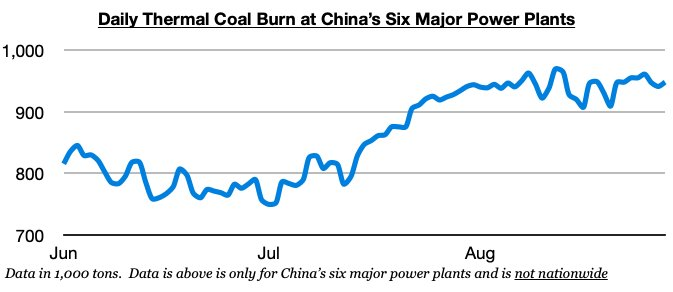
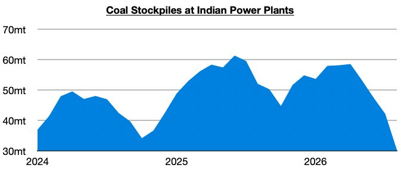

# Coal, Coal, Coal

**Date:** September 04, 2026  
**Publisher:** Breakwave Advisors | **Category:** Market Insights  
**Original URL:** [https://www.breakwaveadvisors.com/insights/2026/9/4/coal-coal-coal](https://www.breakwaveadvisors.com/insights/2026/9/4/coal-coal-coal)  

---

*By*[*Jeffrey Landsberg*](https://www.linkedin.com/in/jeffrey-landsberg-70ab957/)

As we discussed in Commodore Research's most recent Weekly Executive Report, dry bulk rates climbed across the board last week, with Cape rates faring the best. As we have continued to stress in our work, we remain bullish for the market. In China, thermal coal burn has stayed strong, and domestic coal production is set to stay under government-mandated pressure. The dry bulk market will continue to greatly benefit from May’s catastrophic Shanxi coal mine accident and last month’s accident in Hunan province.

> **Figure 1: Chart 1**  
> [Local Asset](file:///C:/Users/Dell/Github/Shipping/corpus/03-breakwave/insights/2026/assets/2026-09-04_coal-coal-coal_img_chart1_3d2a9b6530e7.jpg)

We continue to stress that near-term prospects for Chinese and Indian coal imports are very bullish. In India, of note is that power plant stockpiles have fallen even further and are at their lowest level since 2023. India’s power plant coal stockpiles ended last week at approximately 30.3 million tons, which is down week-on-week by 2.9 million tons (-9%) and down year-on-year by 20.3 million tons (-40%). India's power plant stockpiles have now declined during nineteen of the last twenty weeks. Stockpiles at fifty-one Indian power plants are now at critically low levels.

> **Figure 2: Chart 2**  
> [Local Asset](file:///C:/Users/Dell/Github/Shipping/corpus/03-breakwave/insights/2026/assets/2026-09-04_coal-coal-coal_img_chart2_0d32fc22aaf4.jpg)

---

**Tags:** Coal, Drybulk, Commodities  
