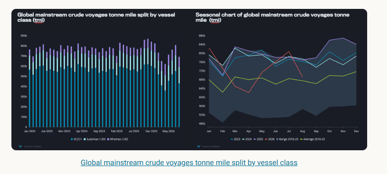
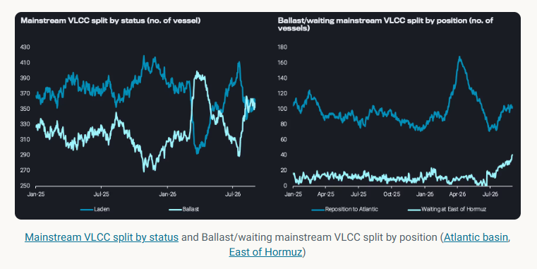
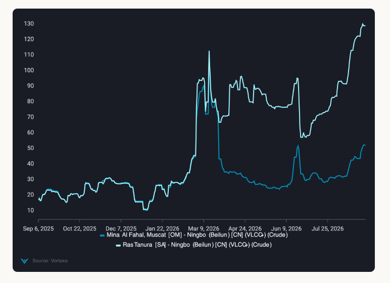
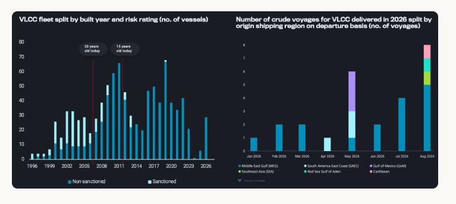

# Geopolitical risk disconnects VLCC freight from demand

**Date:** September 07, 2026  
**Publisher:** Breakwave Advisors | **Category:** Market Insights  
**Original URL:** [https://www.breakwaveadvisors.com/insights/2026/9/7/geopolitical-risk-disconnects-vlcc-freight-from-demand](https://www.breakwaveadvisors.com/insights/2026/9/7/geopolitical-risk-disconnects-vlcc-freight-from-demand)  

---

VLCC supply is building, but Hormuz access constraints are keeping Gulf freight elevated despite softer fundamentals.

*By*[*Wanying Zhang*](https://www.linkedin.com/in/wanying-zhang/)

VLCC fundamentals have softened from the tighter conditions seen earlier this year. Active VLCC tonne mile demand declined in August, while the ballast fleet increased as more vessels completed laden employment. Yet freight has not responded uniformly to the resulting increase in potential supply.

The disconnect is most pronounced around the Middle East Gulf. Ballast tonnage has increasingly positioned towards the region and VLCC waiting capacity East of Hormuz has climbed to its highest level since the start of 2025. Despite this build in nearby capacity, freight for cargoes loading inside the Gulf has continued to rise sharply relative to comparable employment outside the Strait.

The divergence suggests that the current VLCC market is less constrained by the absolute number of vessels than by how much of that fleet is commercially willing and operationally able to access individual loading markets. This is supporting freight today, but also creates a potentially rapid supply response should Gulf transit conditions normalise, ahead of a more structural increase in capacity from the approaching newbuilding cycle.

## VLCC Demand Weakens As Long Haul Tonne Miles Retreat

Global mainstream crude tanker tonne mile demand declined in August, although trends diverged across vessel classes. Suezmax and Aframax demand remained resilient, supported by stronger Atlantic Basin flows into Europe and the Mediterranean, while weaker VLCC demand accounted for most of the overall decline.

For VLCCs, the pullback was concentrated across key loading regions for long haul trades. Gulf of Mexico demand fell 38% m-o-m, while Red Sea demand retreated to less than half July’s elevated level. Even on the traditional Middle East Gulf to Asia trade, ongoing conflict has changed the composition of activity, with more shuttle and STS movements emerging around the Gulf. The result is a growing disconnect between voyage activity and effective vessel demand, as more voyages are required for short haul movements without generating the tonne miles associated with conventional MEG to Asia trades. Combined with weaker long haul demand from Atlantic Basin, this has left the underlying VLCC demand picture considerably softer despite continued vessel activity.

> **Figure 1: Στιγμιότυπο Οθόνης 2026 09 07 104204**  
> **Interactive Data & Source:** [Analytics Vortexa](https://analytics.vortexa.com/AnywhereFreightPricing?page=AnywhereFreightPricing&routes=%5B%22acd3e9c6-ac3b-4acd-8b4d-62ec0be4a55f-1%22%2C%220926a54f-1d8a-44f3-91f3-bee65e95384c-1%22%2C%2235df6468-b2f7-4e03-aad8-047e04f956ba-1%22%2C%2206a5825e-112a-42d6-9873-08fdfd0c46d5-1%22%2C%22208cedc4-f3a2-4201-bddb-268a052d73f5-2%22%2C%2244b3b430-7fbf-4323-a8dd-c63a325f0424-2%22%5D&routesSelected=%5B0%2C3%5D&tabId=348300de-669b-4810-a99b-2c835b506bae&timeSeriesDateRange=5-years) | [Local Asset](file:///C:/Users/Dell/Github/Shipping/corpus/03-breakwave/insights/2026/assets/2026-09-07_geopolitical-risk-disconnects-vlcc-freight-from-demand_img_cea3cf84ceb9ceb3cebcceb9cf8ccf84cf85_c16f4ea37ded.png)

## Ballast VLCC Supply Builds Globally

The VLCC supply picture has shifted materially since July, with the ballast fleet rising around 25% from its July low and remaining elevated for almost a month. By late August, laden and ballast mainstream VLCC numbers had converged at around 350 to 360 vessels respectively, a notable change from the predominantly laden fleet surplus seen in the pre Hormuz-conflict era.

The increase in ballast tonnage is becoming visible across both major positioning directions. Atlantic bound VLCCs have recovered from around 70 vessels in July to around 100, although still well below the March and April peak of around 165. At the same time, more capacity is building East of Hormuz, where the number of waiting VLCCs has risen from low single digits in early July to around 40 by late August.

> **Figure 2: Στιγμιότυπο Οθόνης 2026 09 07 104213**  
> **Interactive Data & Source:** [Analytics Vortexa](https://analytics.vortexa.com/AnywhereFreightPricing?page=AnywhereFreightPricing&routes=%5B%22acd3e9c6-ac3b-4acd-8b4d-62ec0be4a55f-1%22%2C%220926a54f-1d8a-44f3-91f3-bee65e95384c-1%22%2C%2235df6468-b2f7-4e03-aad8-047e04f956ba-1%22%2C%2206a5825e-112a-42d6-9873-08fdfd0c46d5-1%22%2C%22208cedc4-f3a2-4201-bddb-268a052d73f5-2%22%2C%2244b3b430-7fbf-4323-a8dd-c63a325f0424-2%22%5D&routesSelected=%5B0%2C3%5D&tabId=348300de-669b-4810-a99b-2c835b506bae&timeSeriesDateRange=5-years) | [Local Asset](file:///C:/Users/Dell/Github/Shipping/corpus/03-breakwave/insights/2026/assets/2026-09-07_geopolitical-risk-disconnects-vlcc-freight-from-demand_img_cea3cf84ceb9ceb3cebcceb9cf8ccf84cf85_41dc2b086074.png)

## Geopolitical Risk Overrides Weaker VLCC Fundamentals

This leaves the VLCC market in an unusual position. Tonne mile demand has weakened and ballast availability has increased, yet freight rates continue to strengthen. The underlying driver is increasingly shifting from fundamentals to geopolitical risk, with the sharp repricing of Middle East Gulf freight also feeding into owner expectations across the wider VLCC market.

The impact is most visible around Hormuz. Freight for loadings west of the Strait has increasingly disconnected from markets east of Hormuz, reflecting the additional compensation owners require to enter and transit the Gulf following repeated attacks on commercial vessels. By late August,[Ras Tanura to Ningbo had climbed above $120/t, compared with around $45/t from Mina Al Fahal to Ningbo](https://analytics.vortexa.com/AnywhereFreightPricing?page=AnywhereFreightPricing&routes=%5B%22acd3e9c6-ac3b-4acd-8b4d-62ec0be4a55f-1%22%2C%220926a54f-1d8a-44f3-91f3-bee65e95384c-1%22%2C%2235df6468-b2f7-4e03-aad8-047e04f956ba-1%22%2C%2206a5825e-112a-42d6-9873-08fdfd0c46d5-1%22%2C%22208cedc4-f3a2-4201-bddb-268a052d73f5-2%22%2C%2244b3b430-7fbf-4323-a8dd-c63a325f0424-2%22%5D&routesSelected=%5B0%2C3%5D&tabId=348300de-669b-4810-a99b-2c835b506bae&timeSeriesDateRange=5-years). The widening differential is particularly notable given the simultaneous build in VLCCs waiting East of Hormuz, suggesting that greater physical availability outside the Strait is providing limited relief when owners remain reluctant to take Gulf exposure.

Freight strength has also extended into the Atlantic Basin, where firm enquiries have supported rates despite weaker overall VLCC tonne mile demand. At the same time, the sharp increase in Middle East Gulf freight has lifted owners’ rate expectations elsewhere, as Atlantic cargoes compete with increasingly attractive employment in the East. This has allowed owners to push for higher rates in the Atlantic, extending the impact of elevated Middle East Gulf freight into the wider VLCC market.

Further ballast supply is set to emerge from Northeast Asia, where a relatively high number of VLCCs are currently discharging. As these vessels open, more tonnage is expected to move west towards Singapore, with some continuing into the Atlantic Basin. This would lengthen ballast legs and position more vessels for longer haul Atlantic cargoes, providing potential support to future tonne mile demand.

> **Figure 3: Στιγμιότυπο Οθόνης 2026 09 07 104222**  
> **Interactive Data & Source:** [Vortexa](https://www.vortexa.com//oil-gas-data-traders-analysts-data-scientists?gclid=Cj0KCQjw8_qRBhCXARIsAE2AtRZKOvMnbilZ_6_91d7huSFFy71pWLrnPwGwOHVzXsmsG-1a1mZnQw8aAt89EALw_wcB&hsa_acc=1782073842&hsa_ad=548425387665&hsa_cam=14746637662&hsa_grp=125038601902&hsa_kw=&hsa_mt=&hsa_net=adwords&hsa_src=g&hsa_tgt=dsa-1431852288425&hsa_ver=3&utm_campaign=%5BCD%5D%20-%20DSA%20-%20EMEA&utm_medium=cpc&utm_medium=ppc&utm_source=google&utm_source=adwords&utm_term=) | [Local Asset](file:///C:/Users/Dell/Github/Shipping/corpus/03-breakwave/insights/2026/assets/2026-09-07_geopolitical-risk-disconnects-vlcc-freight-from-demand_img_cea3cf84ceb9ceb3cebcceb9cf8ccf84cf85_89e0492f9613.png)

## The Same Dislocation Creates Downside Risk

The concentration of tonnage East of Hormuz leaves the current freight structure particularly sensitive to any improvement in Gulf security. If transit risk eases, owners already positioned outside the Strait would not need to undertake a lengthy repositioning voyage to compete for MEG employment. Part of the existing waiting and ballast pool could therefore become contestable relatively quickly.

This creates an asymmetric supply risk. The current market requires a substantial freight premium to draw effective supply into the Gulf, but a normalisation in owner willingness could release capacity already present around the region before the global fleet itself becomes any larger. As the Gulf premium fades, the incentive to concentrate ballast tonnage around the region would also weaken, allowing capacity to redistribute towards other loading markets.

### Newbuildings Begin to Reshape Mainstream Supply

The approaching delivery cycle comes against an ageing VLCC fleet, but the retirement buffer within the mainstream market is smaller than the headline age profile suggests. Around 22% of the active fleet is already 20 years or older, yet roughly 63% of this ageing cohort is sanctioned. Non-sanctioned vessels therefore account for only around 8% of the total fleet within the 20 year plus bracket.

Meanwhile, the incoming fleet is already beginning to appear in mainstream crude trades. Employment of VLCCs delivered in 2026 has accelerated through July and August, with MEG accounting for the majority of voyages in August. While their current share of overall employment remains small, the pattern provides an early indication that incremental modern capacity is feeding directly into the mainstream market.

> **Figure 4: Στιγμιότυπο Οθόνης 2026 09 07 104233**  
> **Interactive Data & Source:** [Vortexa](https://www.vortexa.com//oil-gas-data-traders-analysts-data-scientists?gclid=Cj0KCQjw8_qRBhCXARIsAE2AtRZKOvMnbilZ_6_91d7huSFFy71pWLrnPwGwOHVzXsmsG-1a1mZnQw8aAt89EALw_wcB&hsa_acc=1782073842&hsa_ad=548425387665&hsa_cam=14746637662&hsa_grp=125038601902&hsa_kw=&hsa_mt=&hsa_net=adwords&hsa_src=g&hsa_tgt=dsa-1431852288425&hsa_ver=3&utm_campaign=%5BCD%5D%20-%20DSA%20-%20EMEA&utm_medium=cpc&utm_medium=ppc&utm_source=google&utm_source=adwords&utm_term=) | [Local Asset](file:///C:/Users/Dell/Github/Shipping/corpus/03-breakwave/insights/2026/assets/2026-09-07_geopolitical-risk-disconnects-vlcc-freight-from-demand_img_cea3cf84ceb9ceb3cebcceb9cf8ccf84cf85_1748824b2beb.png)

This leaves the current balance increasingly dependent on continued Hormuz disruption. A normalisation in transit conditions could unlock capacity already positioned around the Gulf just as newbuilding deliveries accelerate, compounding the increase in competitive VLCC supply.

Data Source:[Vortexa](https://www.vortexa.com//oil-gas-data-traders-analysts-data-scientists?gclid=Cj0KCQjw8_qRBhCXARIsAE2AtRZKOvMnbilZ_6_91d7huSFFy71pWLrnPwGwOHVzXsmsG-1a1mZnQw8aAt89EALw_wcB&hsa_acc=1782073842&hsa_ad=548425387665&hsa_cam=14746637662&hsa_grp=125038601902&hsa_kw=&hsa_mt=&hsa_net=adwords&hsa_src=g&hsa_tgt=dsa-1431852288425&hsa_ver=3&utm_campaign=%5BCD%5D%20-%20DSA%20-%20EMEA&utm_medium=cpc&utm_medium=ppc&utm_source=google&utm_source=adwords&utm_term=)

---

**Tags:** VLCC, Tankers, Crude  
