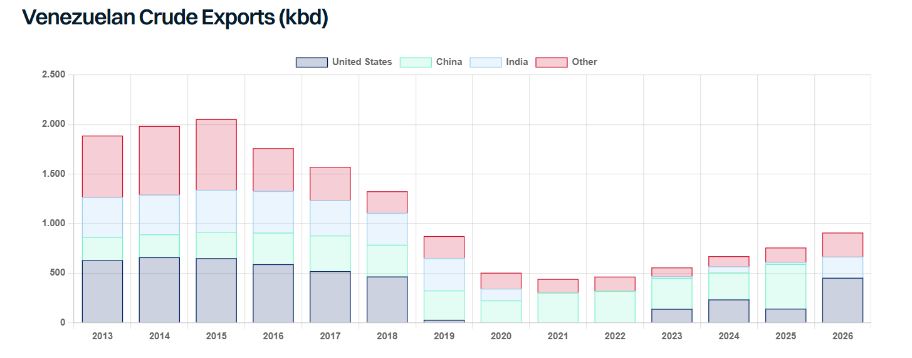

# The 65 Billion Barrel Deal

**Date:** September 07, 2026  
**Publisher:** Breakwave Advisors | **Category:** Market Insights  
**Original URL:** [https://www.breakwaveadvisors.com/insights/2026/9/7/the-65-billion-barrel-deal](https://www.breakwaveadvisors.com/insights/2026/9/7/the-65-billion-barrel-deal)  

---

> **Figure 1: Oil Drilling**  
> **Interactive Data & Source:** [Gibsons Co](https://www.gibsons.co.uk/market-reports) | [Local Asset](file:///C:/Users/Dell/Github/Shipping/corpus/03-breakwave/insights/2026/assets/2026-09-07_the-65-billion-barrel-deal_img_oil-drilling_1f62af173c53.jpg)

Last Friday, President Trump announced that the US had reached an agreement to control 65 billion barrels of Venezuelan oil reserves in partnership with a little-known company called North American Blue Energy Partners (NABEP). The company currently produces around 250kbd, making it the 2nd largest private producer in the country and has been granted 100-year concessions on 17 oil fields with proven reserves of 65 billion barrels. As part of the deal, the US Department of War’s Office of Strategic Capital has been awarded a 35% equity stake in NABEP’s parent company, whilst the US Department of the State has been guaranteed 20% offtake and production cost from all current and future fields NABEP operates. The US will also have first right of refusal on the remaining 80% of production allowing it to exert control over additional oil supplies in emergency situations. NABEP is said to have developed a plan to rapidly scale production by investing up to $100 billion in new oil infrastructure in the country.

Separate from NABEP, earlier this week Chevron said it had been awarded additional acreage in the Orinoco Belt, adjacent to existing operations where it plans to invest more than $7 billion over the next five years, aiming to double its production to 600kbd. Eni also signed a deal on to take control the 35-billion-barrel Junín-5 field, which currently produces just 12kbd, planning to spend $1.5bn a year on the field and raise production to 400kbd.

So, what happens now? The Trump administration expects that material increases in production will be seen early next year with Energy Secretary Chris Wright anticipating 1.5mbd by mid-2027. An increase from 1.1mbd today to 1.5mbd by the mid-2027 is not entirely unrealistic with experienced operators ENI and Chevron. What is less clear is whether all the investment NABEP seeks will materialise and over what time frame, and how many other international operators are attracted to the region. In any case, there appears clear upside for production even if the pace and scale is uncertain. Goldman Sachs recently said it does not expect production to exceed 2mbd over the next couple of years given the scale of investment required.

Where does the incremental production go? Chevron and ENI appear free to trade their equity to wherever they see fit, with their refining systems in the US and Europe the primary recipients. Production from NABEP could in theory go anywhere, but with the US being guaranteed 20% offtake and having first right of refusal on the remaining 80%, the US is likely to be a key destination. Secretary Chris Wright has said the barrels could be used to refill the Strategic Petroleum Reserve (SPR) (swapped with more SPR compatible barrels), whilst it is also unclear what this deal means for previous contracts agreed with major traders in January to market Venezuelan oil.

Given all the inefficiencies and dislocation seen in the current oil market, it is difficult to draw clear conclusions for tankers in the short term. Logically, the US is likely to take the majority of Venezuelan production increases up to a point, with European equity holders sending cargoes to their own refineries. Over time, incrementally more volume is likely to head East as US refiners exhaust their appetite for heavy sour crudes. It’s worth noting that since 2013, US imports from Venezuela have not exceeded 650kbd, whilst heavy sour imports (all sources) have declined from 1.8mbd in 2013, to 750kbd last year. Heavy sour volumes from the Middle East to US could be backed out by increased Venezuelan supply, yet US volumes of heavy crude from the Middle East stood at just 60kbd last year, minimising the impact for tankers.

Overall, the real impact is likely to be an increase in the crude surplus in the Atlantic basis, supporting incremental export flows from West to East, which could also help offset the loss of US exports, as and when the SPR refill commences.

> **Figure 2: Στιγμιότυπο Οθόνης 2026 09 07 110548**  
> **Interactive Data & Source:** [Gibsons Co](https://www.gibsons.co.uk/market-reports) | [Local Asset](file:///C:/Users/Dell/Github/Shipping/corpus/03-breakwave/insights/2026/assets/2026-09-07_the-65-billion-barrel-deal_img_cea3cf84ceb9ceb3cebcceb9cf8ccf84cf85_32e1aa260ffd.png)

Data source:[Gibson Shipbrokers](https://www.gibsons.co.uk/market-reports)

---

**Tags:** Tankers, Shipping, Crude  
