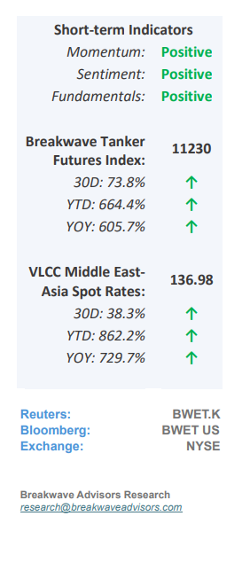
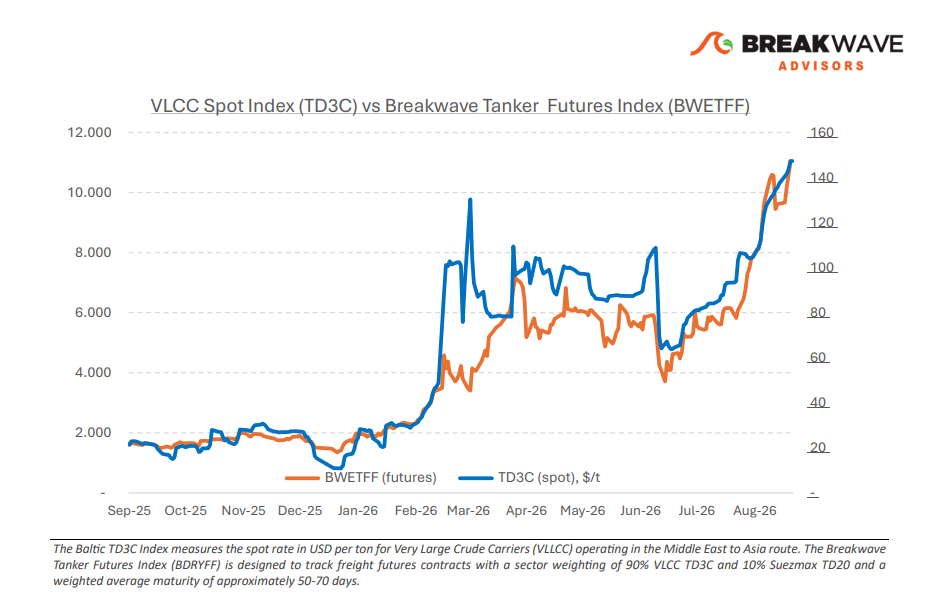
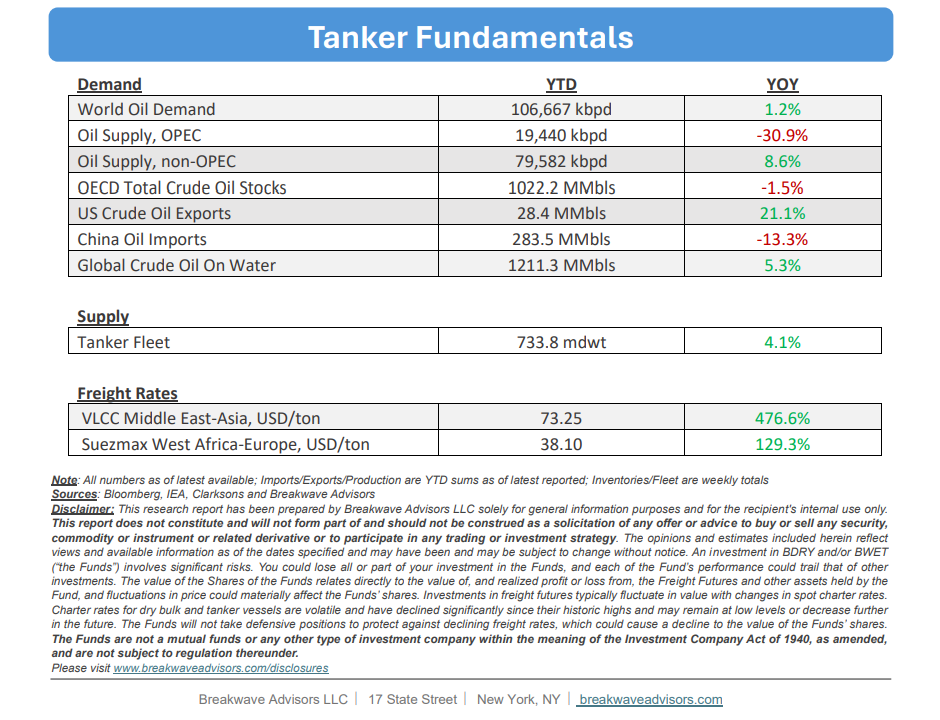

# Breakwave Bi-Weekly Tanker Report - September 8, 2026

**Date:** September 08, 2026  
**Publisher:** Breakwave Advisors | **Category:** Market Insights  
**Original URL:** [https://www.breakwaveadvisors.com/insights/980026wetreportkju458-ook57](https://www.breakwaveadvisors.com/insights/980026wetreportkju458-ook57)  

---

•**Atlantic Strength and Hormuz Risk Support VLCC Premiums**– Firmer enquiry from the US Gulf, Brazil and West Africa is absorbing prompt VLCC tonnage and limiting the number of ships available to ballast towards the Middle East while owners considering Arabian Gulf employment must also factor in the**security, insurance and operational exposure**associated with Hormuz, increasing the cost of attracting vessels east. Iraq’s Basrah exports recovered alongside improved, although still selective, access through Hormuz, with Iraqi crude exports increasing from approximately 1.35 mb/d in July to ~2.35 mb/d in August after certain tankers were permitted to transit. Still,**volumes remained below pre-war levels,**with Basrah cargoes continuing to rely on a smaller pool of vessels prepared and able to enter the Gulf. A clear distinction remains between the Atlantic and East of Suez basins: Atlantic freight is benefiting from firmer cargo activity, while eastbound employment includes an**additional premium for Hormuz exposure**as renewed US and Iranian attacks involving tankers interrupted the tentative recovery in traffic seen during August, pushing commodity-vessel transits to their lowest level since May. The direct involvement of commercial ships has increased the risks of physical damage, delays and vessels being held inside the Gulf. Insurance continues to reinforce this divide. The latest published indications before the renewed escalation placed additional Hormuz war-risk**premiums at 7.5%–12.5%**of hull value per transit, compared with**around 0.25%**before the conflict. Available cover varies by vessel, ownership and voyage, while some underwriters have reduced capacity or outright have declined coverage. Crew safety requirements, charter-party terms and uncertain transit times add further costs. The immediate freight picture is consequently shaped by cargo absorption in the Atlantic and restricted vessel participation in the east.

> **Figure 1: Cea3cf84ceb9ceb3cebcceb9cf8ccf84cf85**  
> [Local Asset](file:///C:/Users/Dell/Github/Shipping/corpus/03-breakwave/insights/2026/assets/2026-09-08_980026wetreportkju458-ook57_img_cea3cf84ceb9ceb3cebcceb9cf8ccf84cf85_566b969b3ee7.png)

•**Oil Prices Rise but Remain Unimpressed from Recent Re-Escalation**– Brent crude oil prices have**steadily risen into the mid/high-$90s range,**though volatility has compressed relative to the extreme spikes observed earlier in the conflict. While**calculating exact volumes transiting the Strait of Hormuz remains difficult**due to opaque "dark" shipping activity, current assessments indicate that global oil flows remain structurally lower than pre-war baselines. The upward pressure on prices has been primarily constrained by**subdued demand from China**, something that most analyst believe is transitory. Yet, looking toward 2027 and beyond, the core risk for energy markets rests on demand trajectories;**actual demand destruction**remains difficult to quantify, and structural shifts, evidenced by surging Chinese electric vehicle (EV) sales, point to an**accelerated adoption of alternative**transport technologies that could permanently lower global oil demand projections.

•**Our Long-term View**– The tanker market has been recovering from a long period of staggered rates as the growth in new vessel supply shrunk while oil demand remained elevated in line with the global economy. The recent rapid increase in freight rates has led to significant new vessel ordering, with the orderbook now standing at above average levels, and although in the near term such a supply/demand misbalance is small, we expect a meaningful negative balance to develop longer term leading to a potential downcycle.

> **Figure 2: Στιγμιότυπο Οθόνης 2026 09 07 230408**  
> [Local Asset](file:///C:/Users/Dell/Github/Shipping/corpus/03-breakwave/insights/2026/assets/2026-09-08_980026wetreportkju458-ook57_img_cea3cf84ceb9ceb3cebcceb9cf8ccf84cf85_f95535dc8765.png)

> **Figure 3: Στιγμιότυπο Οθόνης 2026 09 07 230426**  
> [Local Asset](file:///C:/Users/Dell/Github/Shipping/corpus/03-breakwave/insights/2026/assets/2026-09-08_980026wetreportkju458-ook57_img_cea3cf84ceb9ceb3cebcceb9cf8ccf84cf85_d1c1a09871da.png)

### Subscribe:
