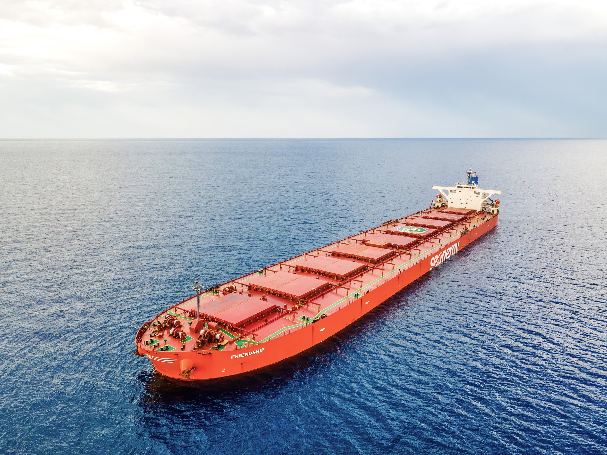

# The Capesize market

**Date:** September 09, 2026  
**Publisher:** Breakwave Advisors | **Category:** Market Insights  
**Original URL:** [https://www.breakwaveadvisors.com/insights/2026/9/9/the-capesize-market](https://www.breakwaveadvisors.com/insights/2026/9/9/the-capesize-market)  

---

> **Figure 1: Byeirini Diamantara&dimitris Roumeliotis**  
> *ByEirini Diamantara&Dimitris Roumeliotis*  
> **Interactive Data & Source:** [Linkedin](https://www.linkedin.com/in/eirini-diamantara-58b269105/) | [Local Asset](file:///C:/Users/Dell/Github/Shipping/corpus/03-breakwave/insights/2026/assets/2026-09-09_the-capesize-market_img_011_9c8bc7480e15.jpg)

The Capesize market has moved into territory not seen for almost five years, with the Baltic Exchange C5TC reaching USD 54,791/day on 4 September 2026. Based on the Baltic historical series, the last time earnings were at a higher level was 21 October 2021, when the index stood at USD 57,374/day, shortly after the extraordinary 2021 rally peaked at almost USD 87,000/day. The current move is therefore more than a short-lived seasonal improvement; it places today’s market alongside one of the strongest freight environments of the post-Covid period.

The main engine behind the rally is the Atlantic. Brazilian iron ore exports have accelerated, while Guinean bauxite continues to generate substantial long-haul employment into China. Brazilian iron ore shipments recently increased around 20% week-on-week, while Guinean bauxite exports on a four-week rolling basis stood approximately 55% higher year-on-year, reinforcing the strength of Atlantic cargo demand. This matters particularly for Capesizes because Atlantic cargoes absorb vessels for longer periods and increase tonne-mile demand. During Q2 2026, total Capesize tonne-miles were already 4.9% higher year-on-year, supported by 2% growth in iron ore tonne-miles, 7.7% in bauxite and 15.3% in coal. At the same time, the number of unfixed Capes ballasting toward the South Atlantic has reportedly fallen to roughly half last year’s level, leaving charterers competing for a much thinner prompt tonnage list.

Weather has added another layer of pressure. Recent disruptions in the Pacific have constrained vessel availability just as cargo demand strengthened in both basins, creating what brokers have described as a “perfect storm” of stronger demand and tightening supply. The renewed Houthi threat and wider Middle East instability are not the direct cause of the Capesize rally, since the principal Brazil/West Africa–China trades do not depend on the Red Sea. Nevertheless, continued security concerns contribute to broader fleet inefficiency, higher voyage risk and a shipping market increasingly sensitive to disruptions in key corridors. Forward markets are also validating the strength: September and October FFAs recently traded around USD 50,000/day, while Q1 2027 was near USD 32,000/day, unusually firm for a seasonally weak quarter. This suggests the market is pricing more than a brief spot squeeze.

What is perhaps more important for the S&P market is that the present strength is not isolated within 2026. Using the daily Baltic observations available through 4 September, the C5TC averaged approximately USD 24,488/day during 2024–2026, compared with USD 22,005/day during 2021–2023, an increase of about 11%. This is particularly notable because the earlier period includes 2021, when the annual average reached USD 33,333/day. By contrast, the current period has produced greater consistency: USD 22,593/day in 2024, USD 21,297/day in 2025 and USD 31,937/day year-to-date in 2026.

From an owner’s perspective, this makes 2024–2026 arguably the better operating period on the data available so far. With Capesize OPEX generally not exceeding EUR 8,000–9,000/day, average freight earnings have provided a substantial operating spread before financing and capital costs, while current spot earnings exceed running costs several times over. If today’s freight strength proves sustainable, the implication for S&P is straightforward: strong cash generation, firmer owner sentiment and further support for already elevated secondhand Capesize values.

Data source:[Xclusiv Shipbrokers Inc.](https://www.linkedin.com/company/xclusiv-shipbrokers-inc/)

---

**Tags:** Drybulk, Shipping, Markets  
