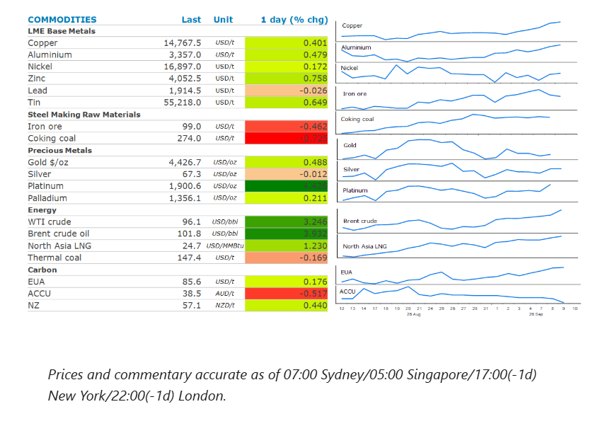
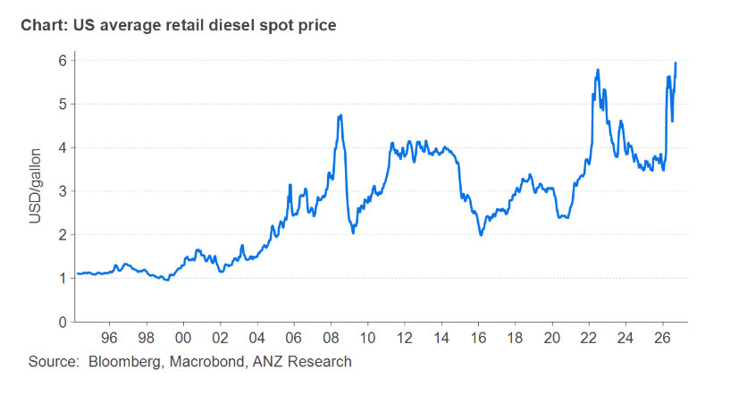

# Brent tops USD100/bbl as US-Iran attacks escalate

**Date:** September 10, 2026  
**Publisher:** Breakwave Advisors | **Category:** Market Insights  
**Original URL:** [https://www.breakwaveadvisors.com/insights/2026/9/10/brent-tops-usd100bbl-as-us-iran-attacks-escalate](https://www.breakwaveadvisors.com/insights/2026/9/10/brent-tops-usd100bbl-as-us-iran-attacks-escalate)  

---

Energy markets led the complex higher, as supply disruptions mounted amid further escalation of attacks in the Middle East. Most other sectors were also higher.

*By*[*Daniel Hynes*](https://www.linkedin.com/in/dahynes/)

> **Figure 1: Στιγμιότυπο Οθόνης 2026 09 10 105438**  
> **Interactive Data & Source:** [Linkedin](https://www.linkedin.com/newsletters/commodities-wrap-6692196755876012032/?fbclid=IwAR3kiXJqZdxmp9ZcRwBNI7FsBySI-XSC0pfPur1qzjt7OZp7PTE59Tsl1QI) | [Local Asset](file:///C:/Users/Dell/Github/Shipping/corpus/03-breakwave/insights/2026/assets/2026-09-10_brent-tops-usd100bbl-as-us-iran-attacks-escalate_img_cea3cf84ceb9ceb3cebcceb9cf8ccf84cf85_b04be10ff39b.png)

### Market Commentary

Escalation in the Middle East conflict saw**Brent crude**top USD100/bbl for the first time since July. The global crude benchmark surged more than 3% after the US military said it had destroyed five Iranian tankers in response to attempts to hit a US Navy warship with ballistic missiles. Local media in Iran also reported that two US warships and eight oil tankers in the Persian Gulf had been targeted. Moreover, Bloomberg reported that a senior official from the Islamic republic had said that Iran was ready for a more intense war and will escalate counter strikes if the US continues attacking its territory and infrastructure. The tit-for-tat attacks suggest oil flows from the Persian Gulf are likely to remain disrupted for the foreseeable future. There didn’t appear any progress on the agreement between Iran and Oman regarding the management of the Strait of Hormuz, after indicating earlier this week that a deal was imminent.

The alternative routes for Persian Gulf producers to get their oil to international markets are also coming under pressure. Yemen’s Iran-backed Houthi militants are ramping up attacks on Saudi Arabia. There were several alerts in the south of the country near key energy facilities. That comes after it targeted Saudi Arabia’s 400kb/d refinery earlier this week. The broadening of the conflict threatens to risk even deeper disruption to oil supplies that had already left the oil market scrambling to adjust. The Energy Information Administration said that US diesel stockpiles are expected to fall this month to their lowest level in over two decades. The agency also hiked its retail diesel price forecast for Q4 2026 to USD5.55/gallon.

**Natural gas**prices in Europe and Asia also rallied as the prospect of an extended period of supply disruptions increased. European natural gas pushed above EUR80/MWh for the first time in three years. Concerns were heightened after reports that a drone attack had damaged Russia’s Yamal LNG facilities, a major hub for the country’s gas industry. While Russian pipeline flows to Europe have collapsed since its invasion of Ukraine in 2022, Yamal LNG still covers about 5% of Europe’s gas needs. Meanwhile North Asia LNG prices neared USD37/MMBtu, the highest level since December 2022 as the escalation in the conflict raises concerns of further supply disruptions. This has seen strong interest from emerging countries in the region.

**Copper**extended recent gains as traders shrugged off mounting economic pressures emanating from the Middle East conflict. Instead supply shortages and tariff fears continue to drive sentiment. The market remains on tenterhooks as it awaits the Trump administration’s decision on applying a 15% tariff on imports of refined metal. In the meantime, supply side issues continue to tighten the market. Inventories in Shanghai Futures Exchange warehouses have fallen to their lowest level since 2024. Stockpiles on the LME have dropped more than 40% since April.

**Gold**rose as US fiscal pressures continue to undermine confidence in the long-term value of government debt and the currency used to finance it. This comes after the US Treasury announced a plan to buy back up to USD6bn of longer-dated debt. Prices did slip later in the session as the escalation in the Middle East conflict raised concerns of higher inflation forcing the Fed to raise rates.

### Chart of the Day

The average US retail diesel spot price hit USD6/gallon this week amid increasing tightness in the distillate market. This has seen prices surpass levels seen in 2022 when Russia invaded Ukraine. That conflict is still having an impact, with recent attacks on Russian oil refineries compounding the shortages that are emanating from the Middle East disruptions. With US distillate inventories expected to fall below 100mbbls in coming weeks, the system has no buffer to withstand stronger demand from the US harvest season and manufacturer’s ramping up for the holiday season.

> **Figure 2: Στιγμιότυπο Οθόνης 2026 09 10 105447**  
> **Interactive Data & Source:** [Linkedin](https://www.linkedin.com/newsletters/commodities-wrap-6692196755876012032/?fbclid=IwAR3kiXJqZdxmp9ZcRwBNI7FsBySI-XSC0pfPur1qzjt7OZp7PTE59Tsl1QI) | [Local Asset](file:///C:/Users/Dell/Github/Shipping/corpus/03-breakwave/insights/2026/assets/2026-09-10_brent-tops-usd100bbl-as-us-iran-attacks-escalate_img_cea3cf84ceb9ceb3cebcceb9cf8ccf84cf85_88f343720248.png)

Data source:[Commodities Wrap](https://www.linkedin.com/newsletters/commodities-wrap-6692196755876012032/?fbclid=IwAR3kiXJqZdxmp9ZcRwBNI7FsBySI-XSC0pfPur1qzjt7OZp7PTE59Tsl1QI)

---

**Tags:** Commodities, Shipping, Markets  
