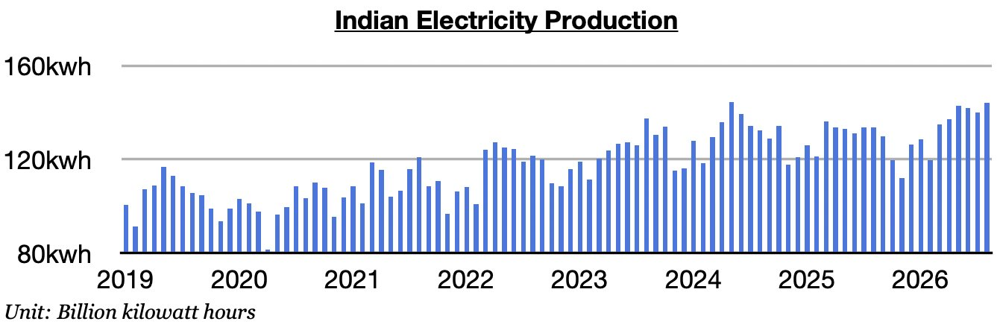
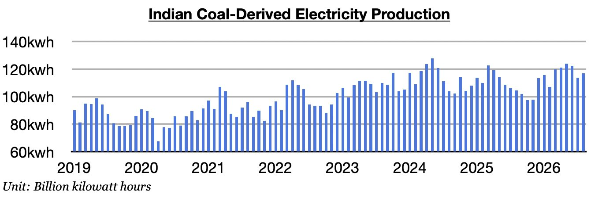

# India Continues To Heat Up

**Date:** September 11, 2026  
**Publisher:** Breakwave Advisors | **Category:** Market Insights  
**Original URL:** [https://www.breakwaveadvisors.com/insights/2026/9/11/india-continues-to-heat-up](https://www.breakwaveadvisors.com/insights/2026/9/11/india-continues-to-heat-up)  

---

*By*[*Jeffrey Landsberg*](https://www.linkedin.com/in/jeffrey-landsberg-70ab957/)

As we discussed in Commodore Research's most recent Weekly Executive Report, India produced approximately 144.1 billion kilowatt hours of electricity last month. This is up month-on-month by 4.1 billion kilowatt hours (3%), up year-on-year by 10.4 billion kilowatt hours (8%), and is the largest amount ever produced in the month of August. India's electricity production has now increased year-on-year for five straight months. Previously, it had contracted in eight of the prior twelve months.

> **Figure 1: Chart 1 (1)**  
> [Local Asset](file:///C:/Users/Dell/Github/Shipping/corpus/03-breakwave/insights/2026/assets/2026-09-11_india-continues-to-heat-up_img_chart128129_d25f801e1716.jpg)

India's coal-derived electricity generation totaled approximately 116.8 billion kilowatt hours last month. This is up month-on-month by 3.1 billion kilowatt hours (3%), up year-on-year by 12.3 billion kilowatt hours (12%), and is the largest amount ever produced in August. India's coal-derived electricity generation has now grown year-on-year for five straight months. Previously, it had fallen on a year-on-year basis in nine of the prior twelve months, which marked the**only time this decade**that such an event had occurred. As we have stressed in our Weekly Executive Reports, the Iran war has been aiding thermal coal demand. Temperatures have also been warmer than usual and hydropower output has remained in contraction.

> **Figure 2: Chart 2 (1)**  
> [Local Asset](file:///C:/Users/Dell/Github/Shipping/corpus/03-breakwave/insights/2026/assets/2026-09-11_india-continues-to-heat-up_img_chart228129_bb698dcf8172.jpg)

Also of note is that Coal India’s production has contracted on a year-on-year during five of the last six months. Our most recent Weekly Executive Report discusses the Indian coal market in much greater detail.

---

**Tags:** Coal, Commodities, Markets  
