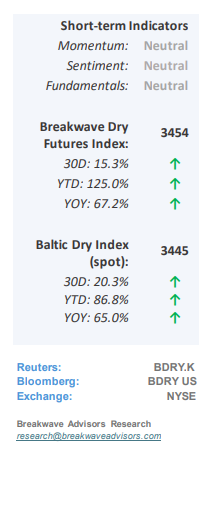
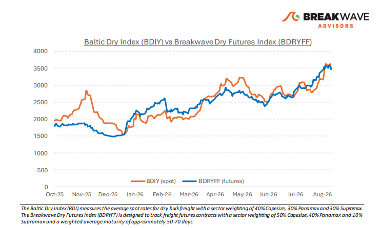
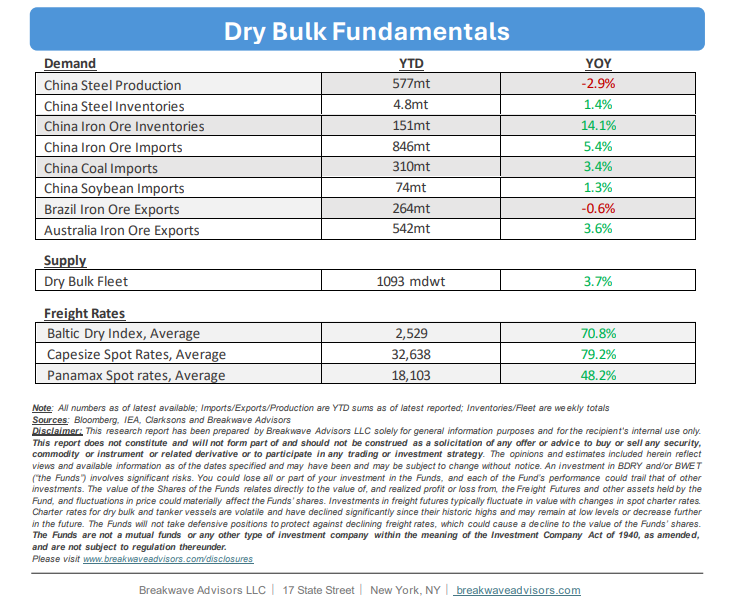

# Breakwave Bi-Weekly Dry Bulk Report - September 15, 2026

**Date:** September 15, 2026  
**Publisher:** Breakwave Advisors | **Category:** Market Insights  
**Original URL:** [https://www.breakwaveadvisors.com/insights/9152026db-reportdbsept-hyu887](https://www.breakwaveadvisors.com/insights/9152026db-reportdbsept-hyu887)  

---

•**Iron Ore Trade Remain Elevated as We Enter the Seasonally Strong Period –**September historically marks the beginning of seasonal strength in the dry bulk trade, as weather-related disruptions subside and Northern Hemisphere import demand for bulk commodity goods rises ahead of winter. This year, the market enters this period from an exceptionally high baseline, with Capesize rates holding firmly well above $40,000 and Panamax spot rates in the low $20,000 range. Consequently, any additional market tightness will likely push spot rates to levels yielding well above-average returns for shipowners. Global shipping continues to generate multi-decade high earnings, driven primarily by ongoing geopolitical disruptions across the Red, Black, and Arabian Seas that impair operational efficiency and constrain effective vessel supply. Although coal trade volumes have declined notably year-over-year, current market balances are dominated by these supply-side restrictions, effectively neutralizing the impact of weaker coal demand. Overall, sector fundamentals remain robust, and despite lower overall volatility, the potential for a substantial rate spike in the fourth quarter remains high.

> **Figure 1: Cea3cf84ceb9ceb3cebcceb9cf8ccf84cf85**  
> [Local Asset](file:///C:/Users/Dell/Github/Shipping/corpus/03-breakwave/insights/2026/assets/2026-09-15_9152026db-reportdbsept-hyu887_img_cea3cf84ceb9ceb3cebcceb9cf8ccf84cf85_8c13c3fdea6b.png)

•**Iron Ore Prices Remain Depressed on High Import Volumes, Inventories**– Although strong iron ore volumes into China have helped propel Capesize rates to multi-year highs, subdued iron ore prices and elevated freight costs are actively squeezing margins for major miners, with energy volatility, especially for the allimportant diesel, further eroding profitability. While the dry bulk market is currently enjoying exceptional strength, largely driven by geopolitical fleet disruptions and operational inefficiencies, the underlying iron ore supply-demand balance presents a medium-term headwind. Had the global fleet maintained pre-conflict efficiency, rate dynamics would look vastly different; shipping historically delivers peak returns during structural disruptions, yet these periods are inevitably followed by extended lulls. Once current supply constraints subside, cost structures will re-align, shifts in the iron ore trade will once again favor miners, and vessel earnings will greatly normalize.

•**Our Long-term View**– The last few years have been characterized by increased geopolitical uncertainty. Going forward, we expect such events to continue to affect global trade and have a meaningful impact on effective vessel supply. Combined with the potential for a multi-year cyclical rebound in China’s economic activity following the recent economic turmoil, dry bulk shipping should experience higher volatility on top of a secular tightness driven by stable bulk commodity demand and rather steady but elevated fleet growth.

> **Figure 2: Στιγμιότυπο Οθόνης 2026 09 14 212508**  
> [Local Asset](file:///C:/Users/Dell/Github/Shipping/corpus/03-breakwave/insights/2026/assets/2026-09-15_9152026db-reportdbsept-hyu887_img_cea3cf84ceb9ceb3cebcceb9cf8ccf84cf85_8e5c878ef3de.png)

> **Figure 3: Στιγμιότυπο Οθόνης 2026 09 14 212524**  
> [Local Asset](file:///C:/Users/Dell/Github/Shipping/corpus/03-breakwave/insights/2026/assets/2026-09-15_9152026db-reportdbsept-hyu887_img_cea3cf84ceb9ceb3cebcceb9cf8ccf84cf85_a2b757cbc22f.png)

### Subscribe:
