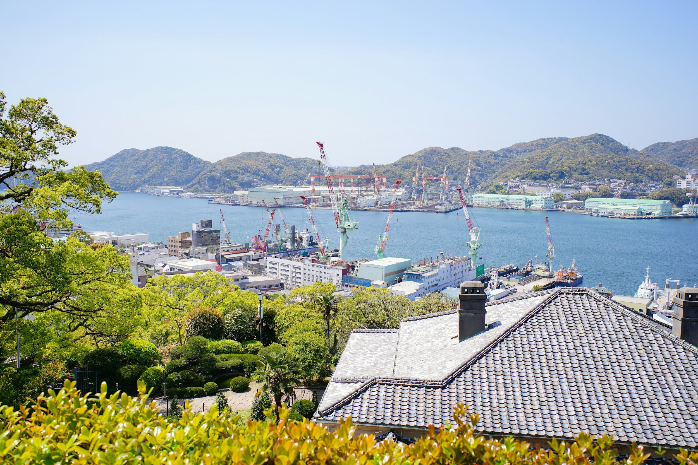

# Japan’s dry bulk shipbuilding market

**Date:** September 15, 2026  
**Publisher:** Breakwave Advisors | **Category:** Market Insights  
**Original URL:** [https://www.breakwaveadvisors.com/insights/2026/9/14/japans-dry-bulk-shipbuilding-market](https://www.breakwaveadvisors.com/insights/2026/9/14/japans-dry-bulk-shipbuilding-market)  

---

> **Figure 1: Byeirini Diamantara&dimitris Roumeliotis**  
> *ByEirini Diamantara&Dimitris Roumeliotis*  
> **Interactive Data & Source:** [Linkedin](https://www.linkedin.com/in/eirini-diamantara-58b269105/) | [Local Asset](file:///C:/Users/Dell/Github/Shipping/corpus/03-breakwave/insights/2026/assets/2026-09-15_japans-dry-bulk-shipbuilding-market_img_unsplash-image-vz9wkid03cs_74e705f9d177.jpg)

Japan’s dry bulk shipbuilding market is dominated by a relatively small group of established builders, but the balance between historical fleet presence and current newbuilding activity varies considerably across vessel segments. Looking first at the active fleet, NSY is by far the largest Japanese dry bulk builder, with 1,299 vessels currently trading, representing 36.6% of the Japanese-built fleet. Tsuneishi follows with 686 vessels, or 19.3%, while Oshima ranks third with 423 vessels and an 11.9% share. Namura and Shin Kurushima account for a further 10.0% and 7.8%, respectively. Together, these names form the core of Japan’s dry bulk construction base and underline how concentrated the country’s shipbuilding expertise remains around a relatively limited number of major groups.

Historically, Japanese dry bulk construction experienced its strongest delivery wave during the early 2010s, with 2012 standing out as the peak year for vessels still trading today. This period reflects the strength of Japanese yards in traditional bulk carrier construction, particularly across Handysize, Supramax and Panamax designs. More recently, the product mix has evolved, with Ultramax vessels gaining a much larger role in Japanese output. This gradual shift reflects owners’ growing preference for larger geared vessels offering better cargo intake, improved fuel efficiency and broader trading flexibility, while still retaining the operational versatility traditionally associated with Japanese-built dry bulk tonnage. This concentration at the top is also reflected in the newbuilding market. NSY currently holds 125 dry bulk orders, equivalent to 34.5% of the Japanese orderbook, followed by Oshima with 76 vessels and a 21.0% share, and Tsuneishi with 63 orders, or 17.4%. Combined, NSY and Oshima alone account for 55.5% of all Japanese dry bulk vessels currently on order, confirming their central role in the country’s shipbuilding industry. The continuity between active fleet presence and newbuilding activity also suggests that established yard relationships and proven designs continue to influence owners’ ordering decisions. The composition differs significantly by segment. Capesize remains the most concentrated, with NSY accounting for 63.8% of the active Japanese-built fleet and 60.5% of the current orderbook. Kamsarmax is similarly concentrated around Tsuneishi, which represents 52.3% of the active fleet and 48.4% of new orders. Ultramax construction is dominated by NSY and Oshima, which together account for more than 70% of the active fleet and over 75% of current orders. These figures illustrate that certain yards have developed particularly strong identities around specific vessel classes, creating a clear pattern of specialization within Japanese shipbuilding. Handysize, by contrast, has a noticeably broader shipyard base. Within the active fleet, NSY holds the largest share at 33.4%, but Namura accounts for 15.0%, Onomichi 10.8%, Kanda 9.2%, Shin Kurushima 8.5% and Oshima 8.0%. The same pattern remains visible in today’s orderbook, where NSY leads with 25.4%, followed by Onomichi at 19.0%, Oshima at 17.5%, Namura at 14.3% and Shin Kurushima at 8.7%. Unlike Capesize or Kamsarmax, no single builder therefore controls the segment, highlighting the depth of technical experience and production capability spread across several Japanese yards.

For the S&P market, this distinction is particularly relevant. Japanese-built bulkers are not treated as a homogeneous product, as yard pedigree, design history and vessel type often influence liquidity and resale pricing. Certain yards have developed strong buyer followings within specific segments, supporting confidence in secondhand transactions and, in some cases, stronger value retention. While Japan’s overall dry bulk market remains led by a handful of major groups, Handysize stands out for its unusually broad construction base, reinforcing both the depth of Japanese design experience and the segment’s distinctive position within the country’s shipbuilding industry.

Data source:[Xclusiv Shipbrokers Inc.](https://www.linkedin.com/company/xclusiv-shipbrokers-inc/)

---

**Tags:** Drybulk, Shipping, Markets  
