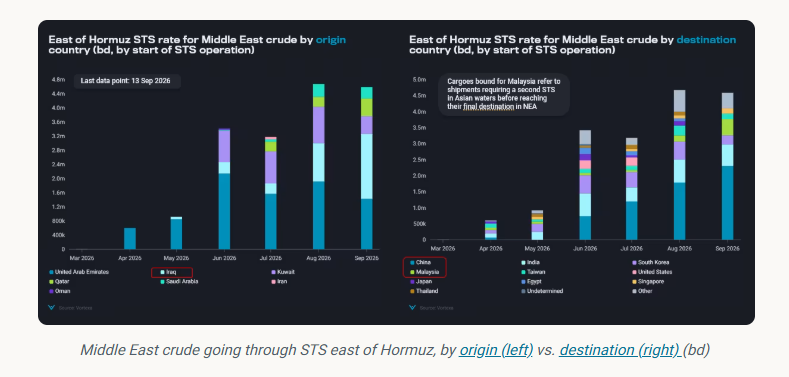
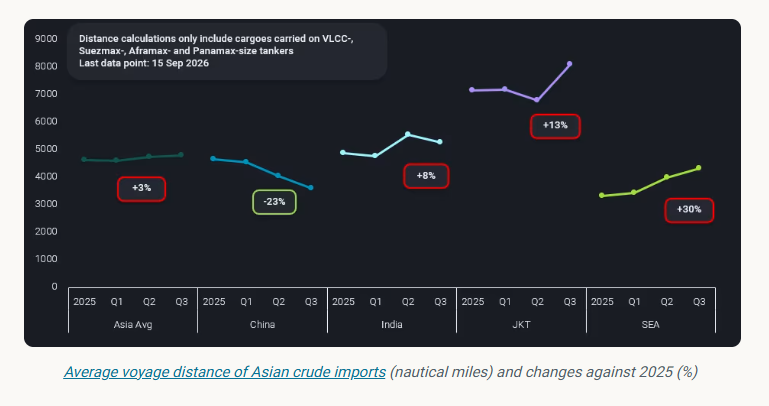
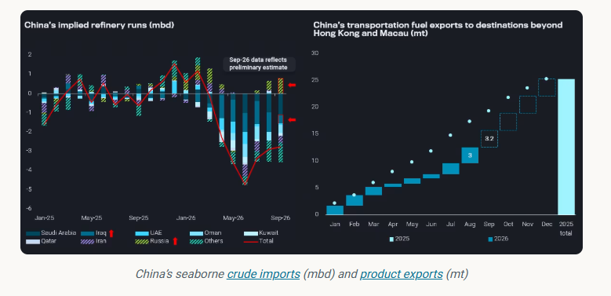

# China’s crude purchase priority in a highfreight environment

**Date:** September 16, 2026  
**Publisher:** Breakwave Advisors | **Category:** Market Insights  
**Original URL:** [https://www.breakwaveadvisors.com/insights/2026/9/16/chinas-crude-purchase-priority-in-a-highfreight-environment](https://www.breakwaveadvisors.com/insights/2026/9/16/chinas-crude-purchase-priority-in-a-highfreight-environment)  

---

When freight rates surge more dramatically than oil, controlling freight costs becomes increasingly important to refiners’ overall feedstock economics.

*By*[*Emma Li*](https://www.linkedin.com/in/emma-li-73003443/)

As China’s refinery strategy has shifted towards revenue recovery following Beijing’s removal of transportation fuel export restrictions in late June, refiners — particularly state-run oil majors that still have substantial unused fuel export quotas — are increasingly prioritising crude cost control rather than simply maximising crude imports.

As highlighted in our[previous insight [last session]](https://analytics.vortexa.com/InsightsHubPage?articleId=3Zw2zubrznHMJI8KAwrkl2&articleType=article&authorFilters=%5B%22mMo3A9IJjPQ7ExzLLqLIu%22%5D&categoryFilters=%5B%22webinar%22%2C%22report%22%2C%22article%22%2C%22highlight%22%2C%22briefing%22%5D&page=InsightsHubPage&tabId=40173c18-c403-400d-85fa-180fff870c86), China’s crude demand recovery should be accompanied by a return to baseload Middle Eastern supplies, particularly Saudi and Iraqi medium-to-heavy grades, via relatively short-haul routes through Hormuz.

Indeed, China returned to Hormuz-linked barrels in August, but increasingly relied on FOB cargoes picked up from STS zones east of Hormuz, rather than sending its own tankers into the Gulf to load directly at production ports.

> **Figure 1: Στιγμιότυπο Οθόνης 2026 09 16 103414**  
> **Interactive Data & Source:** [Vortexa](https://www.vortexa.com//oil-gas-data-traders-analysts-data-scientists?gclid=Cj0KCQjw8_qRBhCXARIsAE2AtRZKOvMnbilZ_6_91d7huSFFy71pWLrnPwGwOHVzXsmsG-1a1mZnQw8aAt89EALw_wcB&hsa_acc=1782073842&hsa_ad=548425387665&hsa_cam=14746637662&hsa_grp=125038601902&hsa_kw=&hsa_mt=&hsa_net=adwords&hsa_src=g&hsa_tgt=dsa-1431852288425&hsa_ver=3&utm_campaign=%5BCD%5D%20-%20DSA%20-%20EMEA&utm_medium=cpc&utm_medium=ppc&utm_source=google&utm_source=adwords&utm_term=) | [Local Asset](file:///C:/Users/Dell/Github/Shipping/corpus/03-breakwave/insights/2026/assets/2026-09-16_chinas-crude-purchase-priority-in-a-highfreight-environment_img_cea3cf84ceb9ceb3cebcceb9cf8ccf84cf85_2d7024d96bdf.png)

During August’s Saudi crude nominations, Chinese term buyers rejected cargoes from Yanbu or Sidi Kerir, which would have added at least 30 days of sailing time via the Cape of Good Hope. Instead, they fixed FOB cargoes from offshore Oman STS zones, effectively limiting charter voyages to around 20 days.

China has also increasingly turned to Iraqi crude since August. Several Chinese oil majors have equity barrels from their upstream investments, while a wider group of refiners has tapped spot Basrah cargoes in September through STS loadings east of Hormuz.

Of the nearly 4.7mbd of crude handled through STS operations east of Hormuz since August, Chinese refiners accounted for at least 50% of the volumes, followed by Indian refiners at around 15%.

Beyond Middle Eastern crude from Gulf ports, Chinese refiners have also competed with Indian buyers for Russian seaborne crude, securing almost all Far East barrels as well as Western Russian barrels shipped via the Northern Sea Route.

By favouring these shorter-haul barrels, Chinese refiners have managed to reduce their average crude voyage distance even as Hormuz-related disruptions have forced other Asian buyers to travel further for alternative supplies. Average voyage distance for China’s crude imports fell to around 3,600 nautical miles in Q3, from 4,670 nautical miles in 2025. Meanwhile, other Asian refiners have faced longer voyages and higher freight costs as tankers are rerouted or refiners turn to alternative supplies from the Atlantic Basin.

> **Figure 2: Στιγμιότυπο Οθόνης 2026 09 16 103501**  
> **Interactive Data & Source:** [Vortexa](https://www.vortexa.com//oil-gas-data-traders-analysts-data-scientists?gclid=Cj0KCQjw8_qRBhCXARIsAE2AtRZKOvMnbilZ_6_91d7huSFFy71pWLrnPwGwOHVzXsmsG-1a1mZnQw8aAt89EALw_wcB&hsa_acc=1782073842&hsa_ad=548425387665&hsa_cam=14746637662&hsa_grp=125038601902&hsa_kw=&hsa_mt=&hsa_net=adwords&hsa_src=g&hsa_tgt=dsa-1431852288425&hsa_ver=3&utm_campaign=%5BCD%5D%20-%20DSA%20-%20EMEA&utm_medium=cpc&utm_medium=ppc&utm_source=google&utm_source=adwords&utm_term=) | [Local Asset](file:///C:/Users/Dell/Github/Shipping/corpus/03-breakwave/insights/2026/assets/2026-09-16_chinas-crude-purchase-priority-in-a-highfreight-environment_img_cea3cf84ceb9ceb3cebcceb9cf8ccf84cf85_57888a0eb7e0.png)

In a record-high freight environment, shorter crude voyages can materially reduce delivered feedstock costs while allowing refiners to respond more quickly to changes in market conditions. This gives Chinese refiners a meaningful advantage in protecting refining margins, particularly when Asian product cracks remain elevated.

## China to Balance Asian Product Market with Strong Q4 Export Momentum

China’s decision to shun Red Sea Arab crude offers was unlikely to have anticipated the subsequent damage to Saudi Arabia’s East-West pipeline. Rather, the arrangement appears to have been a concession from Saudi Aramco to retain its largest term buyers, which had reduced their cargo nominations for three consecutive months between June and August.

Nevertheless, the establishment of the Hormuz STS arrangement has given Chinese buyers a more stable route to secure Saudi crude into September, just as the latest pipeline damage has introduced unprecedented uncertainty around Yanbu loadings. This has further reinforced the value of alternative loading arrangements east of Hormuz, allowing Chinese refiners to maintain feedstock coverage without relying on the Red Sea route.

> **Figure 3: Στιγμιότυπο Οθόνης 2026 09 16 103555**  
> **Interactive Data & Source:** [Vortexa](https://www.vortexa.com//oil-gas-data-traders-analysts-data-scientists?gclid=Cj0KCQjw8_qRBhCXARIsAE2AtRZKOvMnbilZ_6_91d7huSFFy71pWLrnPwGwOHVzXsmsG-1a1mZnQw8aAt89EALw_wcB&hsa_acc=1782073842&hsa_ad=548425387665&hsa_cam=14746637662&hsa_grp=125038601902&hsa_kw=&hsa_mt=&hsa_net=adwords&hsa_src=g&hsa_tgt=dsa-1431852288425&hsa_ver=3&utm_campaign=%5BCD%5D%20-%20DSA%20-%20EMEA&utm_medium=cpc&utm_medium=ppc&utm_source=google&utm_source=adwords&utm_term=) | [Local Asset](file:///C:/Users/Dell/Github/Shipping/corpus/03-breakwave/insights/2026/assets/2026-09-16_chinas-crude-purchase-priority-in-a-highfreight-environment_img_cea3cf84ceb9ceb3cebcceb9cf8ccf84cf85_27a71a57cb79.png)

Preliminary flow data suggests that China’s seaborne crude arrivals will continue rebounding in September and October, though remain well below seasonal norms, with around 8mbd set to arrive assuming no further disruptions.

Although November and December arrivals remain open, refiners still have ample onshore crude stocks to provide a buffer if seaborne supply is disrupted. This should give Chinese oil majors sufficient confidence to maintain refinery runs into Q4 and maximise the value of strong Asian product cracks through higher clean fuel exports.

At an annual clean fuel export quota of 41mt and with utilisation above 95%, China recorded around 25mt of cargo exports beyond Hong Kong and Macau in 2025. If the 2026 annual quota remains unchanged, with the final batch likely to be issued by the end of September, the remaining quota would allow an average of around 3.2mt/month of exports beyond Hong Kong and Macau over the final four months, compared with only around 800kt/month during Q2 when the export restrictions were in place.

The current September export plan is already at this level, with volumes potentially scaling up towards the end of the month.

## Bullish Rather Than Bearish Q4 Outlook

Q4 still carries considerable uncertainty, with higher crude benchmark prices, firmer spot premiums and elevated freight costs potentially weighing on refinery economics. However, as long as product prices continue to keep pace and refining margins remain positive, Chinese refiners are likely to prioritise utilisation of their remaining annual fuel export quotas.

This could shift China’s role in balancing the regional oil market: after reducing crude imports through much of Q2 and Q3 and helping to contain upward pressure on crude prices, China could increasingly provide relief from the product side in Q4 through stronger clean fuel exports. Rather than signalling a broad-based recovery in crude demand, a rebound in Chinese refinery runs could therefore translate into greater product availability across Asia, helping to ease regional tightness while keeping crude demand still below pre-war levels.

Data Source:[Vortexa](https://www.vortexa.com//oil-gas-data-traders-analysts-data-scientists?gclid=Cj0KCQjw8_qRBhCXARIsAE2AtRZKOvMnbilZ_6_91d7huSFFy71pWLrnPwGwOHVzXsmsG-1a1mZnQw8aAt89EALw_wcB&hsa_acc=1782073842&hsa_ad=548425387665&hsa_cam=14746637662&hsa_grp=125038601902&hsa_kw=&hsa_mt=&hsa_net=adwords&hsa_src=g&hsa_tgt=dsa-1431852288425&hsa_ver=3&utm_campaign=%5BCD%5D%20-%20DSA%20-%20EMEA&utm_medium=cpc&utm_medium=ppc&utm_source=google&utm_source=adwords&utm_term=)

---

**Tags:** Tankers, Markets, Crude  
