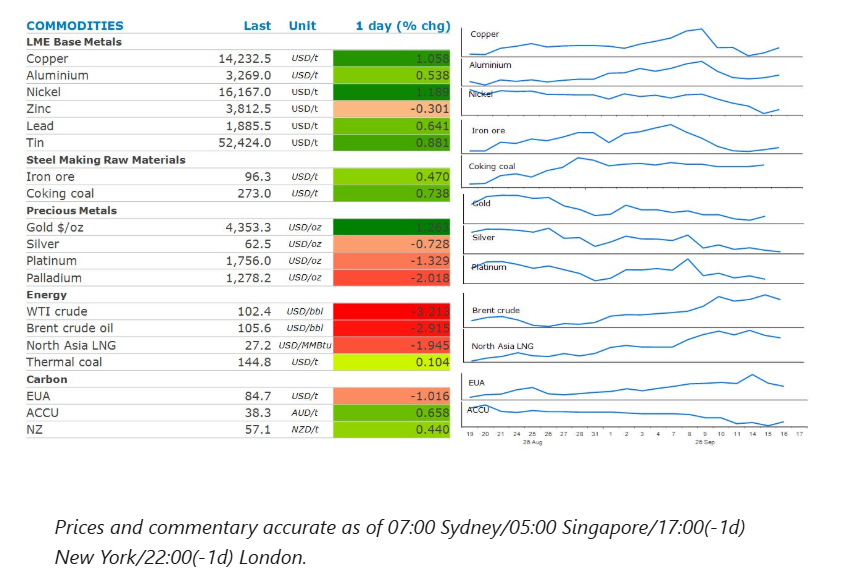
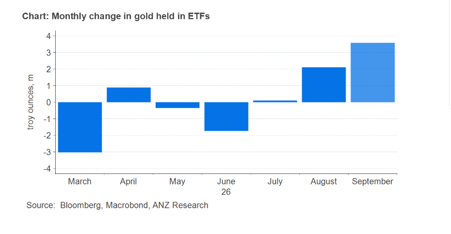

# Oil falls as supply concerns ease

**Date:** September 17, 2026  
**Publisher:** Breakwave Advisors | **Category:** Market Insights  
**Original URL:** [https://www.breakwaveadvisors.com/insights/2026/9/17/oil-falls-as-supply-concerns-ease](https://www.breakwaveadvisors.com/insights/2026/9/17/oil-falls-as-supply-concerns-ease)  

---

Energy markets dipped, as supply disruption concerns in the Middle East eased. Precious metals fell following the Fed’s rate hike. Industrial metals gained.

*By*[*Daniel Hynes*](https://www.linkedin.com/in/dahynes/)

> **Figure 1: Στιγμιότυπο Οθόνης 2026 09 17 105148**  
> **Interactive Data & Source:** [Linkedin](https://www.linkedin.com/newsletters/commodities-wrap-6692196755876012032/?fbclid=IwAR3kiXJqZdxmp9ZcRwBNI7FsBySI-XSC0pfPur1qzjt7OZp7PTE59Tsl1QI) | [Local Asset](file:///C:/Users/Dell/Github/Shipping/corpus/03-breakwave/insights/2026/assets/2026-09-17_oil-falls-as-supply-concerns-ease_img_cea3cf84ceb9ceb3cebcceb9cf8ccf84cf85_cc7e28e952e8.png)

### Market Commentary

**Crude oil**prices gave back recent gains as recent supply disruptions began to resolve. Saudi Arabia said it expects to return about half of the capacity of its East-West pipeline within days after shutting it last week when it was attacked by drones. State-owned Saudi Aramco is said to be working to by-pass a damaged section. However, it could take up to six weeks for the pipeline to be back to full capacity, according to a Bloomberg report. In the meantime, Saudi Arabia is ramping up prompt sales of crude from outside the Strait of Hormuz. It has sold about 20mbbl to Asian refiners this week, according to traders. Compounding matters was reports that Libya was able to restore its normal output levels after outages at oil fields earlier this week.

The selling was briefly interrupted following the release of US inventory data that showed further drawdowns. Crude oil inventories fell 640kbbl last week, compared with a large build forecast by the American Petroleum Institute. This was likely due to a sharp rise in US exports. Nearly 5mb/d was exported last week, which was its biggest weekly increase since late May. There was relief in the diesel sector, with distillate fuel stockpiles rising by 1.6mbbl. Exports also ticked up last week by 1.6mb/d. Nevertheless, stockpiles remain at their lowest seasonal level in history heading into peak demand season which starts in October.

**Natural gas**markets in Europe and Asia fell alongside crude oil amid easing concerns of supply disruptions. However, European prices were up strongly earlier in the session after Germany’s Economy Minister, Katherina Reiche, prompted its state-owned gas trader to buy more gas to boost inventories. This underscores growing concerns over Europe’s depleted gas reserves ahead of winter. Storage facilities across the region are about 68% full, way below the seasonal average. The situation is worse in Germany where they are only 56% full.

**Gold**ended the session lower after the FOMC raised rates by 25bp and signalled another rate hike is likely this year. The precious metal was down as much as 1.3% during Chair Warsh’s briefing, where he reaffirmed the threat posed by inflation on the US economy. Gold had found some support earlier in the session as inflationary concerns eased following a selloff in energy markets.

The**base metals**sector also found some support from investors as US stocks and bonds found some relief ahead of the FOMC meeting.**Copper**led the sector higher, despite signs of easing tightness. Cash contracts are trading at a discount of USD37/t to three months futures. This is a reversal of the premium they have been trading at in previous weeks. This may be due to US traders paring back buying following reports that the White House is delaying a decision on import tariffs on refined metal due to concerns it would worsen the inflationary backdrop.

**Iron ore**futures found some support on expectations that steel mills in China could look to boost buying of raw materials head of the National Day holiday. That’s despite concerns over steel production cuts and weak steel mill margins weighing on sentiment over the past few weeks. Industry data showed ironmaking activity in China increased in early September, with pig iron output from China Iron & Steel Association members reaching 17.95mt during 1-10 September. That was up 1.7% on the previous ten-day period.

### Chart of the Day

Investors continue to pile into gold-backed EFTs despite the prospect of higher interest rates. August recorded the first monthly gain in gold held in ETFs since April. September is on course to increase the most since this time last year. Much of this buying is coming from Asia. Institutional investment demand in China is growing strongly, as insurance companies are taking exposure to gold for 1% of their portfolio. India’s ETF flows were positive in June–August, supported by growing investor participation, with the number of active accounts rising sharply in recent months.

> **Figure 2: Στιγμιότυπο Οθόνης 2026 09 17 105645**  
> **Interactive Data & Source:** [Linkedin](https://www.linkedin.com/newsletters/commodities-wrap-6692196755876012032/?fbclid=IwAR3kiXJqZdxmp9ZcRwBNI7FsBySI-XSC0pfPur1qzjt7OZp7PTE59Tsl1QI) | [Local Asset](file:///C:/Users/Dell/Github/Shipping/corpus/03-breakwave/insights/2026/assets/2026-09-17_oil-falls-as-supply-concerns-ease_img_cea3cf84ceb9ceb3cebcceb9cf8ccf84cf85_c428206cce36.png)

Data source:[Commodities Wrap](https://www.linkedin.com/newsletters/commodities-wrap-6692196755876012032/?fbclid=IwAR3kiXJqZdxmp9ZcRwBNI7FsBySI-XSC0pfPur1qzjt7OZp7PTE59Tsl1QI)

---

**Tags:** Commodities, Shipping, Markets  
