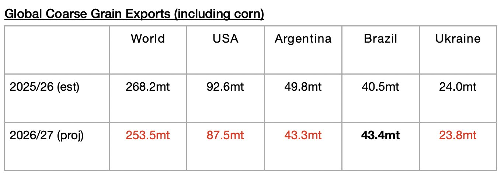

# Upcoming Contraction in Global Grain Exports Still Expected

**Date:** September 21, 2026  
**Publisher:** Breakwave Advisors | **Category:** Market Insights  
**Original URL:** [https://www.breakwaveadvisors.com/insights/2026/9/21/upcoming-contraction-in-global-grain-exports-still-expected](https://www.breakwaveadvisors.com/insights/2026/9/21/upcoming-contraction-in-global-grain-exports-still-expected)  

---

*By*[*Jeffrey Landsberg*](https://www.linkedin.com/in/jeffrey-landsberg-70ab957/)

As we discussed in Commodore Research's most recent Weekly Executive Report,The United States Department of Agriculture (USDA) has released its latest forecast for the 2026/27 season and is predicting that global coarse grain, wheat, soybean, and soymeal exports will total 746.3 million tons. This is 1.4 million tons more than the USDA predicted a month ago — but it is 22.6 million tons (-3%) less than is expected for the 2025/26 season. The forecast is still very preliminary, but a year-on-year decline in exports would be a headwind for our market. Compared to the 706 million tons of grain that was shipped during the 2024/25 season, however, 746.3 million tons — if actually shipped — would mark an increase of 40.3 million tons (6%). Overall, 746.3 million tons represents an impressive amount of grain to be shipped, but it is less than the incredible 768.9 million tons that is now estimated for the 2025/26 season.

The USDA is forecasting that global coarse grain exports in 2026/27 will total 253.5 million tons. This would mark a year-on-year decline of 14.7 million tons (-5%) from the 2025/26 season. Coarse grain exports will remain the global grain market’s largest cargo by volume. Moderate year-on-year declines in coarse grain exports are expected from the United States and Argentina. A small year-on-year decline is expected from Ukraine. A small year-on-year increase is expected from Brazil.

> **Figure 1: Chart**  
> [Local Asset](file:///C:/Users/Dell/Github/Shipping/corpus/03-breakwave/insights/2026/assets/2026-09-21_upcoming-contraction-in-global-grain-exports-still-expected_img_chart_e054ba46ddd4.jpg)

---

**Tags:** Drybulk, Commodities, Markets  
