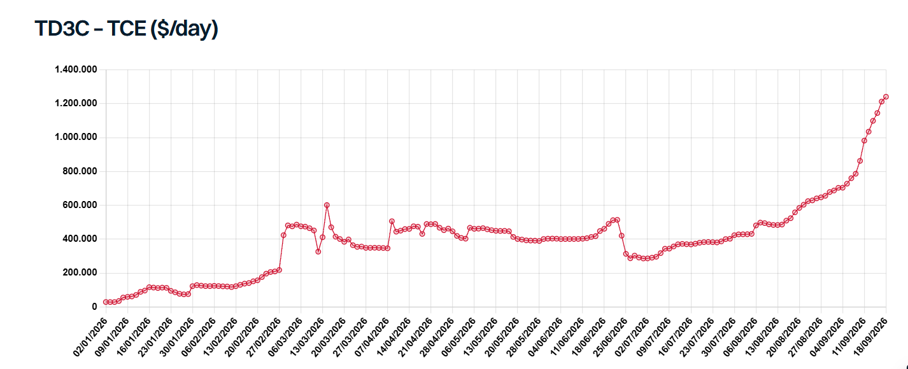

# VLCCs Rewrite the Record Books

**Date:** September 21, 2026  
**Publisher:** Breakwave Advisors | **Category:** Market Insights  
**Original URL:** [https://www.breakwaveadvisors.com/insights/2026/9/21/vlccs-rewrite-the-record-books](https://www.breakwaveadvisors.com/insights/2026/9/21/vlccs-rewrite-the-record-books)  

---

> **Figure 1: Istock 485480338**  
> **Interactive Data & Source:** [Gibsons Co](https://www.gibsons.co.uk/market-reports) | [Local Asset](file:///C:/Users/Dell/Github/Shipping/corpus/03-breakwave/insights/2026/assets/2026-09-21_vlccs-rewrite-the-record-books_img_istock-485480338_6fed1322ffe8.jpg)

The VLCC markets reached unprecedented levels this week, with TD3C surging above $1.2mn/day, TD34 climbing over $750,000/day and TD22 reaching around $400,000/day on an Eco basis. The rally has been driven primarily by increasingly severe geopolitical disruption.

Despite the ongoing double blockade, crude volumes moving through the Strait of Hormuz have increased from the lows seen during the spring, although on paper they remain well below pre-war levels. Convoyed shuttle movements of mainstream crude, largely using ageing vessels, have increased since June. This has enabled a partial rebound in Middle East crude exports, with total regional crude/DPP exports up by around 3.67 mbd versus the March-May average. The actual increase is likely higher but flows remain difficult to track accurately as vessels transit with AIS switched off for safety and security reasons.

At the same time, these movements have created significant inefficiencies. Much of the crude carried through Hormuz on shuttle vessels is subsequently transferred via STS onto often more modern tonnage in the wider Gulf of Oman (GOO) for onward voyages, primarily to Asia. AIS data shows that while the number of ballast and laden VLCCs inside the AG has declined in recent months, the number of vessels sitting in the GOO has surged, more than offsetting the fall inside the Gulf. In recent weeks, the combined VLCC count across the AG and GOO has exceeded total regional supply seen before the war in January and February. This highlights how disruption has increased the number of vessels required to move barrels despite lower absolute volumes.

Houthi attacks on Saudi-controlled assets around Bab el-Mandeb have also forced the rerouting of Yanbu crude into the Mediterranean, for onward shipments to both Western and Asian customers. As a result, VLCC supply in the East Med has increased from marginal levels to close to 30 vessels currently. Nevertheless, despite this increase, overall VLCC supply in the West remains broadly in line with levels observed between mid-April and June.

Available mainstream VLCC supply has been somewhat eroded further by attacks on vessels. The list of attacked vessels continues to grow, and any damage will require time for repairs to take place. The severity ranges from relatively minor damage to more substantial cases, but collectively this is helping to offset the impact of newbuilding deliveries.

The latest attack on the Saudi East-West pipeline represents another twist. Estimates for repair timelines vary. An unofficial estimate suggests repairs could take around five weeks, leading to a temporary decline in Yanbu loadings and a corresponding reduction in VLCC shipments from the East Med. Unless incremental barrels emerge elsewhere, this would result in a net reduction in VLCC tonne-mile demand.

Affected ballast VLCCs in the Med are more likely to remain tied up or require a significant freight premium to trade elsewhere, limiting the amount of tonnage that could realistically become available in the Atlantic Basin. The ballaster flow from the East will also remain restricted, at least in the immediate future. With TD34 spot earnings sizably above those in the West, there remains a strong incentive for Far Eastern ballasters to head to the GOO, until a meaningful downward correction in freight is seen. Longer term Yanbu exports will remain vulnerable to further attacks. Intermittent disruptions are possible, adding another layer of volatility to the market.

On the demand side, so far this year China had done much of the heavy lifting in balancing the oil market, cutting crude imports and refinery runs sharply since the spring while also drawing down inventories. A report circulated this week that China is considering releasing up to 20 million tonnes of crude from its SPR to domestic refiners, which would limit import demand. Domestic gasoline and diesel demand has also weakened amid rising EV penetration and slower industrial activity. However, the loss of Iranian barrels has forced independent Chinese refiners to seek greater volumes from mainstream trades. In addition, the unexpected easing of product export controls in August may indicate that Beijing is willing to allow state refiners to import more crude and take advantage of strong refining margins through higher refined-product exports. Still, there is a natural limit to this upside as stronger Chinese crude buying would place further upward pressure on oil prices and ultimately weigh on demand.

The freight market is beginning to show the same self-correcting response. Exceptionally high VLCC rates are already diverting some demand towards Suezmaxes, while elevated oil prices risk limiting further crude buying. However, there is little indication that the Middle East conflict is moving towards resolution. Despite President Trump’s statements, there are few visible signs that the US and Iran are materially closer to an agreement, and an increasing part of the market appears to be pricing in disruption lasting at least until the end of the year, and potentially beyond.

For tanker markets, this leaves persistent geopolitical disruption and vessel inefficiencies on one side, and growing demand destruction on the other. In the near term, disruption remains the dominant force, highly supportive for freight. But the longer exceptionally high oil and freight costs persist, the greater the risk of permanent demand destruction.

> **Figure 2: Στιγμιότυπο Οθόνης 2026 09 21 101902**  
> **Interactive Data & Source:** [Gibsons Co](https://www.gibsons.co.uk/market-reports) | [Local Asset](file:///C:/Users/Dell/Github/Shipping/corpus/03-breakwave/insights/2026/assets/2026-09-21_vlccs-rewrite-the-record-books_img_cea3cf84ceb9ceb3cebcceb9cf8ccf84cf85_dc3236e1beb8.png)

Data source:[Gibson Shipbrokers](https://www.gibsons.co.uk/market-reports)

---

**Tags:** Tankers, Shipping, Crude  
