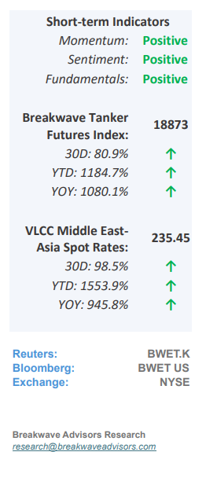
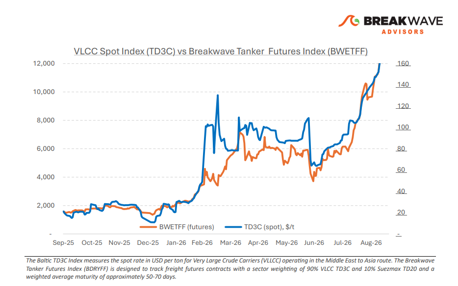
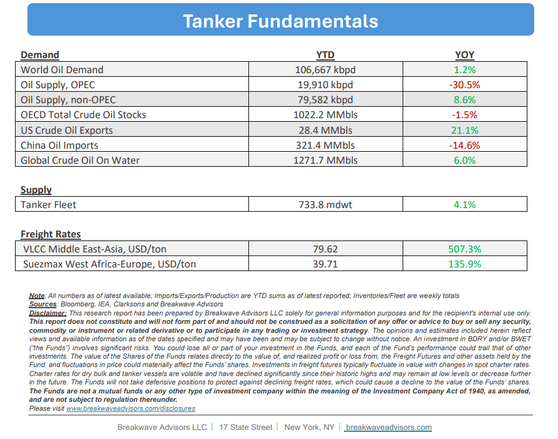

# Breakwave Bi-Weekly Tanker Report - September 22, 2026

**Date:** September 22, 2026  
**Publisher:** Breakwave Advisors | **Category:** Market Insights  
**Original URL:** [https://www.breakwaveadvisors.com/insights/980026wetreportkju458-ook57-j4w3y](https://www.breakwaveadvisors.com/insights/980026wetreportkju458-ook57-j4w3y)  

---

**• Eastern Disruptions Support Atlantic Tightness**– The East continues to lead VLCC freight strength, with steady enquiry and declining prompt availability**keeping owners in control**. Damage to Saudi Arabia’s East–West pipeline has disrupted the Yanbu bypass, while Houthi attacks have made Red Sea security risk an active constraint on export routes. Aramco has reportedly suspended contracted crude supplies to Indian refiners, increasing replacement requirements and procurement costs, although**limited Saudi spot cargoes**may still reach India through traders. Before the suspension,**Yanbu**crude and condensate loadings were estimated at 2.9 million bpd in early September, up from 1.5 million bpd in August. The 21 September tracking update**reported no observed crude loadings since 16 September.**Meanwhile, some tankers continue to cross Hormuz with AIS switched off, leaving visible transit counts unable to capture the full extent of physical movements. Shuttle movements through Hormuz and onward transfers near Oman are supporting Gulf exports while absorbing additional vessel time. Provisional vessel-tracking estimates put total Saudi crude exports at just over 4 million bpd in September to date, compared with 2.4 million bpd in August. Aramco’s reported 60- million-barrel September–October sales programme provides further employment on the shuttle and onward Asian legs, although these contracted volumes have not all completed transit.**Transfers and waiting times continue to constrain fleet efficiency.**CENTCOM said on 19 September that the main transit lanes were clear of mines and Gulf allies had shipped more than one billion barrels over the preceding couple of months, alongside US efforts to facilitate passage. Improved flows nevertheless remain dependent on a transport system that requires additional vessel capacity.

> **Figure 1: Cea3cf84ceb9ceb3cebcceb9cf8ccf84cf85**  
> [Local Asset](file:///C:/Users/Dell/Github/Shipping/corpus/03-breakwave/insights/2026/assets/2026-09-22_980026wetreportkju458-ook57-j4w3y_img_cea3cf84ceb9ceb3cebcceb9cf8ccf84cf85_10fb066e7642.png)

•**Oil Prices Push Past $100/bbl as Infrastructure Hits Accelerate**– Brent crude oil prices remain**elevated above $100/bbl,**though slightly down from recent highs, following a series of attacks on critical Middle Eastern energy infrastructure during the last week. Over the past six months, ongoing market disruptions have led to substantial**drawdowns in both strategic and commercial inventories,**leaving the global supply significantly tighter with minimal reserve buffers. Concurrently,**diesel prices**have reached record levels due to severe global refining constraints, exacerbated by**recent strikes on Russian refining facilities.**Because near-term stability hinges on volatile diplomatic and political developments, energy supply forecasting remains subject to exceptional uncertainty. In such an uncertain environment the only certainty remains**extreme volatility based on headline news**coming from all relevant sides on the two main ongoing conflicts.

•**Our Long-term View**– The tanker market has been recovering from a long period of staggered rates as the growth in new vessel supply shrunk while oil demand remained elevated in line with the global economy. The recent rapid increase in freight rates has led to significant new vessel ordering, with the orderbook now standing at above average levels, and although in the near term such a supply/demand misbalance is small, we expect a meaningful negative balance to develop longer term leading to a potential downcycle.

> **Figure 2: Στιγμιότυπο Οθόνης 2026 09 22 090930**  
> [Local Asset](file:///C:/Users/Dell/Github/Shipping/corpus/03-breakwave/insights/2026/assets/2026-09-22_980026wetreportkju458-ook57-j4w3y_img_cea3cf84ceb9ceb3cebcceb9cf8ccf84cf85_195346197393.png)

> **Figure 3: Στιγμιότυπο Οθόνης 2026 09 22 113320**  
> [Local Asset](file:///C:/Users/Dell/Github/Shipping/corpus/03-breakwave/insights/2026/assets/2026-09-22_980026wetreportkju458-ook57-j4w3y_img_cea3cf84ceb9ceb3cebcceb9cf8ccf84cf85_51509752331f.png)

### Subscribe:
