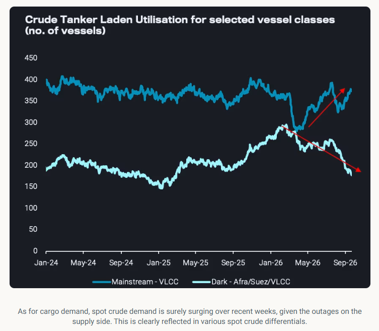
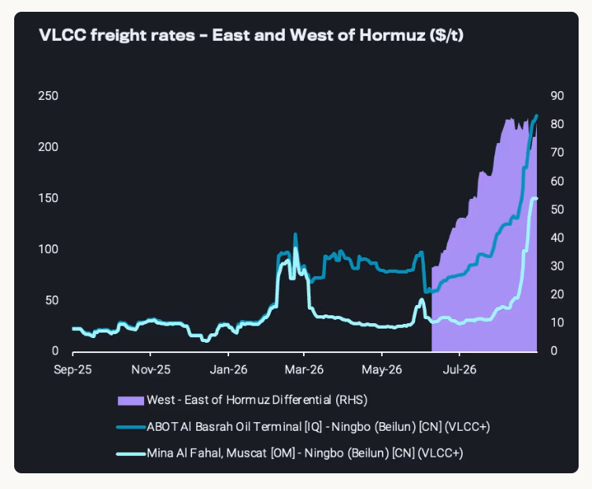
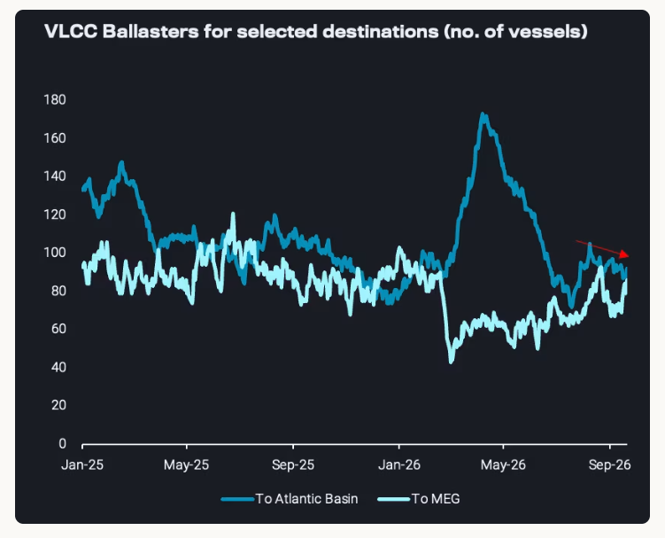
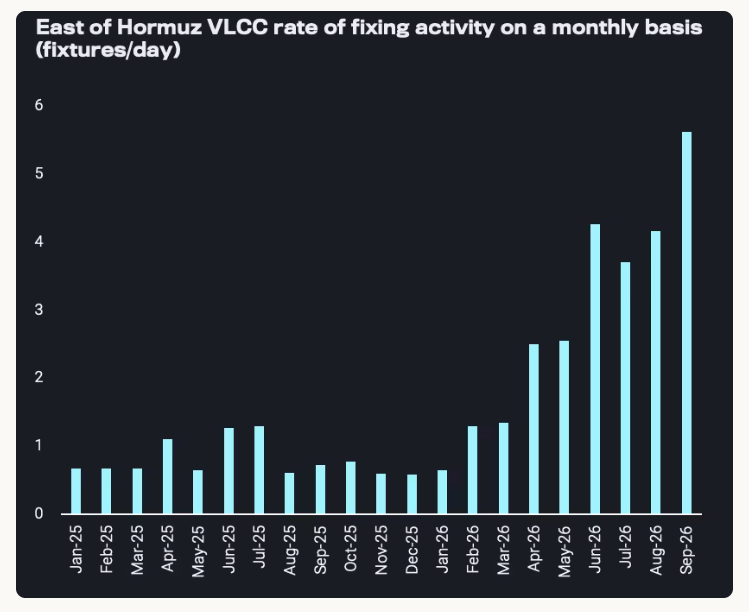

# Deciphering the dirty tanker record rally

**Date:** September 24, 2026  
**Publisher:** Breakwave Advisors | **Category:** Market Insights  
**Original URL:** [https://www.breakwaveadvisors.com/insights/2026/9/24/deciphering-the-dirty-tanker-record-rally](https://www.breakwaveadvisors.com/insights/2026/9/24/deciphering-the-dirty-tanker-record-rally)  

---

In this piece, we are revisiting the undisrupted rally of VLCC freight rates, as earnings broke the 1 million USD per day barrier.

*By*[*Ioannis Papadimitriou*](https://www.linkedin.com/in/ipapadimitriou/)

In order to decipher this historic level of freight rates we will focus on the drivers in three different parts:

## 1 - Cargo Supply and Demand

This is the perspective where record VLCC rates are least justified.[Global crude departures](https://analytics.vortexa.com/Flows?dateRange=2016-01-01T00%3A00%3A00.000Z__2026-09-18T23%3A59%3A59.999Z&filtersEnabled=%5B%22p%22%2C%22o%22%2C%22d%22%2C%22d_r%22%2C%22v%22%2C%22intra_d%22%2C%22sts_o%22%2C%22c_o%22%2C%22w%22%2C%22hd%22%5D&frequency=day&fromExcluded=%5B%22f3058bcbb026a6921bf142f93dbd9e186043df9ee300407a01b35a2d2f588580%22%2C%224818c8f53a8dd12df8c22288dd654e7d29e21d10e294f4eeaed7e144124523c0%22%2C%22916dfa9a40d3cdbb07f3080e22d9e559b3b39f71a26f2829ea735b81d0dcb1bd%22%2C%223cd7b476b240ffbe6191879bcc27ce1cd02c8b6631f4d1b368840bad013c331e%22%2C%22934c47f36c16a58d68ef5e007e62a23f5f036ee3f3d1f5f85a48c572b90ad8b2%22%2C%2250182d9d05051a6c8d24f0514d4ee828da6eaa29eacbb11cfe368f51526328ce%22%5D&intraMovementDropdown=all&maxEventFilter=1789775999999&metric=bpd&minEventFilter=1782864000000&page=Flows&products=%5B%2254af755a090118dcf9b0724c9a4e9f14745c26165385ffa7f1445bc768f06f11%22%5D&tabId=5db615e3-c830-48cd-9115-b3331175cb91&timeSeriesSeasonalEnd=2024&tsSeasonalMovingAvg=1&tsSeasonalMovingAvgWindow=28d&v=3&sbrc=1FnuqM2HemY_y8pGhDB1_5Q%3D%3D%2435wtLg_Do-z_9xxSAAiZuA%3D%3D)have been around 44mbd over the last 2.5 months, about 5mbd lower than over the six months before the war started.[Crude on the water](https://analytics.vortexa.com/Flows?dateRange=2024-01-01T00%3A00%3A00.000Z__2026-09-20T23%3A59%3A59.999Z&filtersEnabled=%5B%22p%22%2C%22o%22%2C%22d%22%2C%22d_r%22%2C%22v%22%2C%22intra_d%22%2C%22sts_o%22%2C%22c_o%22%2C%22w%22%5D&frequency=day&metric=bpd&movementEvent=cargo_on_water_state&page=Flows&products=%5B%2254af755a090118dcf9b0724c9a4e9f14745c26165385ffa7f1445bc768f06f11%22%5D&tabId=216b54b9-b8b5-446c-80e0-54b376e77672&timeSeriesChartView=seasonal&timeSeriesSeasonalEnd=2024&tsSeasonalMovingAvgWindow=14d&v=3)is historically high, but relatively low compared to the values seen over the last twelve months. This reflects some combination of low liftings, relatively long voyages and growing STS operations outside the Strait of Hormuz.

Despite the overall picture on cargo supply, we do see a shift of procurement away[from grades subject to sanctions](https://tinyurl.com/mr2xd2yx)towards more[mainstream](https://tinyurl.com/53twn79c)grades which is overall bullish mainstream freight especially for VLCCs as Chinese independent refineries have been looking to diversify their Iranian and Russian barrel sourcing from further afield. Atlantic Basin crude liftings with China as a destination are at[year to date high](https://analytics.vortexa.com/Flows?dateRange=2024-01-01T00%3A00%3A00.000Z__2026-09-20T23%3A59%3A59.999Z&filtersEnabled=%5B%22p%22%2C%22o%22%2C%22d%22%2C%22d_r%22%2C%22v%22%2C%22intra_d%22%2C%22sts_o%22%2C%22c_o%22%2C%22hd%22%2C%22w%22%2C%22sts%22%5D&from=%5B%2267be333ea46a3cd312e207b05e2c5c4502a9353e39ec81642a93e3b23cc3c10a%22%5D&intraMovementDropdown=all&metric=bpd&page=Flows&products=%5B%2254af755a090118dcf9b0724c9a4e9f14745c26165385ffa7f1445bc768f06f11%22%5D&tabId=1c1841e4-b08d-4412-aeb0-6ab72a6ba26c&timeSeriesHiddenSeries=%5B%22715b6aab56723cb55c3ddbdc12a2851b379919010f119cf98765d4debbdb793d%22%5D&timeSeriesProperty=origin_shipping_region_v2&timeSeriesShowSeasonalAvg=0&to=%5B%22934c47f36c16a58d68ef5e007e62a23f5f036ee3f3d1f5f85a48c572b90ad8b2%22%5D&tsSeasonalMovingAvg=1&v=3)in September.

> **Figure 1: Στιγμιότυπο Οθόνης 2026 09 23 120312**  
> **Interactive Data & Source:** [Sales Vortexa](https://sales.vortexa.com/t/108571/sc/c9b3b5f0-3768-485d-aba2-9e954903aa99/NB2HI4DTHIXS6YLOMFWHS5DJMNZS45TPOJ2GK6DBFZRW63JPIFXHS53IMVZGKRTSMVUWO2DUKBZGSY3JNZTT64DBM5ST2QLOPF3WQZLSMVDHEZLJM5UHIUDSNFRWS3THEZZG65LUMVZT2JJVIISTEMTCHEYWKOLEGYYC2ZRQMM3C2NBVGE2S2OLBG43S2OJWGEZGMOJVGZRTENRVFU4SKMRSEUZEGJJSGJRDSNLGHA2GGOJNGIZTSYJNGRSGEMJNMFTDMZBNGQYTIMDCMJQWCMDGMY2C2MRFGIZCKMSDEUZDEOJRG5SGGMBWMMWTIYTBMMWTINBYGUWTSMJQG4WTCMRWGE4GCN3FMJSTANZNGQSTEMRFGJBSKMRSME3WMNJZMIZDMLJSGMZDSLJUME3TILJYME4DGLJQMEZGCMRRGFTDAYRUGMWTEJJSGISTEQZFGIZDSNTDGBSGCYJVFU2TEZJWFU2GEZJRFU4DMNJQFVSTCOBXGJSDKMLDMRRTALJRGASTEMRFGJBSKMRSGA4GIZRZMQYDILJZMMYTSLJUGA4TMLLBGRTGCLJQMFSWEOJWGQ2DGOJYG4WTEJJSGISTKRBGOJXXK5DFONJWK3DFMN2GKZB5EU2UEMBFGJBTEJJVIQTHG2DPO5DG64TFMNQXG5CSMFXGOZJ5GATHIYLCJFSD2YLCGMZGIMTDGEWTIZJYGMWTIZBRMUWTQYZTGYWTEOBQGI3TEOJXGM2WIZJGORUW2ZKTMVZGSZLTIRQXIZKSMFXGOZJ5GEZC23LPNZ2GQ4ZGONRHEYZ5GFDG45LRJUZEQZLNLFPXSODQI5UEIQRRL42VCJJTIQSTGRBFGI2DGNLXORGGOX2EN4WXUXZZPB4FGQKBNFNHKQJFGNCCKM2E/GY2WCYRUMU3TAZDCGRRWMMJWMFQTCNRTMMYGMYTDGY2DQOBYHBSTGMRRHA2TQNZW/analytics-vortexa-com-anywherefreightpricing) | [Local Asset](file:///C:/Users/Dell/Github/Shipping/corpus/03-breakwave/insights/2026/assets/2026-09-24_deciphering-the-dirty-tanker-record-rally_img_cea3cf84ceb9ceb3cebcceb9cf8ccf84cf85_71126ddd4f29.png)

## 2 - Logistics and Risk

Probably a theme that has been repeated endlessly in 2026 and even before (Hormuz, wider Gulf regions, Red Sea, Black Sea for smaller crude tankers) but definitely one of the key driving factors throughout. The freight rate to shuttle oil from East to West of Hormuz is quoted around 75$/t which is roughly[the difference between a West of Hormuz and East of Hormuz VLCC freight rates](https://sales.vortexa.com/t/108571/sc/c9b3b5f0-3768-485d-aba2-9e954903aa99/NB2HI4DTHIXS6YLOMFWHS5DJMNZS45TPOJ2GK6DBFZRW63JPIFXHS53IMVZGKRTSMVUWO2DUKBZGSY3JNZTT64DBM5ST2QLOPF3WQZLSMVDHEZLJM5UHIUDSNFRWS3THEZZG65LUMVZT2JJVIISTEMTCHEYWKOLEGYYC2ZRQMM3C2NBVGE2S2OLBG43S2OJWGEZGMOJVGZRTENRVFU4SKMRSEUZEGJJSGJRDSNLGHA2GGOJNGIZTSYJNGRSGEMJNMFTDMZBNGQYTIMDCMJQWCMDGMY2C2MRFGIZCKMSDEUZDEOJRG5SGGMBWMMWTIYTBMMWTINBYGUWTSMJQG4WTCMRWGE4GCN3FMJSTANZNGQSTEMRFGJBSKMRSME3WMNJZMIZDMLJSGMZDSLJUME3TILJYME4DGLJQMEZGCMRRGFTDAYRUGMWTEJJSGISTEQZFGIZDSNTDGBSGCYJVFU2TEZJWFU2GEZJRFU4DMNJQFVSTCOBXGJSDKMLDMRRTALJRGASTEMRFGJBSKMRSGA4GIZRZMQYDILJZMMYTSLJUGA4TMLLBGRTGCLJQMFSWEOJWGQ2DGOJYG4WTEJJSGISTKRBGOJXXK5DFONJWK3DFMN2GKZB5EU2UEMBFGJBTEJJVIQTHG2DPO5DG64TFMNQXG5CSMFXGOZJ5GATHIYLCJFSD2YLCGMZGIMTDGEWTIZJYGMWTIZBRMUWTQYZTGYWTEOBQGI3TEOJXGM2WIZJGORUW2ZKTMVZGSZLTIRQXIZKSMFXGOZJ5GEZC23LPNZ2GQ4ZGONRHEYZ5GFDG45LRJUZEQZLNLFPXSODQI5UEIQRRL42VCJJTIQSTGRBFGI2DGNLXORGGOX2EN4WXUXZZPB4FGQKBNFNHKQJFGNCCKM2E/GY2WCYRUMU3TAZDCGRRWMMJWMFQTCNRTMMYGMYTDGY2DQOBYHBSTGMRRHA2TQNZW/analytics-vortexa-com-anywherefreightpricing). This is supported by the tit-for-tat attacks between Iran and the US but has been intensified due to the demand to push cargoes out of the region following the East-West pipeline disruption.

> **Figure 2: Στιγμιότυπο Οθόνης 2026 09 23 120321**  
> **Interactive Data & Source:** [Analytics Vortexa](https://analytics.vortexa.com/InsightsHubPage?articleId=5GDlAM6ZBYLPGFtXz7cYFf&articleType=highlight&page=InsightsHubPage&searchTerm=&tabId=a4536c5a-652f-4e3a-abca-f6fed53814d1) | [Local Asset](file:///C:/Users/Dell/Github/Shipping/corpus/03-breakwave/insights/2026/assets/2026-09-24_deciphering-the-dirty-tanker-record-rally_img_cea3cf84ceb9ceb3cebcceb9cf8ccf84cf85_55a983bab8b1.png)

On top of the risk, there is the logistical aspect of a 6+mbd STS operation emerging outside the Strait of Hormuz from virtually zero before the war started. These STS operations take far longer than the ones in other regions of the world (i.e. the US Gulf), reflecting limitations of the labour, equipment, and the high-risk environment. This is binding a lot of vessel capacity at this point in time, with players exploring new STS areas further away from the area (e.g. Sri Lanka, Singapore).

Rather than crude availability alone, the Hormuz STS system itself is increasingly the constraint on MEG-to-Asia crude flows. VLCC loadings west of Hormuz keep rising even as STS capacity east of Hormuz is already stretched, and the resulting queue risks lengthening vessel turnaround times and squeezing effective VLCC availability further as charterers are attempting to fix at further forward dates ([read more](https://analytics.vortexa.com/InsightsHubPage?articleId=5GDlAM6ZBYLPGFtXz7cYFf&articleType=highlight&page=InsightsHubPage&searchTerm=&tabId=a4536c5a-652f-4e3a-abca-f6fed53814d1)).

## 3 - Vessel Supply and Demand

This is currently surely the most bullish element, and likely the main booster behind record freight rates. There are various factors that are constraining in particular vessel supply, including

- a much higher concentration of the fleet after the Sinokor buying spree early in the year
- the efforts to compile a fleet by regional MEG suppliers as well as by trading houses
- Vessel positioning causing a supply-demand imbalance. Blaasters increasingly opt to move towards the Middle East east instead of the Atlantic Basin where supply of vessels has remained flat over the past two months, 10% below pre-war averages. Whilst supply remains stranded due to the logistical constraints mentioned above in the MEG, and even if vessels are loading outside their laycan windows, it is an extremely difficult decision to relocate a VLCC to the US Gulf Coast, because the long ballast leg causes massive opportunity costs in this record freight environment. So players may rather wait where they are than commit to a cargo far away.

> **Figure 3: Στιγμιότυπο Οθόνης 2026 09 23 120330**  
> **Interactive Data & Source:** [Analytics Vortexa](https://analytics.vortexa.com/AnywhereFreightPricing?page=AnywhereFreightPricing&routes=%5B%22b91e9d60-f0c6-4515-9a77-9612f956c265-6%22%2C%2221a7a233-a57d-4f2c-adbf-2ff033b535d8-2%22%2C%224ef8ab99-6f91-47ec-83d5-156f4323ba60-2%22%2C%225d84287c-802a-4da9-9344-261c1b81a4cc-2%22%2C%226206817e-b03b-4d0e-aea2-8b53baf4f3fa-2%22%2C%220b486c03-8c62-432f-b773-4092444658c1-2%22%2C%224f13bf19-6bfe-46b2-851e-5db486cddab4-3%22%2C%225462392d-30eb-473b-a12b-d08cb5884487-3%22%5D&routesSelected=%5B4%2C5%5D&showForecastRange=0&tabId=3e87f311-35ca-46ee-a999-59c673427b31&timeSeriesDateRange=5-years) | [Local Asset](file:///C:/Users/Dell/Github/Shipping/corpus/03-breakwave/insights/2026/assets/2026-09-24_deciphering-the-dirty-tanker-record-rally_img_cea3cf84ceb9ceb3cebcceb9cf8ccf84cf85_b4b1cba3225f.png)

Quite some players are currently scrambling for crude cargoes, e.g. in China, other Asian countries, or also Europe, given the loss of Saudi Red Sea volumes and delays with STS operations in the Gulf of Oman. September fixtures in the East of Hormuz are running at 1.5 times the rate of October so far this month. Chinese state refiners have been relatively cautious in terms of crude procurement over recent months, but now they need to step in for teapot refiners who are forced to cut runs, while having a strong incentive to keep product exports high (high margins, need to make up for financial losses in Q2, need to use quota allocations to get same level in 2027), with limited room to draw down stocks further (strategic stocks should not be used for product exports). So cargo and vessel demand is supportive as well. And in spite of record freight rates, the overall resulting crude procurement costs are mostly still acceptable given record refinery margins.

> **Figure 4: Στιγμιότυπο Οθόνης 2026 09 23 120339**  
> **Interactive Data & Source:** [Analytics Vortexa](https://analytics.vortexa.com/AnywhereFreightPricing?page=AnywhereFreightPricing&routes=%5B%22b91e9d60-f0c6-4515-9a77-9612f956c265-6%22%2C%2221a7a233-a57d-4f2c-adbf-2ff033b535d8-2%22%2C%224ef8ab99-6f91-47ec-83d5-156f4323ba60-2%22%2C%225d84287c-802a-4da9-9344-261c1b81a4cc-2%22%2C%226206817e-b03b-4d0e-aea2-8b53baf4f3fa-2%22%2C%220b486c03-8c62-432f-b773-4092444658c1-2%22%2C%224f13bf19-6bfe-46b2-851e-5db486cddab4-3%22%2C%225462392d-30eb-473b-a12b-d08cb5884487-3%22%5D&routesSelected=%5B4%2C5%5D&showForecastRange=0&tabId=3e87f311-35ca-46ee-a999-59c673427b31&timeSeriesDateRange=5-years) | [Local Asset](file:///C:/Users/Dell/Github/Shipping/corpus/03-breakwave/insights/2026/assets/2026-09-24_deciphering-the-dirty-tanker-record-rally_img_cea3cf84ceb9ceb3cebcceb9cf8ccf84cf85_52b172438ef6.png)

Whilst the environment will remain supportive, a further increase in VLCC rates could erode margins for refiners without time charter deals in place, which could ultimately lead to demand destruction (as do record fuel prices at pumps around the world). Furthermore, VLCC rates in the Atlantic Basin (i.e.[West Africa](https://analytics.vortexa.com/AnywhereFreightPricing?page=AnywhereFreightPricing&routes=%5B%22b91e9d60-f0c6-4515-9a77-9612f956c265-6%22%2C%2221a7a233-a57d-4f2c-adbf-2ff033b535d8-2%22%2C%224ef8ab99-6f91-47ec-83d5-156f4323ba60-2%22%2C%225d84287c-802a-4da9-9344-261c1b81a4cc-2%22%2C%226206817e-b03b-4d0e-aea2-8b53baf4f3fa-2%22%2C%220b486c03-8c62-432f-b773-4092444658c1-2%22%2C%224f13bf19-6bfe-46b2-851e-5db486cddab4-3%22%2C%225462392d-30eb-473b-a12b-d08cb5884487-3%22%5D&routesSelected=%5B4%2C5%5D&showForecastRange=0&tabId=3e87f311-35ca-46ee-a999-59c673427b31&timeSeriesDateRange=5-years)and[Brazil](https://analytics.vortexa.com/AnywhereFreightPricing?page=AnywhereFreightPricing&routes=%5B%22b91e9d60-f0c6-4515-9a77-9612f956c265-6%22%2C%2221a7a233-a57d-4f2c-adbf-2ff033b535d8-2%22%2C%224ef8ab99-6f91-47ec-83d5-156f4323ba60-2%22%2C%225d84287c-802a-4da9-9344-261c1b81a4cc-2%22%2C%226206817e-b03b-4d0e-aea2-8b53baf4f3fa-2%22%2C%220b486c03-8c62-432f-b773-4092444658c1-2%22%2C%224f13bf19-6bfe-46b2-851e-5db486cddab4-3%22%2C%225462392d-30eb-473b-a12b-d08cb5884487-3%22%5D&routesSelected=%5B0%2C1%5D&showForecastRange=0&tabId=3e87f311-35ca-46ee-a999-59c673427b31&timeSeriesDateRange=5-years)) are currently priced above Suezmaxes. This has driven traders to put their cargoes into Suezmaxes and even smaller vessels, which should create upside for these vessel classes and limit further upside for VLCCs.

Data Source:[Vortexa](https://www.vortexa.com//oil-gas-data-traders-analysts-data-scientists?gclid=Cj0KCQjw8_qRBhCXARIsAE2AtRZKOvMnbilZ_6_91d7huSFFy71pWLrnPwGwOHVzXsmsG-1a1mZnQw8aAt89EALw_wcB&hsa_acc=1782073842&hsa_ad=548425387665&hsa_cam=14746637662&hsa_grp=125038601902&hsa_kw=&hsa_mt=&hsa_net=adwords&hsa_src=g&hsa_tgt=dsa-1431852288425&hsa_ver=3&utm_campaign=%5BCD%5D%20-%20DSA%20-%20EMEA&utm_medium=cpc&utm_medium=ppc&utm_source=google&utm_source=adwords&utm_term=)

---

**Tags:** Tankers, Markets, Crude  
