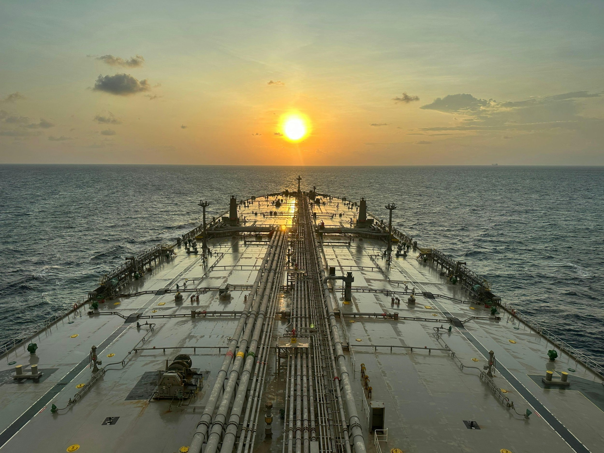

# VLCCs: Freight Boom Reprices the Fleet

**Date:** September 24, 2026  
**Publisher:** Breakwave Advisors | **Category:** Market Insights  
**Original URL:** [https://www.breakwaveadvisors.com/insights/2026/9/24/vlccs-freight-boom-reprices-the-fleet](https://www.breakwaveadvisors.com/insights/2026/9/24/vlccs-freight-boom-reprices-the-fleet)  

---

> **Figure 1: Byeirini Diamantara&dimitris Roumeliotis**  
> *ByEirini Diamantara&Dimitris Roumeliotis*  
> **Interactive Data & Source:** [Linkedin](https://www.linkedin.com/in/eirini-diamantara-58b269105/) | [Local Asset](file:///C:/Users/Dell/Github/Shipping/corpus/03-breakwave/insights/2026/assets/2026-09-24_vlccs-freight-boom-reprices-the-fleet_img_pexels-punit-singh-325095531-3656358_39bbc655e243.jpg)

The VLCC market has experienced a sharp repricing during 2026, with the most significant acceleration taking place since late July as exceptionally strong freight earnings have fed directly into secondhand values. While prices had already been moving higher earlier in the year, the latest increase has been particularly rapid, reflecting a combination of geopolitical disruption, tighter effective vessel availability and the immediate cash-flow potential offered by existing tonnage.

The Baltic VLCC TC Average rose from around USD 198,000/day in July to approximately USD 272,000/day in August, before averaging close to USD 449,000/day during the first half of September. By 18 September, the index had reached approximately USD 722,946/day, compared with around USD 79,700/day in mid-September 2025. Geopolitical developments have played a major role in this move. Escalation around Iran and disruption surrounding the Strait of Hormuz have increased war-risk exposure, affected vessel availability and created greater uncertainty around normal trading patterns. At the same time, diversions, longer voyage requirements and stronger demand for alternative crude sources have increased tonne-mile demand, tightening effective supply and placing further upward pressure on earnings.

Asset values have reacted accordingly. Between 10 July and 18 September, five-year-old VLCC values increased from around USD 145 mills to USD 172 mills, or approximately 18.6%, while 10-year-old tonnage rose from USD 115 mills to USD 152 mills, up around 32%. Fifteen-year-old values increased from approximately USD 83.5 mills to USD 135 mills, a rise of almost 61%, while resale values moved from around USD 175 mills to USD 193 mills. The S&P market also reflects this change in sentiment. A total of 103 VLCC sales were recorded between January and 14 September, although activity has been uneven throughout the year. January and February were particularly active, with 38 and 27 sales respectively, before transactions slowed sharply during the spring. Momentum gradually returned during the summer, with 10 sales recorded in August and a further nine by mid-September. The age profile of transactions is equally notable. Of the 103 VLCCs sold, 43 were aged 11–15 years and another 32 were 16–20 years old. A further 14 were aged 6–10 years, nine were above 20 years and only five were within the 0–5-year bracket. September has moved even further towards older tonnage, with the average age of vessels changing hands reaching approximately 18 years, compared with 13.6 years in August. Recent transactions underline the scale of the repricing. The 2007-built DHT EUROPE was sold in January for approximately USD 51 mills, while the 2008-built “***RAIN CUBIC”***was reportedly sold in September for around USD 90 mills. Similarly, the 2012-built “***INGRID***” changed hands in February at approximately USD 89 mills, compared with around USD 132 mills reportedly paid for the older 2010-built KALLISTA in September. At the modern end of the market, the 2026-built “***LAS PALMAS”***was sold in May for approximately USD 162.5 mills, while the similarly aged “***PINIOS”***was reportedly changing hands in September at around USD 200 mills.

Values largely reflect the economics of immediate market exposure. Existing VLCCs can capture exceptionally strong freight earnings now, while owners have little incentive to sell without a substantial premium. Long newbuilding lead times further support secondhand demand. However, the outlook remains highly uncertain: any de-escalation around Iran could trigger a correction, while continued disruption may keep freight and asset values elevated.

Data source:[Xclusiv Shipbrokers Inc.](https://www.linkedin.com/company/xclusiv-shipbrokers-inc/)

---

**Tags:** Tankers, Shipping, Markets  
