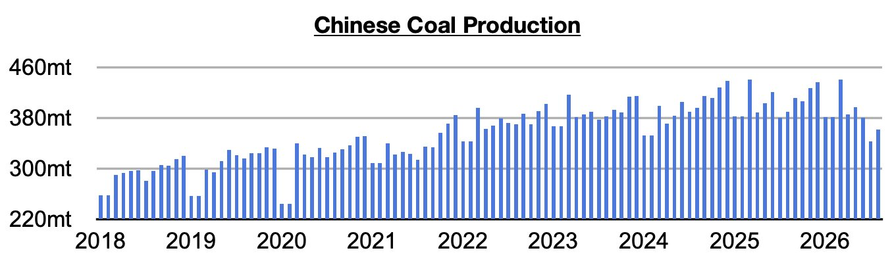
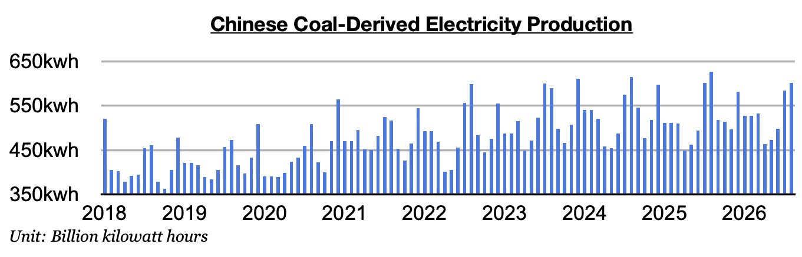
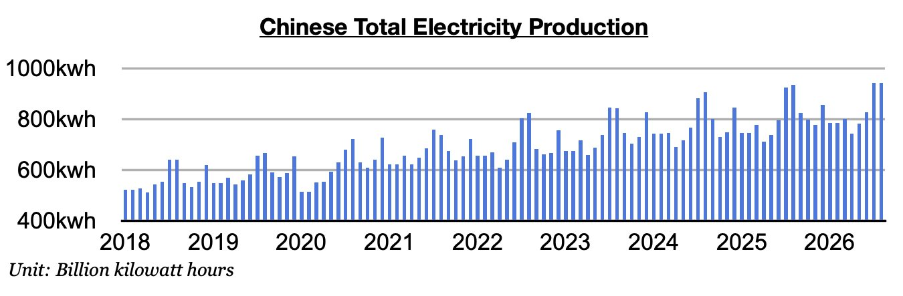

# Coal Situation in China Still Bullish

**Date:** September 25, 2026  
**Publisher:** Breakwave Advisors | **Category:** Market Insights  
**Original URL:** [https://www.breakwaveadvisors.com/insights/2026/9/25/coal-situation-in-china-still-bullish](https://www.breakwaveadvisors.com/insights/2026/9/25/coal-situation-in-china-still-bullish)  

---

*By*[*Jeffrey Landsberg*](https://www.linkedin.com/in/jeffrey-landsberg-70ab957/)

As we discussed in Commodore Research's most recent Weekly Executive Report, China’s coal production totaled 361.8 million tons in August. This is up month-on-month by 18.6 million tons (5%) but down year-on-year by 28.6 million tons (-7%). Remaining very significant is that the last time there was any year-on-year growth was back in June 2025. Prior to the current fourteen-month period of contraction, China's coal production had grown on a year-on-year basis for thirteen straight months.

> **Figure 1: Chart 1**  
> [Local Asset](file:///C:/Users/Dell/Github/Shipping/corpus/03-breakwave/insights/2026/assets/2026-09-25_coal-situation-in-china-still-bullish_img_chart1_eda46594730a.jpg)

Coal-derived electricity generation totaled 602 billion kilowatt hours. This is up month-on-month by 17.9 billion kilowatt hours (3%) but down year-on-year by 25.4 billion kilowatt hours (-4%). Very helpful for coal import demand and the dry bulk market is that China's coal-derived electricity generation has now fared better than coal production for eight straight months. A troubling thought, though, is where would the dry bulk market be if coal production was not in contraction?

> **Figure 2: Chart 2**  
> [Local Asset](file:///C:/Users/Dell/Github/Shipping/corpus/03-breakwave/insights/2026/assets/2026-09-25_coal-situation-in-china-still-bullish_img_chart2_cf10df56d432.jpg)

Total electricity production came in at 943.8 billion kilowatt hours. This is down month-on-month by just 100 million kilowatt hours from July's record and up year-on-year by 7.5 billion kilowatt hours (1%). China’s consumer market remains weak and renewables also continue to experience robust growth. Coal-derived electricity generation remains under pressure as a result of these factors and it is not clear if a rebound is coming soon. China’s coal-derived electricity generation has now contracted on a year-on-year basis for two straight months.

> **Figure 3: Chart 3**  
> [Local Asset](file:///C:/Users/Dell/Github/Shipping/corpus/03-breakwave/insights/2026/assets/2026-09-25_coal-situation-in-china-still-bullish_img_chart3_1122f9d78c15.jpg)

---

**Tags:** China, Coal, Drybulk  
