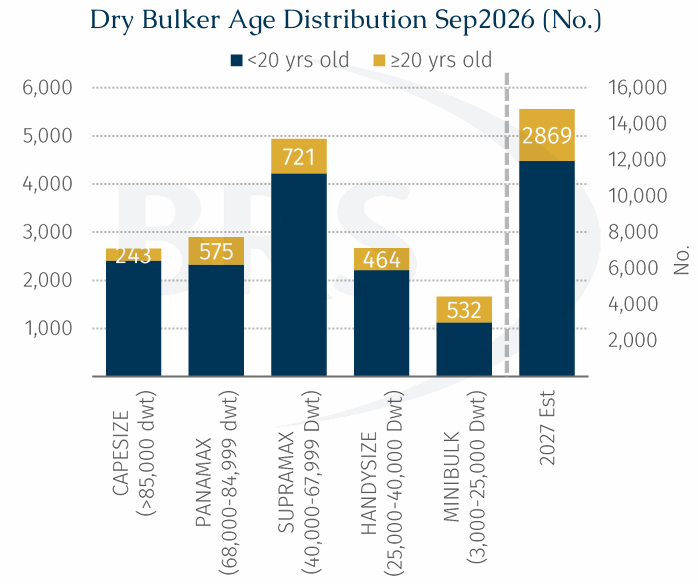
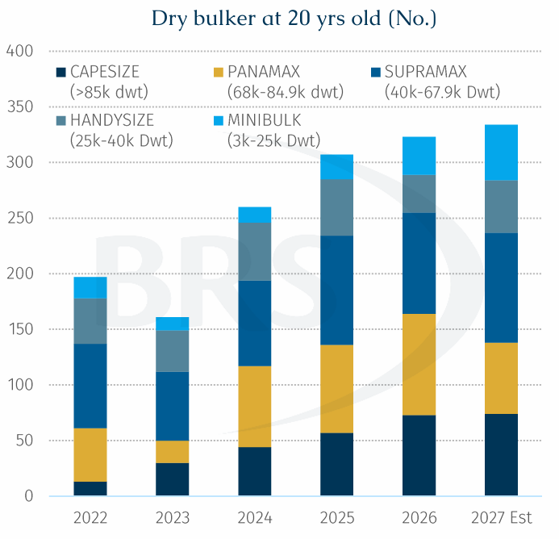
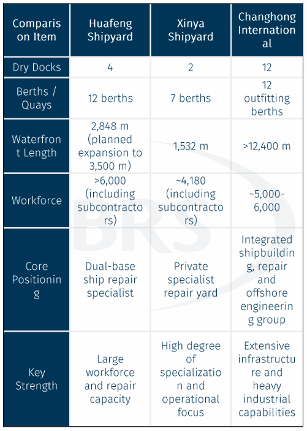

# The Overlooked Boom in Ship Repair

**Date:** September 28, 2026  
**Publisher:** Breakwave Advisors | **Category:** Market Insights  
**Original URL:** [https://www.breakwaveadvisors.com/insights/2026/9/28/the-overlooked-boom-in-ship-repair](https://www.breakwaveadvisors.com/insights/2026/9/28/the-overlooked-boom-in-ship-repair)  

---

> **Figure 1: Rgb Color Brs Shipbrokers Monogram L**  
> [Local Asset](file:///C:/Users/Dell/Github/Shipping/corpus/03-breakwave/insights/2026/assets/2026-09-28_the-overlooked-boom-in-ship-repair_img_rgb-color-brs-shipbrokers-monogram-l_c365f35f1de5.png)

### Ageing Fleets Are Creating the Next Capacity Challenge

Global shipping demand is pushing Chinese shipbuilding to unprecedented levels of activity. During the first eight months of this year, China accounted for around 65% of global merchant ship completions, 78% of new orders and 70% of the worldwide orderbook. While the spotlight has largely been on record-breaking orderbooks and shrinking newbuilding slots, another silent segment of the fleet equation is subtly becoming increasingly important: ship repair.

The recent fire onboard the 2006-built Supramax Ocean Melody during repair works at Qingdao Beihai Shipbuilding serves as a timely reminder of this overlooked sector. As the global fleet ages and more ships approach major special surveys, repair yards are emerging as an increasingly critical part of the shipping value chain.

**The Overlooked Ship Repair Market.**The conventional design life of a bulk carrier is around 25 years. Once ships move beyond 15 years of age, coating deterioration, structural corrosion, steel renewal and equipment wear begin to emerge more frequently, increasing the need for drydockings, repairs and special surveys. Today, the global dry bulk fleet has an average age of 13.3 years, while roughly one fifth of vessels are already older than 20 years. Meanwhile, ageing is increasingly becoming a safety issue. According to Lloyd's List report, 52% of all maritime accidents recorded in 2024 involved vessels older than 20 years. This trend is set to accelerate.

By 2027, an estimated 2,869 current active dry bulk vessels will be older than 20 years, creating a substantial wave of demand for drydock capacity, repair services and technical maintenance. Historically, reaching 20 years of age often placed a vessel on the path towards demolition. However, prevailing operating circumstances have radically challenged this ‘rule of thumb’.

> **Figure 2: 2 Tow 1**  
> [Local Asset](file:///C:/Users/Dell/Github/Shipping/corpus/03-breakwave/insights/2026/assets/2026-09-28_the-overlooked-boom-in-ship-repair_img_2tow1_93c8b416c241.png)

**Strong freight markets are keeping older vessels alive.**Freight earnings remain sufficiently attractive to justify extending the operating lives of ageing ships. Transactions for further trading involving vessels above 20 years of age remain regular, suggesting that many owners still see commercial value in keeping older assets trading, these kinds of vessels no longer have loans on them and thus their profit is straight income generation for their owners. This is particularly evident in dry bulk shipping. During early September, Capesize earnings briefly exceeded $58,000/day. Under such conditions, taking a vessel out of service for a 20-day Special Survey could mean sacrificing around $1 mln in revenue. As a result, owners face a difficult trade-off.

On one hand, ageing vessels require more frequent inspections, steel renewals and maintenance work. On the other hand, every additional day spent off hire represents lost earnings during a profitable freight market. Consequently, owners are increasingly demanding shorter repair schedules and faster project completion times.

> **Figure 3: 3 Tow 2**  
> [Local Asset](file:///C:/Users/Dell/Github/Shipping/corpus/03-breakwave/insights/2026/assets/2026-09-28_the-overlooked-boom-in-ship-repair_img_3tow2_bf0cca31ecc6.png)

**Repair yards are becoming the next capacity bottleneck.**Unlike newbuilding capacity, which can be expanded through large-scale investment programmes over time, repair capacity is much more difficult to grow quickly.

Each drydock can only process a limited number of ships each year. Even China's largest private repair facility, Xinya Shipyard, with two drydocks and seven berths, repairs only around 400 vessels annually. In addition to routine surveys, owners are increasingly using drydock periods to carry out a broader range of upgrades, including scrubber retrofits, steel renewal projects, energy-efficiency improvements and advanced hull coating applications. The economics can be compelling.

For example, installing a package of energy-saving devices on a Supramax vessel, such as a pre-swirl duct, rudder bulb and high-efficiency propeller, could generate fuel savings worth approximately 22,000 per year, assuming 250 trading days annually. At the same time, more sophisticated maintenance work often extends repair schedules. The application of modern silicone-based hull coatings alone can add 7-8 days, considering whether the weather is good or not to a vessel's stay in dock, highlighting the growing complexity and value of drydocking projects.

The result is a market facing pressure from both sides:

Demand for repair services or adding equipment’s services are rising rapidly due to fleet ageing and stricter environmental legislation, while available repair capacity is becoming increasingly.

> **Figure 4: 4 Tow 3**  
> [Local Asset](file:///C:/Users/Dell/Github/Shipping/corpus/03-breakwave/insights/2026/assets/2026-09-28_the-overlooked-boom-in-ship-repair_img_4tow3_399ad6a6b0fa.png)

**Zhoushan is emerging as the centre of gravity for global ship repairs.**Few regions are better positioned to benefit from this structural trend than Zhoushan. According to the Zhoushan Customs Authority,during the first seven months of this year, 1,700 foreign vessels underwent repairs in the region, generating approximately $1.38 billion. The region currently accounts for over 45% of China's ship repair activity and more than 20% of the global market.Its dominance is equally evident at the company level. Five of the world's top ten repair yards are located in Zhoushan, with Xinya Shipyard, Huafeng Shipyard and Changhong International ranking among the world's leading facilities by annual repair completions.As more bulk carriers move into the 20-year-plus age category, these kinds of yards are likely to become critical infrastructure supporting the continued operation of the global fleet.

The Qingdao Beihai incident serves as a stark reminder that shipping's current boom is creating operational pressure not only for shipbuilders, but also for repair yards. As older vessels stay in service longer, proactive maintenance becoming more frequent and necessary. Yet owners simultaneously expect shorter turnaround times in order to minimise off-hire losses. The inevitable consequence is an industry being asked to deliver more work, on older vessels, within increasingly compressed schedules.

For years, the industry's discussion has focused on whether shipbuilding capacity is sufficient to meet fleet renewal demand. The next question may be equally important: Can the global ship repair sector handle the growing maintenance burden of an ageing fleet safely and efficiently? The answer could have a significant impact on vessel availability, operational reliability and ultimately the resilience of the global maritime supply chain.

---

**Tags:** Drybulk, Shipping, Markets  
