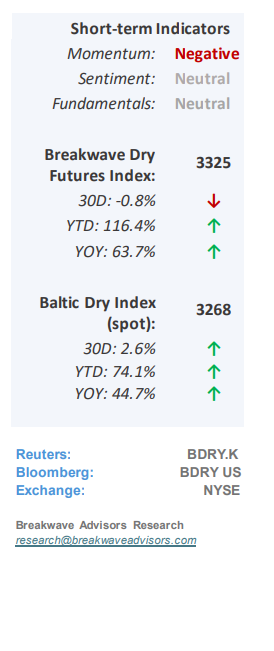
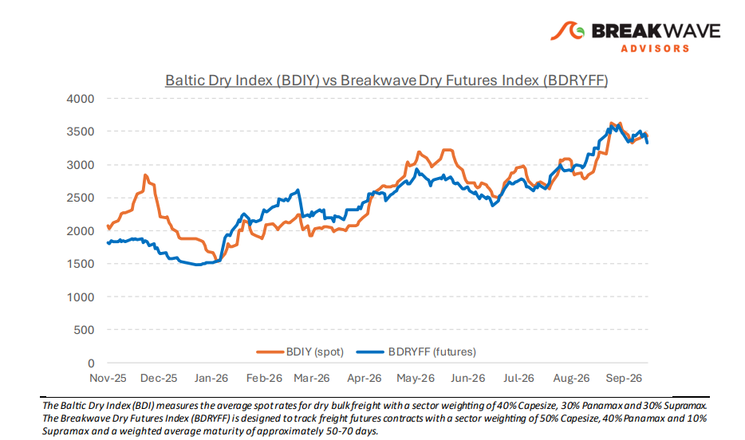
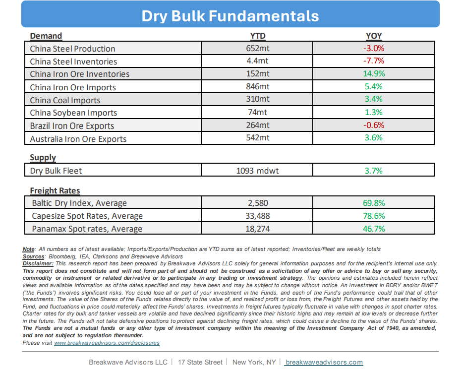

# Breakwave Bi-Weekly Dry Bulk Report - September 29, 2026

**Date:** September 29, 2026  
**Publisher:** Breakwave Advisors | **Category:** Market Insights  
**Original URL:** [https://www.breakwaveadvisors.com/insights/9292026db-reportdbsept-k785oo-8547](https://www.breakwaveadvisors.com/insights/9292026db-reportdbsept-k785oo-8547)  

---

•**What If: The Bear Case for Dry Bulk**– As we enter the seasonally strong fourth quarter, dry bulk**shipping spot rates**remain exceptionally**robust**, with full-year averages on track to reach multi-year highs. Market consensus remains firmly bullish, with**little indication of an imminent correction**, an**outlook we share**given the absence of near-term catalysts to disrupt current rate stability. Nevertheless, several potential**developments**could trigger a**downward adjustment**that would catch the broader industry off guard. We attribute current rate strength primarily to**widespread fleet inefficiencies**, which have reduced effective supply well below headline capacity. Consequently, any meaningful market correction requires an expansion in effective supply through operational improvements across loading, discharging, bunkering, and transit times. Because these friction points stem largely from ongoing conflicts, geopolitical shifts remain the critical catalyst to monitor. The magnitude of these supply constraints is substantial; without them,**underlying supply-and-demand**fundamentals would sit at**multi-decade lows**(excluding the pandemic period, which was similarly buoyed by operational friction). While we maintain a**constructive outlook**due to limited visibility into near-term geopolitical resolution, underlying market fundamentals, specifically projected demand growth alongside headline fleet expansion, indicate increasingly**loose market balances**in the years ahead.

> **Figure 1: Cea3cf84ceb9ceb3cebcceb9cf8ccf84cf85**  
> [Local Asset](file:///C:/Users/Dell/Github/Shipping/corpus/03-breakwave/insights/2026/assets/2026-09-29_9292026db-reportdbsept-k785oo-8547_img_cea3cf84ceb9ceb3cebcceb9cf8ccf84cf85_cfcb67e4d7ad.png)

•**Freight Rates Continue to Put Pressure on Iron Ore, Bauxite Margins**– The**recent escalation in headline freight rates**, paired with elevated diesel prices, is significantly**impacting mining operations,**particularly within the iron ore and bauxite sectors. Smaller Brazilian operators and Guinean miners are experiencing**multi-year lows in profit margins**, facing a dual squeeze from high domestic production costs and surging logistics expenses, where the Atlantic-to-China freight rate now accounts for over 40% of the landed cost for iron ore and an unprecedented 55% for bauxite. While these escalating costs may not immediately depress export volumes in the near term, a**prolonged pricing environment**of this nature will likely render**volume reductions**inevitable over time.

•**Our Long-term View**– The last few years have been characterized by increased geopolitical uncertainty. Going forward, we expect such events to continue to affect global trade and have a meaningful impact on effective vessel supply. Combined with the potential for a multi-year cyclical rebound in China’s economic activity following the recent economic turmoil, dry bulk shipping should experience higher volatility on top of a secular tightness driven by stable bulk commodity demand and rather steady but elevated fleet growth.

> **Figure 2: Στιγμιότυπο Οθόνης 2026 09 28 211841**  
> [Local Asset](file:///C:/Users/Dell/Github/Shipping/corpus/03-breakwave/insights/2026/assets/2026-09-29_9292026db-reportdbsept-k785oo-8547_img_cea3cf84ceb9ceb3cebcceb9cf8ccf84cf85_42ebfedf7e93.png)

> **Figure 3: Στιγμιότυπο Οθόνης 2026 09 28 211856**  
> [Local Asset](file:///C:/Users/Dell/Github/Shipping/corpus/03-breakwave/insights/2026/assets/2026-09-29_9292026db-reportdbsept-k785oo-8547_img_cea3cf84ceb9ceb3cebcceb9cf8ccf84cf85_5f5702750b88.png)

### Subscribe:
