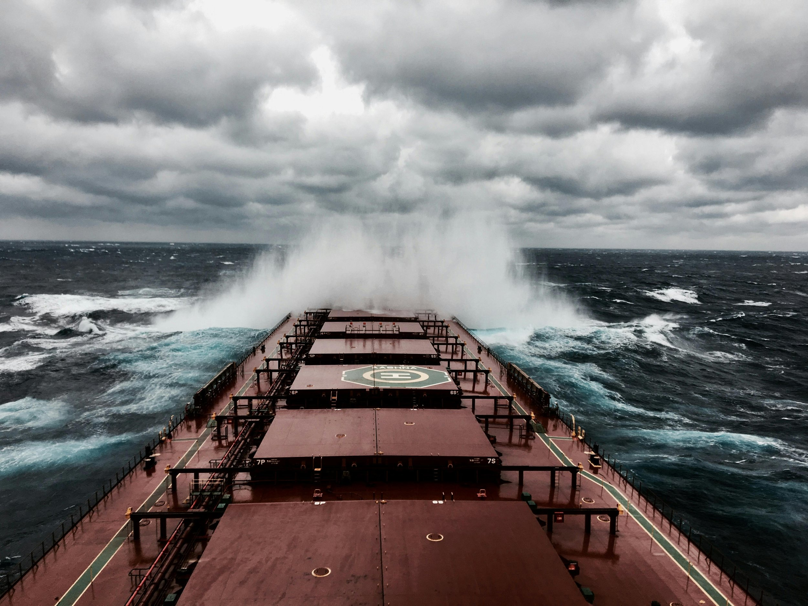

# Capes on a High

**Date:** September 29, 2026  
**Publisher:** Breakwave Advisors | **Category:** Market Insights  
**Original URL:** [https://www.breakwaveadvisors.com/insights/2026/9/29/capes-on-a-high](https://www.breakwaveadvisors.com/insights/2026/9/29/capes-on-a-high)  

---

> **Figure 1: Byeirini Diamantara&dimitris Roumeliotis**  
> *ByEirini Diamantara&Dimitris Roumeliotis*  
> **Interactive Data & Source:** [Linkedin](https://www.linkedin.com/in/eirini-diamantara-58b269105/) | [Local Asset](file:///C:/Users/Dell/Github/Shipping/corpus/03-breakwave/insights/2026/assets/2026-09-29_capes-on-a-high_img_pexels-vasu27-5520019_d99490a74a25.jpg)

The Capesize market has emerged as one of the clearest examples of how improved cargo demand, stronger tonne-mile fundamentals and tighter vessel availability can translate into materially better freight earnings and asset values. Based on Signal Ocean data, between 1 January and 25 September 2026, Capesize dry bulk movements reached 1,198.68 million MT across 9,555 voyages, up 4.4% from 1,148.06 million MT and 9,367 voyages during the same period of 2025. Australia remained the dominant loading origin, with volumes rising 3.9% to 658.42 million MT, while Guinea recorded the most significant expansion, increasing 36.9% to 149.88 million MT and overtaking Brazil, where volumes slipped 1.4% to 133.82 million MT. China remained overwhelmingly the main destination, receiving 854.97 million MT, up 5.1% year-on-year, while South Korean imports increased 16.1% to 74.23 million MT.

More importantly for Capesize demand, the increase in cargo volumes was accompanied by stronger tonne-mile generation. Weekly tonne miles averaged 218.31 billion during the 2026 period, 5.3% above the 207.24 billion average recorded in 2025. The rapid expansion of long-haul Guinean bauxite exports towards China has been particularly supportive, increasing sailing distances and vessel utilisation. This stronger demand environment was reflected directly in freight performance. The BCI averaged 4,068 points during 2026, compared with 2,261 points during the corresponding 2025 period, an increase of around 80%, while the index rallied from 3,108 at the beginning of the year to 5,939 by 24 September, having peaked at 6,427 earlier in the month.

The C5TC(182) paints essentially the same picture in earnings terms. Average earnings during the 2026 period were approximately USD 36,900/day, versus around USD 20,500/day during the comparable 2025 period, representing an improvement of almost 80%. The 2026 market briefly approached USD 58,300/day at its early-September peak and remained above USD 52,000/day in late September. By comparison, on 25 September 2025 the C5TC(182) stood at USD 29,636/day. Importantly, the difference is not simply the result of one short-lived rally. Earnings across much of 2026 have operated from a substantially stronger base, reflecting the combination of additional cargo, greater tonne-mile demand and periods of tighter tonnage availability in both Atlantic and Pacific basins.

Unsurprisingly, this improvement has also filtered into the S&P market. In March 2025, the 2010-built Mitsui Capesize Mount Austin, then 15 years old, was sold in the mid-USD 27 million range. By August 2026, the similarly aged 2011-built Imabari vessels Mount Dampier and Orange Tiger were sold at around USD 38 million and USD 37 million respectively, implying an increase of roughly USD 10 million for comparable vintage Japanese tonnage. The same trend is visible among younger vessels: Bulk Ginza, a 2020-built Imabari, changed hands in June 2025 for around USD 64 million, while the 2020-built JMU Lady Deena was rumoured sold in July 2026 at around USD 71 million. Taken together, cargo volumes, tonne miles, freight earnings and secondhand prices all point in the same direction. Capesize fundamentals during 2026 YTD are considerably stronger than during the corresponding period of 2025, and, importantly, the improvement is broad-based across the entire market chain. Increased long-haul demand is supporting utilisation, stronger utilisation is feeding into higher earnings, and improved cash generation and sentiment are being capitalised directly into secondhand asset values.

Data source:[Xclusiv Shipbrokers Inc.](https://www.linkedin.com/company/xclusiv-shipbrokers-inc/)

---

**Tags:** Drybulk, Shipping, Markets  
