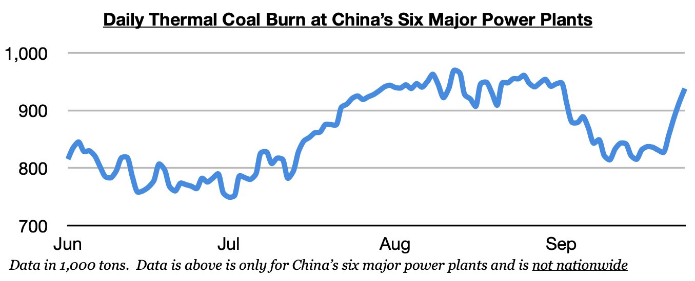
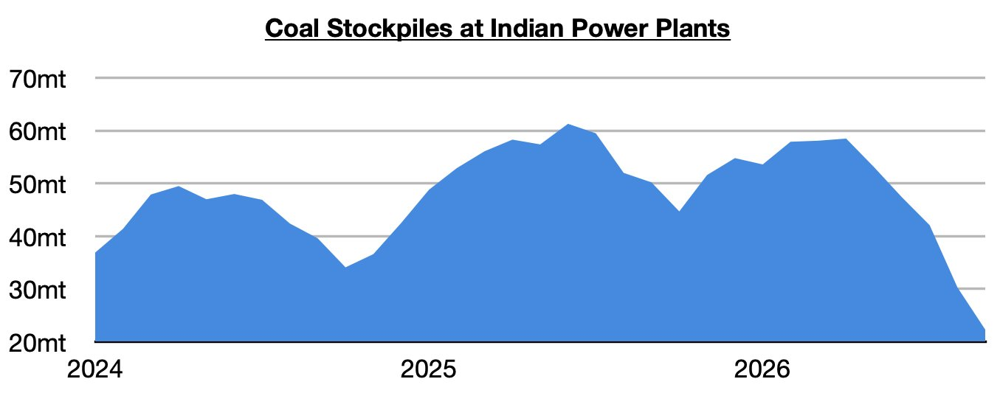

# Indian and Chinese Thermal Coal Demand Remain Strong

**Date:** October 02, 2026  
**Publisher:** Breakwave Advisors | **Category:** Market Insights  
**Original URL:** [https://www.breakwaveadvisors.com/insights/2026/10/2/indian-and-chinese-thermal-coal-demand-remain-strong](https://www.breakwaveadvisors.com/insights/2026/10/2/indian-and-chinese-thermal-coal-demand-remain-strong)  

---

*By*[*Jeffrey Landsberg*](https://www.linkedin.com/in/jeffrey-landsberg-70ab957/)

As we discussed in Commodore Research's most recent Weekly Executive Report, dry bulk rates increased across the board last week, with panamax rates rising by the largest amount. Spot coal cargo volume was particularly strong. As we stressed again last week, near-term prospects for Chinese and Indian coal imports are bullish. New last week was that thermal coal burn in China (and thermal coal prices) experienced a significant rebound due to unseasonably hot and humid weather in the southern part of the country.

> **Figure 1: $1.png**  
> [Local Asset](file:///C:/Users/Dell/Github/Shipping/corpus/03-breakwave/insights/2026/assets/2026-10-02_indian-and-chinese-thermal-coal-demand-remain-strong_img_241png_8125a60661c5.jpg)

In India, stockpiles have fallen even further, and**80 power plants now hold critically low stockpiles**. Just four weeks ago, it was 47. India’s power plant coal stockpiles ended last week at approximately 22.3 million tons, which is 1.1 million tons (-5%) less than a week ago and down year-on-year by 24.8 million tons (-53%). India's power plant coal stockpiles have now declined in twenty-three of the last twenty-four weeks.

> **Figure 2: 242**  
> [Local Asset](file:///C:/Users/Dell/Github/Shipping/corpus/03-breakwave/insights/2026/assets/2026-10-02_indian-and-chinese-thermal-coal-demand-remain-strong_img_242_7ff115c4669d.jpg)

Overall, China’s own thermal coal demand remains robust — but it most likely will be India where robust demand continues the longest.

---

**Tags:** India, China, Coal  
