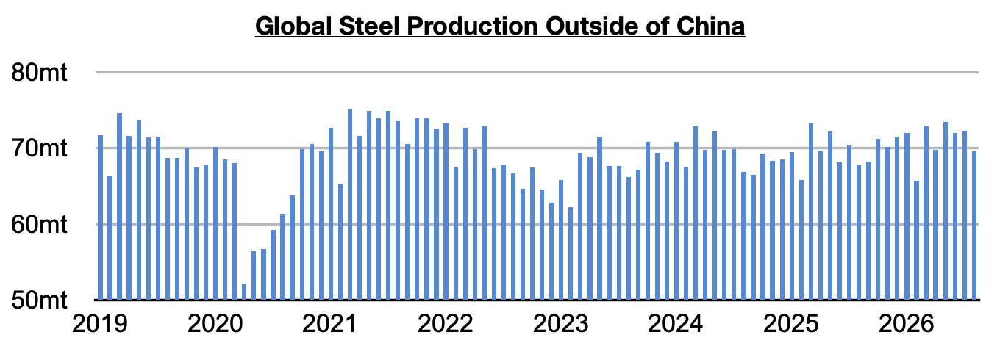
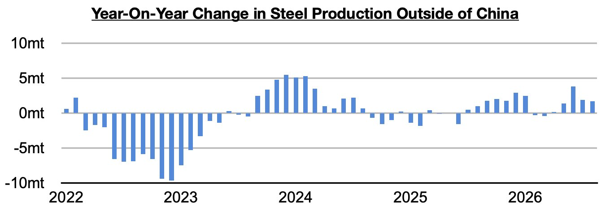
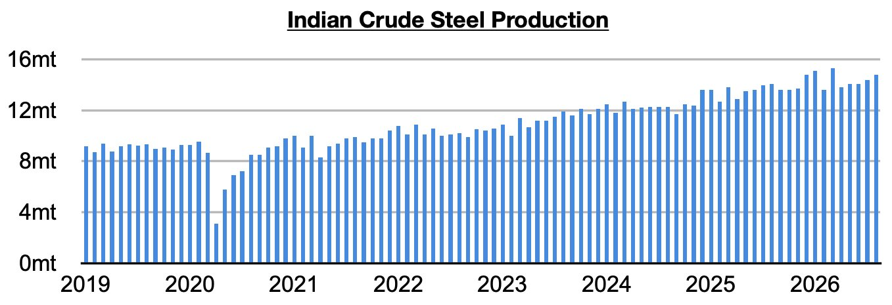
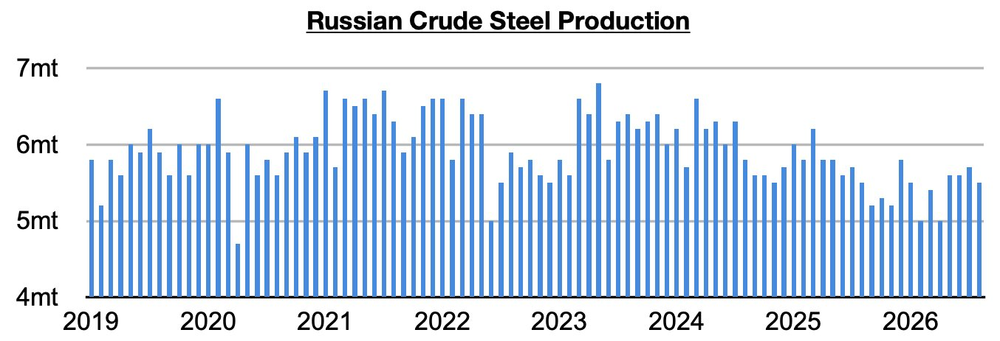
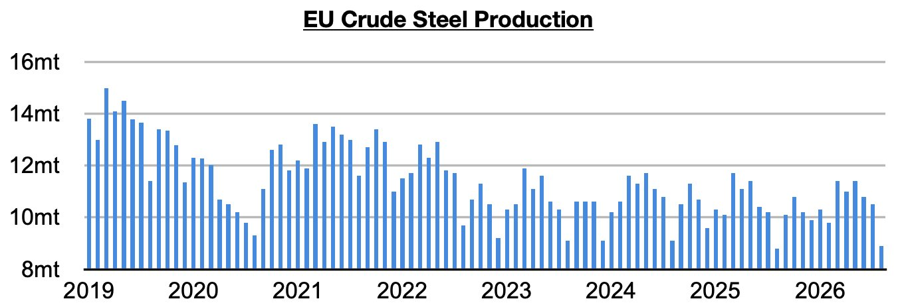
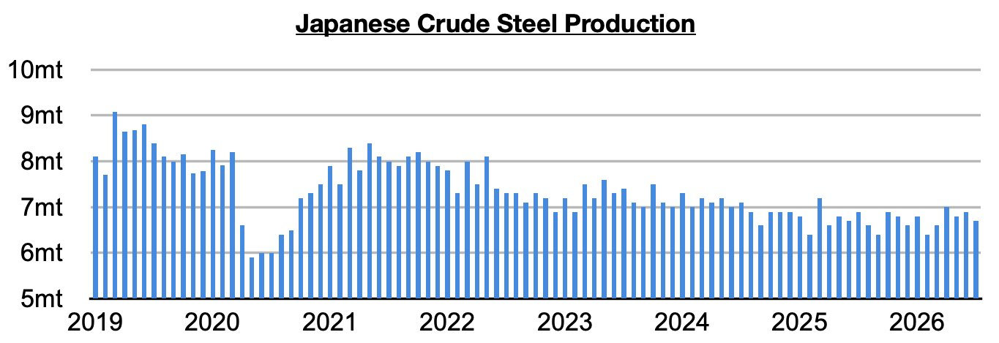
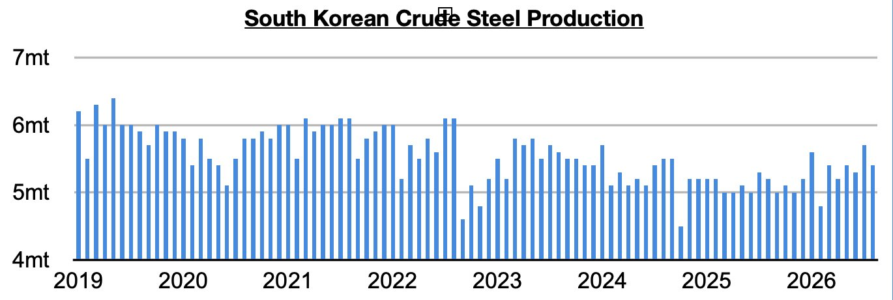

# Ongoing Growth in Steel Production Ex-China

**Date:** October 05, 2026  
**Publisher:** Breakwave Advisors | **Category:** Market Insights  
**Original URL:** [https://www.breakwaveadvisors.com/insights/2026/10/5/ongoing-growth-in-steel-production-ex-china](https://www.breakwaveadvisors.com/insights/2026/10/5/ongoing-growth-in-steel-production-ex-china)  

---

*By*[*Jeffrey Landsberg*](https://www.linkedin.com/in/jeffrey-landsberg-70ab957/)

As we discussed in Commodore Research's most recent Weekly Executive Report, global steel production totaled approximately 144.2 million tons in August. This is down month-on-month by 5 million tons (-3%) and down year-on-year by 1.1 million tons (-1%). Steel production ex-China totaled approximately 69.6 million tons. This is down month-on-month by 2.7 million tons (-4%) but up year-on-year by 1.7 million tons (3%).

> **Figure 1: Chart 1**  
> [Local Asset](file:///C:/Users/Dell/Github/Shipping/corpus/03-breakwave/insights/2026/assets/2026-10-05_ongoing-growth-in-steel-production-ex-china_img_chart1_61768321cc75.jpg)

Steel production ex-China has now increased on a year-on-year basis for five straight months. Previously, it had contracted on a year-on-year basis for two straight months. China’s steel output remains in a contraction however.

> **Figure 2: Chart 2**  
> [Local Asset](file:///C:/Users/Dell/Github/Shipping/corpus/03-breakwave/insights/2026/assets/2026-10-05_ongoing-growth-in-steel-production-ex-china_img_chart2_2606f41eb332.jpg)

Taking India out of the equation, production grew year-on-year by 1 million tons (2%). Steel output ex-China/India has now grown on a year-on-year basis for four straight months.

Indian steel output totaled 14.8 million tons. This is up month-on-month by 400,000 tons (3%) and is up year-on-year by 700,000 tons (5%). Production has now grown on a year-on-year basis for forty-two straight months.

> **Figure 3: Chart 3**  
> [Local Asset](file:///C:/Users/Dell/Github/Shipping/corpus/03-breakwave/insights/2026/assets/2026-10-05_ongoing-growth-in-steel-production-ex-china_img_chart3_cb3de2d58443.jpg)

Russian output totaled 5.5 million tons. This is down month-on-month by 200,000 tons (-4%) and is again unchanged year-on-year. Before the last three months, output contracted on a year-on-year basis in twenty of the prior twenty-two months.

> **Figure 4: Chart 4**  
> [Local Asset](file:///C:/Users/Dell/Github/Shipping/corpus/03-breakwave/insights/2026/assets/2026-10-05_ongoing-growth-in-steel-production-ex-china_img_chart4_c9f0ef2ee1d3.jpg)

EU steel output totaled 8.9 million tons. This is down month-on-month by 1.6 million tons (-15%) but up year-on-year by 100,000 tons (1%). Production has now increased on a year-on-year basis for three straight months.

> **Figure 5: Chart 5**  
> [Local Asset](file:///C:/Users/Dell/Github/Shipping/corpus/03-breakwave/insights/2026/assets/2026-10-05_ongoing-growth-in-steel-production-ex-china_img_chart5_27fd9defe015.jpg)

Japanese steel output totaled 6.7 million tons. This is down month-on-month by 200,000 tons (-3%) but is up year-on-year by 100,000 tons (2%). Japan’s steel production has now increased on a year-on-year basis during three of the last five months.

> **Figure 6: Chart 6**  
> [Local Asset](file:///C:/Users/Dell/Github/Shipping/corpus/03-breakwave/insights/2026/assets/2026-10-05_ongoing-growth-in-steel-production-ex-china_img_chart6_26a97b9ed6d0.jpg)

South Korean steel output totaled 5.4 million tons. This is down month-on-month by 300,000 tons (-5%) but up year-on-year by 200,000 tons (4%). South Korean steel output has now increased on a year-on-year basis during seven of the last eight months.

> **Figure 7: Chart 7**  
> [Local Asset](file:///C:/Users/Dell/Github/Shipping/corpus/03-breakwave/insights/2026/assets/2026-10-05_ongoing-growth-in-steel-production-ex-china_img_chart7_3f10753077ba.jpg)

---

**Tags:** Commodities, Markets, Drybulk  
