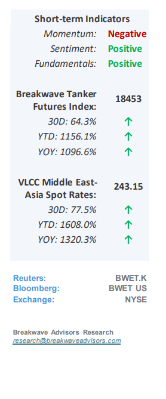
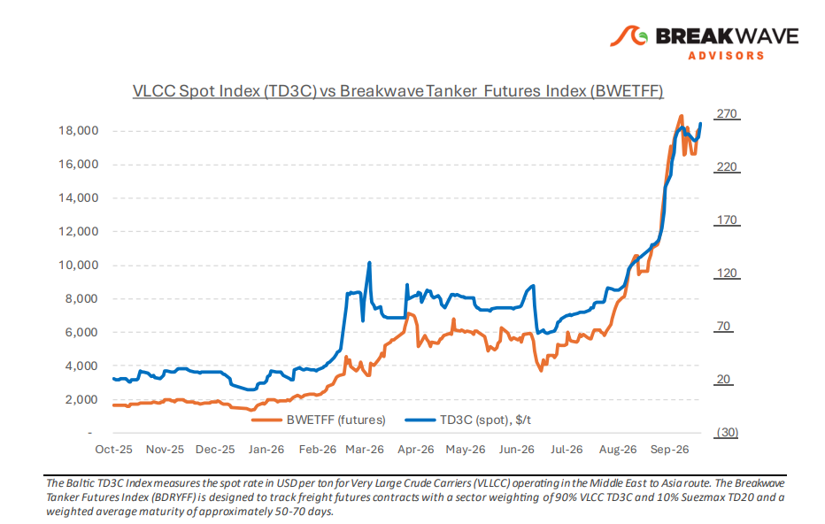
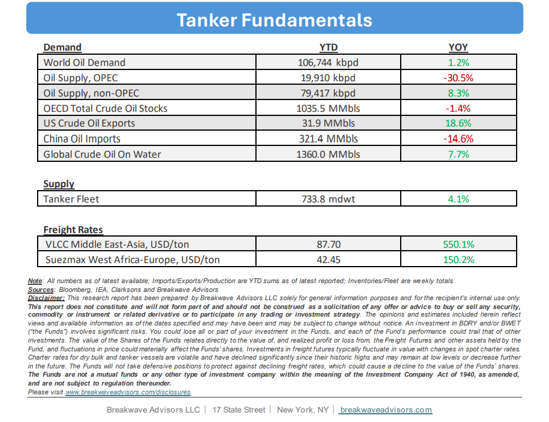

# Breakwave Bi-Weekly Tanker Report - October 6, 2026

**Date:** October 06, 2026  
**Publisher:** Breakwave Advisors | **Category:** Market Insights  
**Original URL:** [https://www.breakwaveadvisors.com/insights/10626wetreport2026llk784](https://www.breakwaveadvisors.com/insights/10626wetreport2026llk784)  

---

**• Disrupted Vessel Circulation, Atlantic Tightening, Drives New Records**– The close of the third quarter left crude freight at**exceptionally high levels,**with the consequences of Saudi Arabia’s East-West pipeline disruption still shaping the eastern market and**Atlantic tightening**providing stronger support to owners. Middle East crude exports averaged 18.5 million bpd in the seven days to October 1, according to provisional estimates,**exceeding the pre-war**regional average of 18 million bpd. The total includes shipments through Hormuz and the Red Sea, loadings from other regional terminals and ship-to-ship transfers in the Gulf of Oman. In the East, the recovery is bringing more cargoes into a transport sys tem in which normal vessel circulation has yet to return.**Shuttle voyages, transfers and waiting time continue to absorb capacity**, while the risk of attack affects owners’ willingness to accept Gulf employment. Yanbu loadings have resumed following the pipeline restart, although the brief interruption after the reported October 1 strike highlights the bypass route’s continued vulnerability. Arabian Gulf–China VLCC freight remains exceptionally high, with daily earnings above $1 million. Renewed chartering demand and the slow return of normal vessel circulation are expected to**sustain elevated freight levels**for the foreseeable future, with freight futures pointing to tightness all the way into the New Year.

> **Figure 1: Cea3cf84ceb9ceb3cebcceb9cf8ccf84cf85**  
> [Local Asset](file:///c:/Users/Dell/Github/Shipping/corpus/03-breakwave/insights/2026/assets/2026-10-06_10626wetreport2026llk784_img_cea3cf84ceb9ceb3cebcceb9cf8ccf84cf85_a6345e7d14ad.png)

•**Oil Prices Remain Elevated Despite Better Hormuz Flows**– Global oil prices remain elevated with Brent above $100/bbl despite recent improvements in Hormuz flows, while refined product prices persist near record highs despite strategic diesel releases from European reserves. This price resilience signals a**structural shift**where market fundamentals, rather than immediate geopolitical events, are driving prices. Despite relatively ample crude oil, the**significant depletion**of crude oil inventories has moved the oil equilibrium price higher. In addition, long-term**refining bottlenecks**stemming from ongoing conflicts in the Persian Gulf and Eastern Europe, has severely**constrained product availability.**Consequently, demand destruction has become the primary mechanism required to rebalance the market, paving the way for a**post-normalization landscape**characterized by permanently lowered demand and increased global production**fighting for market share**. This behavioral shift will ultimately have profound, long-term implications for both the global energy industry and macroeconomic developments, especially for the all-important emerging markets.

•**Our Long-term View**– The tanker market has been recovering from a long period of staggered rates as the growth in new vessel supply shrunk while oil demand remained elevated in line with the global economy. The recent rapid increase in freight rates has led to significant new vessel ordering, with the orderbook now standing at above average levels, and although in the near term such a supply/demand misbalance is small, we expect a meaningful negative balance to develop longer term leading to a potential downcycle.

> **Figure 2: Στιγμιότυπο Οθόνης 2026 10 05 214832**  
> [Local Asset](file:///c:/Users/Dell/Github/Shipping/corpus/03-breakwave/insights/2026/assets/2026-10-06_10626wetreport2026llk784_img_cea3cf84ceb9ceb3cebcceb9cf8ccf84cf85_98da9ff0227a.png)

> **Figure 3: Στιγμιότυπο Οθόνης 2026 10 05 214847**  
> [Local Asset](file:///c:/Users/Dell/Github/Shipping/corpus/03-breakwave/insights/2026/assets/2026-10-06_10626wetreport2026llk784_img_cea3cf84ceb9ceb3cebcceb9cf8ccf84cf85_603733109c55.png)

### Subscribe:
