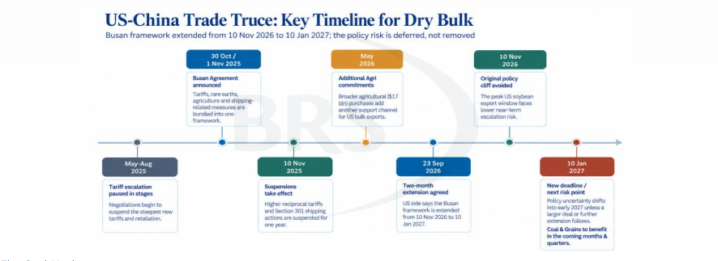
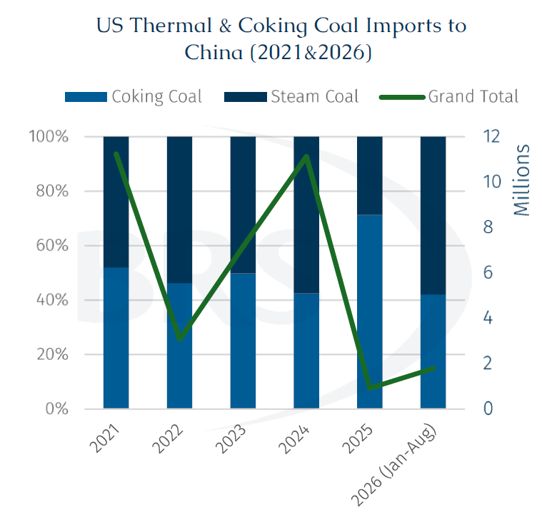
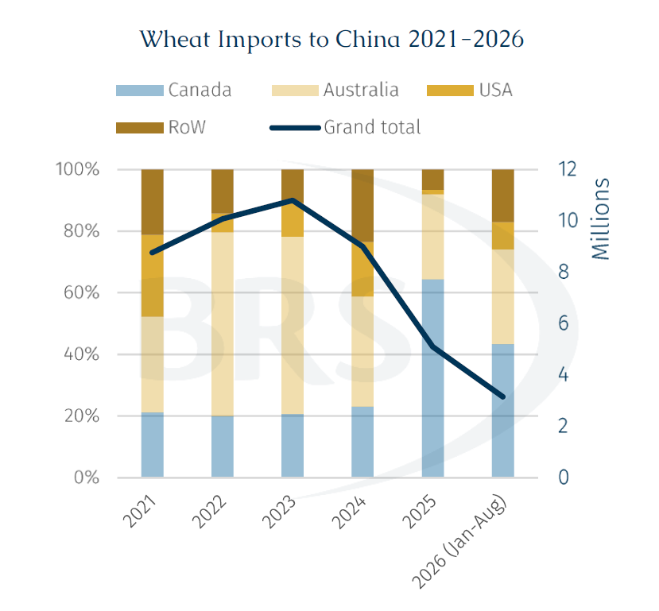
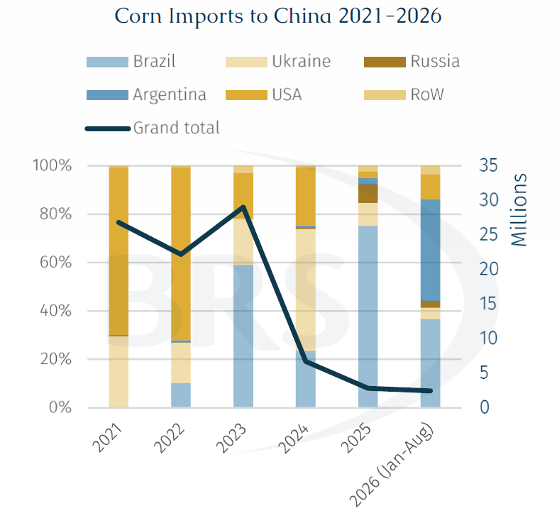
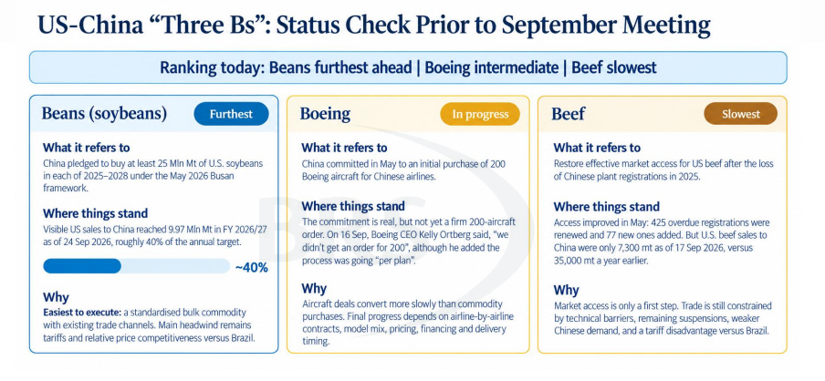

# US-China Trade Deal: Reshaping Grain and Coal Trade Flows

**Date:** October 08, 2026  
**Publisher:** Breakwave Advisors | **Category:** Market Insights  
**Original URL:** [https://www.breakwaveadvisors.com/insights/2026/10/6/us-china-trade-deal-reshaping-grain-and-coal-trade-flows](https://www.breakwaveadvisors.com/insights/2026/10/6/us-china-trade-deal-reshaping-grain-and-coal-trade-flows)  

---

> **Figure 1: Rgb Color Brs Shipbrokers Monogram L**  
> [Local Asset](file:///c:/Users/Dell/Github/Shipping/corpus/03-breakwave/insights/2026/assets/2026-10-08_us-china-trade-deal-reshaping-grain-and-coal-trade-flows_img_rgb-color-brs-shipbrokers-monogram-l_c365f35f1de5.png)

On 28 September, the US and China announced a new trade agreement following the summit between Presidents Trump and Xi. The two countries agreed to provide more favourable tariffs for approximately $30 billion of each other’s non-sensitive goods imports. Tariffs on around 90% of covered products are expected to be reduced to most-favored-nation rates, subject to each side completing its domestic procedures. The tariff truce has also been extended until January, providing a near-term window for additional agricultural and commodity purchases. The US Trade Representative stated that the measures will improve market access for goods representing around 30% of current US exports to China.

The agreement should nevertheless be viewed as a targeted easing of trade barriers rather than a broader normalisation of US-China trade relations. China’s tariff concessions cover a range of agricultural commodities, including corn, wheat and sorghum, alongside coal and selected manufactured goods, while the US is expected to provide more favourable tariff treatment for certain Chinese consumer products. The measures could support a gradual recovery in bilateral trade flows, particularly across non-soybean agricultural commodities where US exporters have lost market share in recent years. In addition to supporting bilateral commodity flows, the agreement could also have broader implications for dry bulk shipping through a potential easing of USTR-related measures on Chinese-built and Chinese-operated tonnage.

> **Figure 2: Στιγμιότυπο Οθόνης 2026 10 05 124027**  
> [Local Asset](file:///c:/Users/Dell/Github/Shipping/corpus/03-breakwave/insights/2026/assets/2026-10-08_us-china-trade-deal-reshaping-grain-and-coal-trade-flows_img_cea3cf84ceb9ceb3cebcceb9cf8ccf84cf85_6b96d781bd12.png)

The Coal Market

For the coal market, the most significant development is China’s commitment to import at least 10 mln mt of US coal annually in both 2027 and 2028. Coal has also been formally included within the $30 billion tariff-reduction framework, potentially improving the competitiveness of US supply in the Chinese market. The committed volume is equivalent to roughly 2% of China’s annual coal imports and is therefore relatively modest in the context of the country’s overall import requirements, but it could represent a meaningful increase in bilateral coal trade from current levels.

While the immediate impact on trade flows is likely to be limited, the move improves the competitiveness of US coal in the Chinese market and could support a gradual recovery in imports towards the 10 mln mt per year levels seen before trade tensions intensified. The benefits are expected to be concentrated in metallurgical coal rather than thermal coal, as higher-value coking coal is better able to absorb long-haul freight costs, while US thermal coal generally faces challenges related to quality specifications and sulfur content.

> **Figure 3: 2 Tow 2**  
> [Local Asset](file:///c:/Users/Dell/Github/Shipping/corpus/03-breakwave/insights/2026/assets/2026-10-08_us-china-trade-deal-reshaping-grain-and-coal-trade-flows_img_2tow2_2651a0bfd9f0.png)

According to AXSMarine data, China imported approximately 30.2 mln mt of coking coal during January-August. Russia remained the leading supplier, accounting for around 42% of total imports, followed by Australia with a 38% market share.

Against this backdrop, any resurgence in US coal exports to China would be more likely to compete with established Australian, Russian and other seaborne coking coal suppliers, rather than directly displacing Indonesian thermal coal volumes. The impact is expected to become more visible from 2027 onwards, as new trade arrangements are implemented and Chinese procurement patterns gradually adjust. Meanwhile increased US coking coal flows to China could provide additional support to Kamsamax and Post-Panamax demand due to certain port restrictions in the US. In particular, stronger US Gulf-China volumes would generate additional long-haul fronthaul employment, with the extended sailing distance potentially providing support to tonne-mile demand.

The Agri Market

Beijing plans to reduce tariffs on a range of US agricultural products, including corn, wheat, sorghum, meat, dairy products, vegetable oils and meals. Soybeans were not included in the latest tariff-cut list, although China has already resumed large-scale purchases under a separate agreement to buy 25 mln mt of US soybeans annually.

The tariff reductions are expected to support China’s broader commitment to purchase $17 billion worth of US agricultural goods. In addition, both countries will establish an agricultural working group to discuss market access and regulatory issues, with the first meeting scheduled before the end of the year.

> **Figure 4: 2 Tow 3**  
> [Local Asset](file:///c:/Users/Dell/Github/Shipping/corpus/03-breakwave/insights/2026/assets/2026-10-08_us-china-trade-deal-reshaping-grain-and-coal-trade-flows_img_2tow3_eb2d21f9f5e2.png)

China’s wheat imports, which declined sharply between 2023 and 2025 as Beijing prioritised domestic supply and import diversification. From January to August 2026, China’s seaborne wheat imports were estimated at approximately 3.2 mln mt, with Canada and Australia emerging as its principal suppliers. Meanwhile, US wheat shipments to China have fallen considerably, highlighting the broader shift in China’s procurement strategy away from heavier reliance on US-origin grain.

> **Figure 5: 2 Tow 4**  
> [Local Asset](file:///c:/Users/Dell/Github/Shipping/corpus/03-breakwave/insights/2026/assets/2026-10-08_us-china-trade-deal-reshaping-grain-and-coal-trade-flows_img_2tow4_3495894fbb48.png)

A similar trend is observed in China’s corn imports which have remained subdued since 2024, when trade tensions and proposed US tariff measures began to weigh on bilateral agricultural flows. Since then, imports have softened further as Beijing has placed greater emphasis on domestic production and supply security.

From January to August 2026, China imported approximately 2.44 mln mt of corn compared to approximately 23 mln mt in 2023, reflecting the country’s continued focus on meeting demand through domestic output. Historically, China relied more heavily on US corn. However, over recent years it has diversified its supply base, broadening the range of approved import origins in order to reduce dependence on a single supplier and strengthen overall supply resilience.

The 3 “Bs”

The trade agreement could also support a broader recovery in commercial ties between the US and China, building on progress across the so-called “3 Bs” — Beans, Boeing and Beef. Under the May 2026 framework, China pledged to purchase at least 25 mln mt of US soybeans in FY 2026/27. As of 24 September, visible US soybean sales to China had reached approximately 9.97 mln mt, equivalent to around 40% of the annual target, providing the most direct positive dry bulk impact through additional long-haul grain voyages.

In the “Boeing” segment, China committed in May 2026 to an initial purchase of 200 Boeing aircraft for Chinese airlines. However, as of mid-September, a firm 200-aircraft order had yet to be finalised, highlighting the longer execution timeline associated with aircraft transactions. Meanwhile, in the “Beef” segment, market access has improved although annual US beef sales to China remained subdued at around 7,300 mt as of 17 September, compared with approximately 35,000 mt a year earlier.

Of the “3 Bs”, soybeans therefore have the clearest direct relevance for dry bulk shipping. However, progress across all three sectors provides evidence of improving bilateral trade engagement and could create a more supportive backdrop for additional US–China commodity flows.

> **Figure 6: Στιγμιότυπο Οθόνης 2026 10 05 124038**  
> [Local Asset](file:///c:/Users/Dell/Github/Shipping/corpus/03-breakwave/insights/2026/assets/2026-10-08_us-china-trade-deal-reshaping-grain-and-coal-trade-flows_img_cea3cf84ceb9ceb3cebcceb9cf8ccf84cf85_b7f70afbbfc4.png)

The Impact on Dry Bulk Shipping

Overall, the potential recovery in US-China commodity trade could coincide with a tightening tonnage environment across the Atlantic. Stronger US coal and grain exports to China would generate additional long-haul requirements from the US Gulf and North Atlantic. Meanwhile, Russia’s ongoing diversification of grain exports towards Baltic ports could provide an additional source of cargo demand on the eastern side of the basin. Incremental Black Sea grain shipments could further add to vessel requirements. Should these flows strengthen simultaneously, competition for available tonnage across the Atlantic could intensify, increasing the market’s sensitivity to regional vessel supply and potentially supporting freight rates.

The impact could be further amplified by constraints affecting the Panama and Suez Canals. Continued disruption in the Middle East could limit routing flexibility through the Suez Canal, while weather-related restrictions remain a potential risk for Panama Canal operations. Any requirement for longer or alternative routings would increase vessel utilisation and absorb additional sailing days, potentially providing further support to tone-mile demand.

Nevertheless, the outlook remains highly dependent on the implementation of the US–China agreement. While the temporary easing of USTR-related measures provides near-term support, the underlying policy framework remains a source of uncertainty. Overall, stronger US coal and agricultural flows to China, alongside evolving Russian and Black Sea grain exports and potential canal constraints, could reshape Atlantic tonnage dynamics and increase freight market volatility over the coming quarters, with the impact becoming more pronounced as the trade arrangements are implemented from 2027 onwards.

---

**Tags:** Drybulk, Shipping, Markets  
