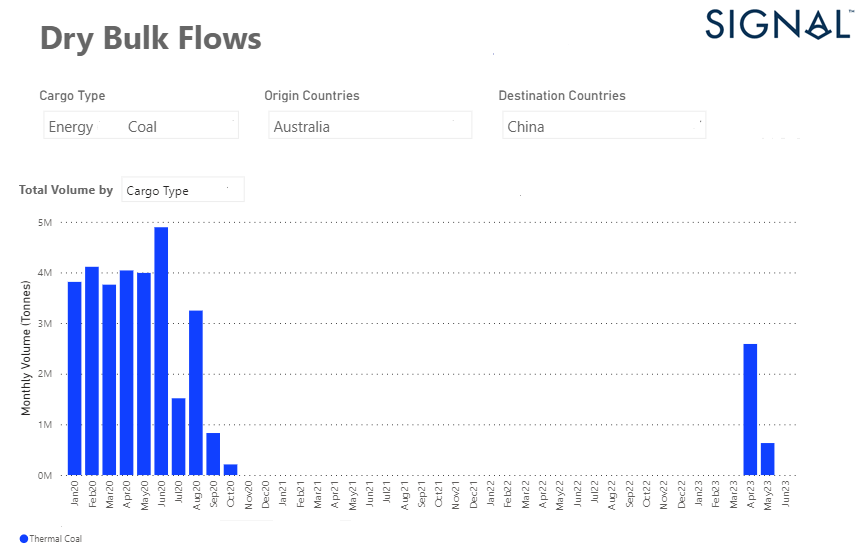

# Weekly Dry Bulk Market Monitor Week 18, 2023

*Published on 04 May 2023*

## Rise in April to Highest Level Since September 2020

> **Figure 1: Data Source: The Signal Ocean Platform, Dry Bulk Flows Https://app.signalocean.com/dry/dynamic/drybulkflows-Downloadable**  
> *Data Source: The Signal Ocean Platform, Dry Bulk Flows https://app.signalocean.com/dry/dynamic/drybulkflows-downloadable*  
> **Interactive Data & Source:** [Signal Ocean Platform](https://www.thesignalgroup.com/weekly-market-monitor/dry-bulk-week-18) | [Local Asset](file:///C:/Users/Dell/Github/Shipping/corpus/07-signal/images/645366231b72a897971d696f_coal flows logo.png)

In the first days of May, we have seen that the Capesize freight market momentum is still solid, while there are signs of slowdown in Panamax. It is interesting to note that the Chinese (see picture above) have stepped up their Australian thermal coal imports again after the lifting of the ban, which will eventually have a positive impact on Panamax rates. April was the first month of highest Chinese thermal coal imports from Australia, with the trend of increased purchases continuing in the second quarter.

In the grain segment, we expect further shortages in commodity flows following the European Commission's recent ban on imports of Ukrainian wheat, corn, rapeseed and sunflower into Bulgaria, Hungary, Poland, Romania and Slovakia until June 5. However, imports of all products from Ukraine, including wheat, corn, rapeseed and sunflower, to the rest of the European Union countries will continue without restrictions.

For the latest updates and insights, make sure to visit the [Signal Ocean Newsroom](https://www.thesignalgroup.com/newsroom) website page. Click [here to request a demo](https://www.thesignalgroup.com/request-demo?utm\_source=oceanhome&utm\_medium=website&utm\_campaign=demo).

For subscription to our FREE weekly market trends email, please contact us: research@thesignalgroup.com
