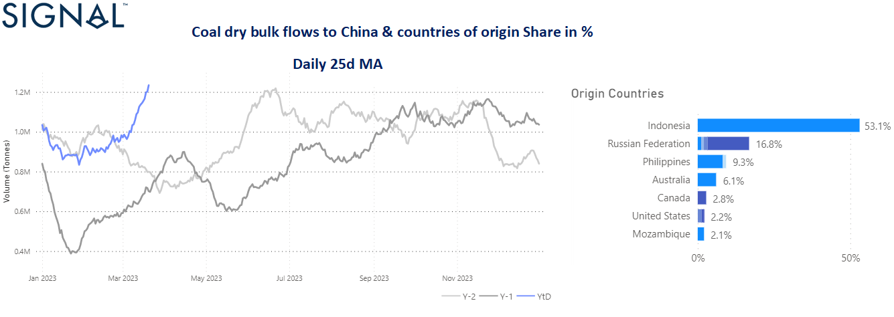

# Weekly Dry Market Monitor - Week 12.2023

*Published on 24 March 2023*

## Increase in the Volume of Tonnes in the First Quarter of the Year to a New High, with Russia Taking Second Place Among the Countries of Origin

> **Figure 1: 641c21848d908c37895055a3 Coal China with Signal Logo**  
> **Interactive Data & Source:** [Signal Ocean Platform](https://www.thesignalgroup.com/weekly-market-monitor/dry-week-12-2023) | [Local Asset](file:///C:/Users/Dell/Github/Shipping/corpus/07-signal/images/641c21848d908c37895055a3_COAL CHINA with Signal logo.png)

The third week of March has confirmed that the first quarter is ending with positive momentum for higher rates, as demand growth recovers, especially for the larger ship categories. The supply of ballast vessels in the Capesize segment is now gradually decreasing and demand growth is higher than ever before this year, reaching its final peak at the end of 2022.

In the coal segment, imports to China are now rising to the highest level compared to a similar period in the previous two years (see image above - the 25days moving average), with Russia taking second place among source countries. This firmness in Chinese coal imports suggests that the recent upward trend in freight rates and demand will continue, providing more employment opportunities for prompt vessels.

Meanwhile, the smaller vessel categories will continue to face challenges as tensions between Russia and Ukraine continue to impede the flow of grain and increase congestion at Black Sea ports. However, it has been interesting to read in recent days about the extension of the grain agreement that will allow Ukraine to export millions of tonnes of grain across the Black Sea. It is unclear how long the agreement will last. Ukraine is pushing for 120 days, while Russia is asking for 60 days. Russia has already warned that it will not allow the agreement to be extended unless sanctions against Moscow are eased.

For the latest updates and insights, make sure to visit the [Signal Ocean Newsroom](https://www.thesignalgroup.com/newsroom) website page. Click [here to request a demo](https://www.thesignalgroup.com/request-demo?utm\_source=oceanhome&utm\_medium=website&utm\_campaign=demo).

For subscription to our FREE weekly market trends email, please contact us: research@thesignalgroup.com

-Republishing is allowed with an active link to the source
