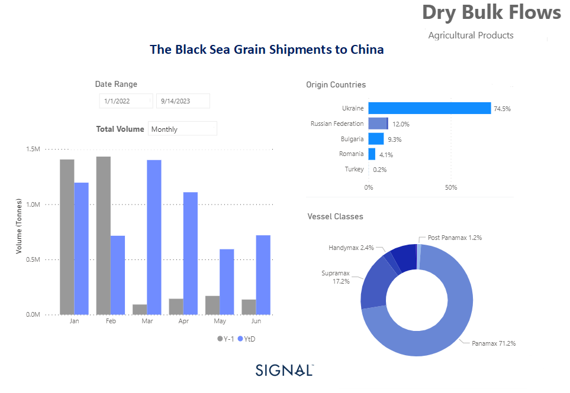

# Weekly Dry Market Monitor - Week 27, 2023

*Published on 05 July 2023*

## Dominant Destination: China Receives the Lion's Share of Black Sea Grain Shipments

> **Figure 1: Data Source: The Signal Ocean Platform Data**  
> *Data Source: The Signal Ocean Platform Data*  
> **Interactive Data & Source:** [Signal Ocean Platform](https://www.thesignalgroup.com/weekly-market-monitor/dry-week-27-2023) | [Local Asset](file:///C:/Users/Dell/Github/Shipping/corpus/07-signal/images/64a5340894841e45e280bb1e_chart of the week dry.png)

The initial days of July concluded on a positive note, with a buoyant sentiment surrounding vessel freight rates in the Capesize segment. Additionally, both the Panamax and Supramax segments experienced a firmer momentum. However, the uncertainty surrounding the potential extension of the Black Sea Grain Initiative casts a shadow over the outlook for smaller vessel sizes.

The increasing volume of grain exports from Black Sea countries, particularly to China, is a noteworthy development in the industry. The Panamax vessel size plays a vital role in facilitating these shipments, as depicted in the provided image. The surge in Black Sea grain shipments has been significant, with China emerging as the primary destination, receiving the highest volume of grain from this region. Amidst the ongoing uncertainty surrounding the potential extension of the Black Sea Grain Initiative in mid-July, notable developments are taking place in China's iron ore industry aimed at improving air quality.

Recent decisions made by China indicate a mixed sentiment of concerns regarding Chinese demand. This sentiment has led to a slip in iron ore prices following the order from Tangshan, China's top steelmaking hub, for local steel mills to reduce production as part of their efforts to enhance air quality.

For the latest updates and insights, make sure to visit the [Signal Ocean Newsroom](https://www.thesignalgroup.com/newsroom) website page. Click [here to request a demo](https://www.thesignalgroup.com/request-demo?utm\_source=oceanhome&utm\_medium=website&utm\_campaign=demo).

For subscription to our FREE weekly market trends email, please contact us: research@thesignalgroup.com

-Republishing is allowed with an active link to the source
