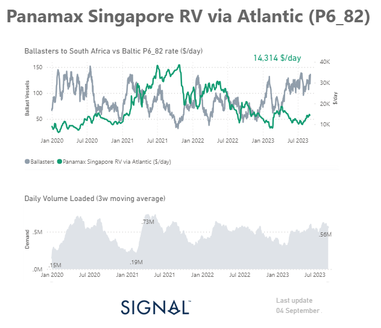

# Weekly Dry Market Monitor - Week 36, 2023

*Published on 06 September 2023*

## Higher Freight Rates Despite the Increase in the Volume of Ballast Ships as Demand Gradually Rises

> **Figure 1: Data Source: The Signal Ocean Platform Data**  
> *Data Source: The Signal Ocean Platform Data*  
> **Interactive Data & Source:** [Signal Ocean Platform](https://www.thesignalgroup.com/weekly-market-monitor/dry-week-36-2023) | [Local Asset](file:///C:/Users/Dell/Github/Shipping/corpus/07-signal/images/64f82b3c5193b228ec284559_Panamax ballasters.png)

As September began, freight rates continued to remain firm, as recorded at the end of the summer season. However, the Capesize segment remained under downward pressure. On the other hand, the Panamax and Handysize vessel freight rates showed an upturn. Despite this recent firmness, there are still uncertainties regarding the stability of the market, given the ongoing grain crisis and the gloomy economic outlook in China.

When we look at the Panamax vessel size segment, we can observe that there is a rise in the number of ballasters heading towards South Africa. However, it is interesting to note that the Panamax Singapore RV route (P6\_82) is experiencing a stronger momentum of freight rates. The recent firmness follows an upward trend that has been evident in daily volume loaded since July.

In the midst of these developments, iron ore prices managed to rally on Monday, defying the prevailing weakness in steel demand stemming from the struggling Chinese property sector. This surprising resilience can be attributed to Chinese mills, which are continuing their production unabated, taking advantage of the absence of a concrete government production cap and working to replenish their dwindling inventories of this crucial raw material. In the realm of grains, a significant breakthrough in negotiations remains elusive, with President Putin firmly stating that there will be no agreement on grain until the Western counterparts fulfill their obligations.

For the latest updates and insights, make sure to visit the [Signal Ocean Newsroom](https://www.thesignalgroup.com/newsroom) website page. Click [here to request a demo](https://www.thesignalgroup.com/request-demo?utm\_source=oceanhome&utm\_medium=website&utm\_campaign=demo).

For subscription to our FREE weekly market trends email, please contact us: research@thesignalgroup.com

-Republishing is allowed with an active link to the source
