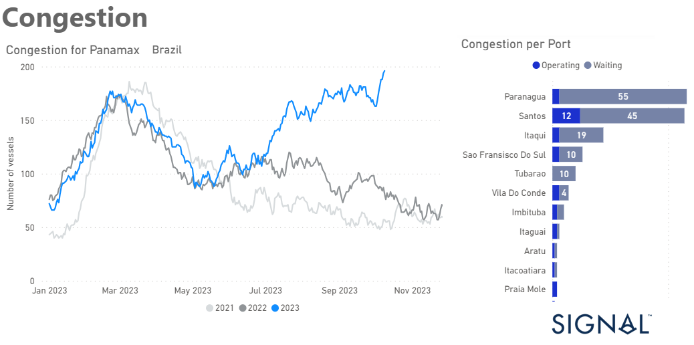

# Weekly Dry Market Monitor - Week 41, 2023

*Published on 11 October 2023*

## Congestion at Brazilian Ports for Panamax Bulkers Increases Significantly From Summer Season Onwards

> **Figure 1: Data Source: The Signal Ocean Platform Data**  
> *Data Source: The Signal Ocean Platform Data*  
> **Interactive Data & Source:** [Signal Ocean Platform](https://www.thesignalgroup.com/weekly-market-monitor/dry-week-41-2023) | [Local Asset](file:///C:/Users/Dell/Github/Shipping/corpus/07-signal/images/65264f3f9f74b46f3a1202c7_Dry Bulk Panamax Brazil Congestion.png)

The second week of October brought both promising and concerning developments in the shipping industry. In the Capesize Brazil to North China route, freight rates continued to exhibit strength, reaffirming their resilience in the face of various market dynamics. However, amidst these encouraging signs, a significant shift has occurred in the number of ballasters since the end of September. The decrease in ballasters could indicate a change in market dynamics or a response to the evolving conditions in the shipping industry. In contrast to the Capesize sector, the Panamax segment is experiencing a noticeable downward trend in freight rates.

Interestingly, the increase in Brazilian port congestion, as visually represented in the provided image, could potentially serve as a significant driver for an upturn in rates. The congestion in Brazilian ports may disrupt shipping schedules and increase demand for available vessels, thereby exerting upward pressure on freight rates.

For the latest updates and insights, make sure to visit the [Signal Ocean Newsroom](https://www.thesignalgroup.com/newsroom) website page. Click [here to request a demo](https://www.thesignalgroup.com/request-demo?utm\_source=oceanhome&utm\_medium=website&utm\_campaign=demo).

For subscription to our FREE weekly market trends email, please contact us: research@thesignalgroup.com

-Republishing is allowed with an active link to the source
