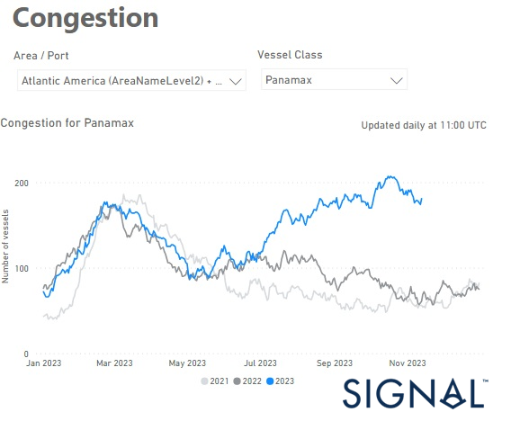

# Weekly Dry Market Monitor - Week 46, 2023

*Published on 15 November 2023*

## Higher Monthly Volumes of Congestion at Major Brazilian Ports and Days Waiting

> **Figure 1: Data Source: The Signal Ocean Platform Data**  
> *Data Source: The Signal Ocean Platform Data*  
> **Interactive Data & Source:** [Signal Ocean Platform](https://www.thesignalgroup.com/weekly-market-monitor/dry-week-46-2023) | [Local Asset](file:///C:/Users/Dell/Github/Shipping/corpus/07-signal/images/6554e44861a60ab81de1d248_Untitled.png)

In the third week of November, the larger ship categories recorded greater stability in freight rates, which indicates a more solid development. In contrast, a downward trend was observed in the smaller ship sizes, particularly in the Handysize category. At the beginning of the fourth quarter, the stability of the upturn in freight rates is being called into question. The current supply and demand dynamics do not yet show promising signs of robust momentum, adding to the uncertainties in the market. Interestingly, the Panamax freight market should continue to gain momentum as congestion in Brazilian ports has reached record levels compared to a similar period two years ago.

In the meantime, the Chinese property market fueled hopes with iron ore prices recording a recent increase. Iron ore has emerged resilient amidst the general weakness in the commodity complex, reaching an eight-month peak due to a combination of positive sentiment and supportive fundamentals in China, Reuters news reported. As the largest global purchaser of the steel raw material, China's influence is pivotal in driving these price increases. Iron ore contracts in Singapore concluded at $129.24 per metric ton on Monday, marking the highest point since March 16. This ascent represents a substantial 25% rally from the low of $103.21 recorded on August 3.

For the latest updates and insights, make sure to visit the [Signal Ocean Newsroom](https://www.thesignalgroup.com/newsroom) website page. Click [here to request a demo](https://www.thesignalgroup.com/request-demo?utm\_source=oceanhome&utm\_medium=website&utm\_campaign=demo).

For subscription to our FREE weekly market trends email, please contact us: research@thesignalgroup.com

-Republishing is allowed with an active link to the source
